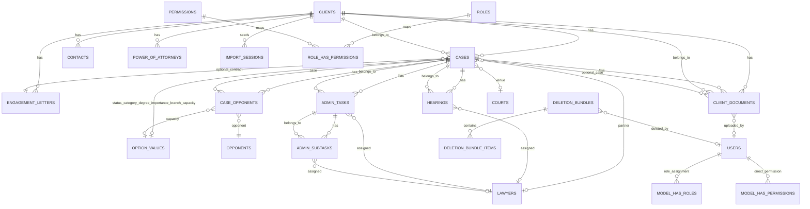

# CLMS Technical Dossier

> Sources referenced throughout include `clm-app/README.md`, `docs/master-plan.md`, `docs/security/Security-Controls.md`, generated schema extracts under `scripts/`, Laravel models, form requests, and SQL dump `DB_DUMP/litigation_db_ver2 (23Oct2025-650PM).sql`.

## 1) Executive Summary

Central Litigation Management (CLMS) is a Laravel 10.49.1 application running on PHP 8.4 and MySQL 9.1.0 that delivers bilingual (English/Arabic with RTL) tooling for end-to-end litigation tracking across clients, matters, hearings, documents, administrative tasks, finance artefacts, and audit trails. The system packages enterprise controls including Spatie-based RBAC (5 roles, 22 permissions), activity logging, a restorable trash subsystem, and data quality dashboards to remediate legacy MS Access exports during migration to MySQL. (`clm-app/README.md`, `docs/master-plan.md`)

## 2) Domain Model (Entities & Relations)

### 2.1 Field Inventory

Extracted directly from the production snapshot `DB_DUMP/litigation_db_ver2 (23Oct2025-650PM).sql` via `scripts/extract_ddl.py`, the markdown below enumerates every table, column, and index currently materialized in the MySQL schema (`scripts/domain_tables.md`).

### `activity_log`
| Column | DB Type | Null | Default | Extra |
|---|---|---|---|---|
| `id` | bigint | NO | — | AUTO_INCREMENT |
| `log_name` | varchar(191) | YES | NULL | — |
| `description` | text | NO | — | — |
| `subject_type` | varchar(191) | YES | NULL | — |
| `event` | varchar(191) | YES | NULL | — |
| `subject_id` | bigint | YES | NULL | — |
| `causer_type` | varchar(191) | YES | NULL | — |
| `causer_id` | bigint | YES | NULL | — |
| `properties` | json | YES | NULL | — |
| `batch_uuid` | char(36) | YES | NULL | — |
| `created_at` | timestamp | YES | NULL | — |
| `updated_at` | timestamp | YES | NULL | — |

**Indexes:**
- `PRIMARY KEY (`id`)`
- `KEY `subject` (`subject_type`,`subject_id`)`
- `KEY `causer` (`causer_type`,`causer_id`)`
- `KEY `activity_log_log_name_index` (`log_name`)`

### `admin_subtasks`
| Column | DB Type | Null | Default | Extra |
|---|---|---|---|---|
| `id` | int | NO | — | — |
| `task_id` | bigint | NO | — | — |
| `lawyer_id` | bigint | YES | NULL | — |
| `performer` | varchar(191) | YES | NULL | — |
| `next_date` | date | YES | NULL | — |
| `result` | text | YES | — | — |
| `procedure_date` | date | YES | NULL | — |
| `report` | tinyint(1) | NO | '0' | — |
| `created_by` | bigint | YES | NULL | — |
| `updated_by` | bigint | YES | NULL | — |
| `created_at` | timestamp | YES | NULL | — |
| `updated_at` | timestamp | YES | NULL | — |
| `deleted_at` | timestamp | YES | NULL | — |

**Indexes:**
- `PRIMARY KEY (`id`)`
- `KEY `admin_subtasks_task_id_index` (`task_id`)`
- `KEY `admin_subtasks_lawyer_id_index` (`lawyer_id`)`
- `KEY `admin_subtasks_next_date_index` (`next_date`)`
- `KEY `admin_subtasks_created_by_foreign` (`created_by`)`
- `KEY `admin_subtasks_updated_by_foreign` (`updated_by`)`

### `admin_tasks`
| Column | DB Type | Null | Default | Extra |
|---|---|---|---|---|
| `id` | int | NO | — | — |
| `matter_id` | bigint | NO | — | — |
| `lawyer_id` | bigint | YES | NULL | — |
| `last_follow_up` | text | YES | — | — |
| `last_date` | date | YES | NULL | — |
| `authority` | varchar(191) | YES | NULL | — |
| `status` | varchar(191) | YES | NULL | — |
| `circuit` | varchar(191) | YES | NULL | — |
| `required_work` | text | YES | — | — |
| `performer` | varchar(191) | YES | NULL | — |
| `previous_decision` | text | YES | — | — |
| `court` | varchar(191) | YES | NULL | — |
| `result` | text | YES | — | — |
| `creation_date` | datetime | YES | NULL | — |
| `execution_date` | datetime | YES | NULL | — |
| `alert` | tinyint(1) | NO | '0' | — |
| `created_by` | bigint | YES | NULL | — |
| `updated_by` | bigint | YES | NULL | — |
| `created_at` | timestamp | YES | NULL | — |
| `updated_at` | timestamp | YES | NULL | — |
| `deleted_at` | timestamp | YES | NULL | — |

**Indexes:**
- `PRIMARY KEY (`id`)`
- `KEY `admin_tasks_matter_id_status_index` (`matter_id`,`status`)`
- `KEY `admin_tasks_lawyer_id_index` (`lawyer_id`)`
- `KEY `admin_tasks_execution_date_index` (`execution_date`)`
- `KEY `admin_tasks_created_by_foreign` (`created_by`)`
- `KEY `admin_tasks_updated_by_foreign` (`updated_by`)`

### `cases`
| Column | DB Type | Null | Default | Extra |
|---|---|---|---|---|
| `id` | int | NO | — | — |
| `client_id` | bigint | NO | — | — |
| `client_in_case_name` | varchar(191) | YES | NULL | — |
| `opponent_in_case_name` | varchar(191) | YES | NULL | — |
| `contract_id` | bigint | YES | NULL | — |
| `engagement_letter_no` | varchar(191) | YES | NULL | — |
| `matter_name_ar` | varchar(191) | NO | — | — |
| `matter_name_en` | varchar(191) | NO | — | — |
| `matter_description` | text | YES | — | — |
| `matter_status` | varchar(191) | YES | NULL | — |
| `matter_status_id` | bigint | YES | NULL | — |
| `matter_category` | varchar(191) | YES | NULL | — |
| `matter_category_id` | bigint | YES | NULL | — |
| `court_id` | bigint | YES | NULL | — |
| `circuit_name_id` | bigint | YES | NULL | — |
| `circuit_serial_id` | bigint | YES | NULL | — |
| `circuit_shift_id` | bigint | YES | '221' | — |
| `matter_circuit_legacy` | bigint | YES | NULL | — |
| `circuit_secretary` | bigint | YES | NULL | — |
| `court_floor` | bigint | YES | NULL | — |
| `court_hall` | bigint | YES | NULL | — |
| `matter_degree` | varchar(191) | YES | NULL | — |
| `matter_degree_id` | bigint | YES | NULL | — |
| `matter_court_text` | varchar(191) | YES | NULL | — |
| `matter_destination` | varchar(191) | YES | NULL | — |
| `matter_destination_id` | bigint | YES | NULL | — |
| `matter_importance` | varchar(191) | YES | NULL | — |
| `matter_importance_id` | bigint | YES | NULL | — |
| `matter_evaluation` | varchar(191) | YES | NULL | — |
| `matter_start_date` | date | YES | NULL | — |
| `matter_end_date` | date | YES | NULL | — |
| `matter_asked_amount` | decimal(15,2) | YES | NULL | — |
| `matter_judged_amount` | decimal(15,2) | YES | NULL | — |
| `matter_shelf` | varchar(10) | YES | NULL | — |
| `matter_partner` | varchar(191) | YES | NULL | — |
| `matter_partner_id` | bigint | YES | NULL | — |
| `lawyer_a` | varchar(191) | YES | NULL | — |
| `lawyer_b` | varchar(191) | YES | NULL | — |
| `fee_letter` | decimal(15,2) | YES | NULL | — |
| `allocated_budget` | text | YES | — | — |
| `team_id` | int | YES | NULL | — |
| `legal_opinion` | text | YES | — | — |
| `financial_provision` | text | YES | — | — |
| `current_status` | text | YES | — | — |
| `notes_1` | text | YES | — | — |
| `notes_2` | text | YES | — | — |
| `client_and_capacity` | text | YES | — | — |
| `client_capacity_id` | bigint | YES | NULL | — |
| `opponent_and_capacity` | text | YES | — | — |
| `opponent_id` | bigint | YES | NULL | — |
| `opponent_capacity_id` | bigint | YES | NULL | — |
| `client_branch` | varchar(191) | YES | NULL | — |
| `matter_branch_id` | bigint | YES | NULL | — |
| `client_type` | varchar(191) | YES | NULL | — |
| `client_type_id` | bigint | YES | NULL | — |
| `matter_select` | tinyint(1) | NO | '1' | — |
| `created_by` | bigint | YES | NULL | — |
| `updated_by` | bigint | YES | NULL | — |
| `created_at` | timestamp | YES | NULL | — |
| `updated_at` | timestamp | YES | NULL | — |
| `deleted_at` | timestamp | YES | NULL | — |
| `client_capacity_note` | text | YES | — | — |
| `opponent_capacity_note` | text | YES | — | — |

**Indexes:**
- `PRIMARY KEY (`id`)`
- `KEY `cases_client_id_matter_status_index` (`client_id`,`matter_status`)`
- `KEY `cases_matter_name_ar_index` (`matter_name_ar`)`
- `KEY `cases_matter_name_en_index` (`matter_name_en`)`
- `KEY `cases_matter_status_index` (`matter_status`)`
- `KEY `cases_matter_start_date_index` (`matter_start_date`)`
- `KEY `cases_contract_id_index` (`contract_id`)`
- `KEY `cases_created_by_foreign` (`created_by`)`
- `KEY `cases_updated_by_foreign` (`updated_by`)`
- `KEY `cases_court_id_foreign` (`court_id`)`
- `KEY `cases_circuit_secretary_foreign` (`circuit_secretary`)`
- `KEY `cases_court_floor_foreign` (`court_floor`)`
- `KEY `cases_court_hall_foreign` (`court_hall`)`
- `KEY `cases_circuit_name_id_index` (`circuit_name_id`)`
- `KEY `cases_circuit_serial_id_index` (`circuit_serial_id`)`
- `KEY `cases_circuit_shift_id_index` (`circuit_shift_id`)`
- `KEY `cases_matter_category_id_foreign` (`matter_category_id`)`
- `KEY `cases_matter_degree_id_foreign` (`matter_degree_id`)`
- `KEY `cases_matter_status_id_foreign` (`matter_status_id`)`
- `KEY `cases_matter_importance_id_foreign` (`matter_importance_id`)`
- `KEY `cases_matter_branch_id_foreign` (`matter_branch_id`)`
- `KEY `cases_client_capacity_id_foreign` (`client_capacity_id`)`
- `KEY `cases_client_type_id_foreign` (`client_type_id`)`
- `KEY `cases_opponent_capacity_id_foreign` (`opponent_capacity_id`)`
- `KEY `cases_matter_destination_id_foreign` (`matter_destination_id`)`
- `KEY `cases_matter_partner_id_foreign` (`matter_partner_id`)`
- `KEY `cases_opponent_id_foreign` (`opponent_id`)`

### `clients`
| Column | DB Type | Null | Default | Extra |
|---|---|---|---|---|
| `id` | int | NO | — | — |
| `mfiles_id` | int | YES | NULL | COMMENT MFiles system identifier |
| `client_code` | varchar(50) | YES | NULL | COMMENT Unique client code for identification |
| `client_name_ar` | varchar(191) | NO | — | — |
| `client_name_en` | varchar(191) | YES | NULL | — |
| `client_print_name` | varchar(191) | NO | — | — |
| `status` | varchar(191) | YES | 'Active' | — |
| `cash_or_probono` | varchar(191) | YES | NULL | — |
| `client_start` | date | YES | NULL | — |
| `client_end` | date | YES | NULL | — |
| `contact_lawyer` | varchar(191) | YES | NULL | — |
| `contact_lawyer_id` | bigint | YES | NULL | — |
| `logo` | varchar(191) | YES | NULL | — |
| `power_of_attorney_location` | varchar(191) | YES | NULL | — |
| `documents_location` | varchar(191) | YES | NULL | — |
| `created_by` | bigint | YES | NULL | — |
| `updated_by` | bigint | YES | NULL | — |
| `created_at` | timestamp | YES | NULL | — |
| `updated_at` | timestamp | YES | NULL | — |
| `deleted_at` | timestamp | YES | NULL | — |
| `cash_or_probono_id` | bigint | YES | NULL | — |
| `status_id` | bigint | YES | NULL | — |
| `power_of_attorney_location_id` | bigint | YES | NULL | — |
| `documents_location_id` | bigint | YES | NULL | — |

**Indexes:**
- `PRIMARY KEY (`id`)`
- `UNIQUE KEY `clients_client_code_unique` (`client_code`)`
- `KEY `clients_client_name_ar_index` (`client_name_ar`)`
- `KEY `clients_client_name_en_index` (`client_name_en`)`
- `KEY `clients_status_index` (`status`)`
- `KEY `clients_client_start_index` (`client_start`)`
- `KEY `clients_created_by_foreign` (`created_by`)`
- `KEY `clients_updated_by_foreign` (`updated_by`)`
- `KEY `clients_cash_or_probono_id_index` (`cash_or_probono_id`)`
- `KEY `clients_status_id_index` (`status_id`)`
- `KEY `clients_power_of_attorney_location_id_index` (`power_of_attorney_location_id`)`
- `KEY `clients_documents_location_id_index` (`documents_location_id`)`
- `KEY `clients_contact_lawyer_id_index` (`contact_lawyer_id`)`

### `client_documents`
| Column | DB Type | Null | Default | Extra |
|---|---|---|---|---|
| `id` | int | NO | — | — |
| `client_id` | bigint | NO | — | — |
| `matter_id` | bigint | YES | NULL | — |
| `client_name` | varchar(191) | YES | NULL | — |
| `document_name` | varchar(191) | YES | NULL | — |
| `document_type` | varchar(191) | YES | NULL | — |
| `file_path` | varchar(191) | YES | NULL | — |
| `file_size` | bigint | YES | NULL | — |
| `mime_type` | varchar(191) | YES | NULL | — |
| `document_storage_type` | enum('physical','digital','both') | NO | 'physical' | — |
| `mfiles_uploaded` | tinyint(1) | NO | '0' | — |
| `mfiles_id` | varchar(191) | YES | NULL | — |
| `responsible_lawyer` | varchar(191) | YES | NULL | — |
| `movement_card` | tinyint(1) | NO | '0' | — |
| `document_description` | text | YES | — | — |
| `deposit_date` | date | NO | — | — |
| `document_date` | date | YES | NULL | — |
| `case_number` | varchar(191) | YES | NULL | — |
| `pages_count` | varchar(191) | YES | NULL | — |
| `notes` | text | YES | — | — |
| `created_by` | bigint | YES | NULL | — |
| `updated_by` | bigint | YES | NULL | — |
| `created_at` | timestamp | YES | NULL | — |
| `updated_at` | timestamp | YES | NULL | — |
| `deleted_at` | timestamp | YES | NULL | — |

**Indexes:**
- `PRIMARY KEY (`id`)`
- `KEY `client_documents_matter_id_foreign` (`matter_id`)`
- `KEY `client_documents_client_id_matter_id_deposit_date_index` (`client_id`,`matter_id`,`deposit_date`)`
- `KEY `client_documents_deposit_date_index` (`deposit_date`)`
- `KEY `client_documents_created_by_foreign` (`created_by`)`
- `KEY `client_documents_updated_by_foreign` (`updated_by`)`
- `KEY `client_documents_document_type_index` (`document_type`)`
- `KEY `client_documents_mime_type_index` (`mime_type`)`

### `contacts`
| Column | DB Type | Null | Default | Extra |
|---|---|---|---|---|
| `id` | int | NO | — | — |
| `client_id` | bigint | NO | — | — |
| `contact_name` | varchar(191) | YES | NULL | — |
| `full_name` | varchar(191) | YES | NULL | — |
| `job_title` | varchar(191) | YES | NULL | — |
| `address` | varchar(191) | YES | NULL | — |
| `city` | varchar(191) | YES | NULL | — |
| `state` | varchar(191) | YES | NULL | — |
| `country` | varchar(191) | YES | NULL | — |
| `zip_code` | varchar(191) | YES | NULL | — |
| `business_phone` | varchar(191) | YES | NULL | — |
| `home_phone` | varchar(191) | YES | NULL | — |
| `mobile_phone` | varchar(191) | YES | NULL | — |
| `fax_number` | varchar(191) | YES | NULL | — |
| `email` | varchar(191) | YES | NULL | — |
| `web_page` | varchar(191) | YES | NULL | — |
| `attachments` | text | YES | — | — |
| `created_by` | bigint | YES | NULL | — |
| `updated_by` | bigint | YES | NULL | — |
| `created_at` | timestamp | YES | NULL | — |
| `updated_at` | timestamp | YES | NULL | — |
| `deleted_at` | timestamp | YES | NULL | — |

**Indexes:**
- `PRIMARY KEY (`id`)`
- `KEY `contacts_client_id_index` (`client_id`)`
- `KEY `contacts_email_index` (`email`)`
- `KEY `contacts_created_by_foreign` (`created_by`)`
- `KEY `contacts_updated_by_foreign` (`updated_by`)`

### `courts`
| Column | DB Type | Null | Default | Extra |
|---|---|---|---|---|
| `id` | int | NO | — | — |
| `court_name_ar` | varchar(191) | YES | NULL | — |
| `court_name_en` | varchar(191) | YES | NULL | — |
| `is_active` | tinyint(1) | NO | '1' | — |
| `created_by` | bigint | YES | NULL | — |
| `updated_by` | bigint | YES | NULL | — |
| `created_at` | timestamp | YES | NULL | — |
| `updated_at` | timestamp | YES | NULL | — |
| `deleted_at` | timestamp | YES | NULL | — |

**Indexes:**
- `PRIMARY KEY (`id`)`
- `KEY `courts_court_name_ar_index` (`court_name_ar`)`
- `KEY `courts_court_name_en_index` (`court_name_en`)`
- `KEY `courts_is_active_index` (`is_active`)`
- `KEY `courts_created_by_foreign` (`created_by`)`
- `KEY `courts_updated_by_foreign` (`updated_by`)`

### `court_circuit`
| Column | DB Type | Null | Default | Extra |
|---|---|---|---|---|
| `id` | bigint | NO | — | AUTO_INCREMENT |
| `court_id` | bigint | NO | — | — |
| `circuit_name_id` | bigint | NO | — | — |
| `circuit_serial_id` | bigint | YES | NULL | — |
| `circuit_shift_id` | bigint | NO | — | — |
| `created_at` | timestamp | YES | NULL | — |
| `updated_at` | timestamp | YES | NULL | — |

**Indexes:**
- `PRIMARY KEY (`id`)`
- `UNIQUE KEY `unique_court_circuit_combo` (`court_id`,`circuit_name_id`,`circuit_serial_id`,`circuit_shift_id`)`
- `KEY `court_circuit_court_id_index` (`court_id`)`
- `KEY `court_circuit_circuit_name_id_index` (`circuit_name_id`)`
- `KEY `court_circuit_circuit_serial_id_index` (`circuit_serial_id`)`
- `KEY `court_circuit_circuit_shift_id_index` (`circuit_shift_id`)`

### `court_floor`
| Column | DB Type | Null | Default | Extra |
|---|---|---|---|---|
| `id` | bigint | NO | — | AUTO_INCREMENT |
| `court_id` | bigint | NO | — | — |
| `option_value_id` | bigint | NO | — | — |
| `created_at` | timestamp | YES | NULL | — |
| `updated_at` | timestamp | YES | NULL | — |

**Indexes:**
- `PRIMARY KEY (`id`)`
- `UNIQUE KEY `court_floor_court_id_option_value_id_unique` (`court_id`,`option_value_id`)`
- `KEY `court_floor_court_id_index` (`court_id`)`
- `KEY `court_floor_option_value_id_index` (`option_value_id`)`

### `court_hall`
| Column | DB Type | Null | Default | Extra |
|---|---|---|---|---|
| `id` | bigint | NO | — | AUTO_INCREMENT |
| `court_id` | bigint | NO | — | — |
| `option_value_id` | bigint | NO | — | — |
| `created_at` | timestamp | YES | NULL | — |
| `updated_at` | timestamp | YES | NULL | — |

**Indexes:**
- `PRIMARY KEY (`id`)`
- `UNIQUE KEY `court_hall_court_id_option_value_id_unique` (`court_id`,`option_value_id`)`
- `KEY `court_hall_court_id_index` (`court_id`)`
- `KEY `court_hall_option_value_id_index` (`option_value_id`)`

### `court_secretary`
| Column | DB Type | Null | Default | Extra |
|---|---|---|---|---|
| `id` | bigint | NO | — | AUTO_INCREMENT |
| `court_id` | bigint | NO | — | — |
| `option_value_id` | bigint | NO | — | — |
| `created_at` | timestamp | YES | NULL | — |
| `updated_at` | timestamp | YES | NULL | — |

**Indexes:**
- `PRIMARY KEY (`id`)`
- `UNIQUE KEY `court_secretary_court_id_option_value_id_unique` (`court_id`,`option_value_id`)`
- `KEY `court_secretary_court_id_index` (`court_id`)`
- `KEY `court_secretary_option_value_id_index` (`option_value_id`)`

### `deletion_bundles`
| Column | DB Type | Null | Default | Extra |
|---|---|---|---|---|
| `id` | char(36) | NO | — | — |
| `root_type` | varchar(191) | NO | — | — |
| `root_id` | bigint | NO | — | — |
| `root_label` | varchar(191) | NO | — | — |
| `snapshot_json` | json | NO | — | — |
| `files_json` | json | YES | NULL | — |
| `cascade_count` | int | NO | '0' | — |
| `deleted_by` | bigint | NO | — | — |
| `reason` | text | YES | — | — |
| `status` | enum('trashed','restored','purged') | NO | 'trashed' | — |
| `ttl_at` | datetime | YES | NULL | — |
| `restored_at` | datetime | YES | NULL | — |
| `restore_notes` | text | YES | — | — |
| `created_at` | timestamp | YES | NULL | — |
| `updated_at` | timestamp | YES | NULL | — |

**Indexes:**
- `PRIMARY KEY (`id`)`
- `KEY `deletion_bundles_root_type_root_id_index` (`root_type`,`root_id`)`
- `KEY `deletion_bundles_status_index` (`status`)`
- `KEY `deletion_bundles_deleted_by_index` (`deleted_by`)`
- `KEY `deletion_bundles_ttl_at_index` (`ttl_at`)`
- `KEY `deletion_bundles_created_at_index` (`created_at`)`

### `deletion_bundle_items`
| Column | DB Type | Null | Default | Extra |
|---|---|---|---|---|
| `id` | char(36) | NO | — | — |
| `bundle_id` | char(36) | NO | — | — |
| `model` | varchar(191) | NO | — | — |
| `model_id` | bigint | YES | NULL | — |
| `payload_json` | json | NO | — | — |
| `created_at` | timestamp | YES | NULL | — |
| `updated_at` | timestamp | YES | NULL | — |

**Indexes:**
- `PRIMARY KEY (`id`)`
- `KEY `deletion_bundle_items_bundle_id_index` (`bundle_id`)`
- `KEY `deletion_bundle_items_model_model_id_index` (`model`,`model_id`)`

### `engagement_letters`
| Column | DB Type | Null | Default | Extra |
|---|---|---|---|---|
| `id` | int | NO | — | — |
| `client_id` | bigint | NO | — | — |
| `client_name` | varchar(191) | YES | NULL | — |
| `contract_date` | datetime | YES | NULL | — |
| `contract_details` | text | YES | — | — |
| `contract_structure` | text | YES | — | — |
| `contract_type` | varchar(191) | YES | NULL | — |
| `matters` | text | YES | — | — |
| `status` | varchar(191) | YES | NULL | — |
| `mfiles_id` | int | YES | NULL | — |
| `created_by` | bigint | YES | NULL | — |
| `updated_by` | bigint | YES | NULL | — |
| `created_at` | timestamp | YES | NULL | — |
| `updated_at` | timestamp | YES | NULL | — |
| `deleted_at` | timestamp | YES | NULL | — |

**Indexes:**
- `PRIMARY KEY (`id`)`
- `KEY `engagement_letters_client_id_index` (`client_id`)`
- `KEY `engagement_letters_contract_date_index` (`contract_date`)`
- `KEY `engagement_letters_status_index` (`status`)`
- `KEY `engagement_letters_created_by_foreign` (`created_by`)`
- `KEY `engagement_letters_updated_by_foreign` (`updated_by`)`

### `failed_jobs`
| Column | DB Type | Null | Default | Extra |
|---|---|---|---|---|
| `id` | bigint | NO | — | AUTO_INCREMENT |
| `uuid` | varchar(191) | NO | — | — |
| `connection` | text | NO | — | — |
| `queue` | text | NO | — | — |
| `payload` | longtext | NO | — | — |
| `exception` | longtext | NO | — | — |
| `failed_at` | timestamp | NO | CURRENT_TIMESTAMP | — |

**Indexes:**
- `PRIMARY KEY (`id`)`
- `UNIQUE KEY `failed_jobs_uuid_unique` (`uuid`)`

### `hearings`
| Column | DB Type | Null | Default | Extra |
|---|---|---|---|---|
| `id` | int | NO | — | — |
| `matter_id` | bigint | NO | — | — |
| `lawyer_id` | bigint | YES | NULL | — |
| `date` | date | YES | NULL | — |
| `procedure` | varchar(191) | YES | NULL | — |
| `court` | varchar(191) | YES | NULL | — |
| `circuit` | varchar(191) | YES | NULL | — |
| `destination` | varchar(191) | YES | NULL | — |
| `decision` | text | YES | — | — |
| `short_decision` | varchar(191) | YES | NULL | — |
| `last_decision` | varchar(191) | YES | NULL | — |
| `next_hearing` | date | YES | NULL | — |
| `report` | tinyint(1) | NO | '0' | — |
| `notify_client` | tinyint(1) | NO | '0' | — |
| `attendee` | varchar(191) | YES | NULL | — |
| `attendee_1` | varchar(191) | YES | NULL | — |
| `attendee_2` | varchar(191) | YES | NULL | — |
| `attendee_3` | varchar(191) | YES | NULL | — |
| `attendee_4` | varchar(191) | YES | NULL | — |
| `next_attendee` | varchar(191) | YES | NULL | — |
| `evaluation` | varchar(191) | YES | NULL | — |
| `notes` | text | YES | — | — |
| `created_by` | bigint | YES | NULL | — |
| `updated_by` | bigint | YES | NULL | — |
| `created_at` | timestamp | YES | NULL | — |
| `updated_at` | timestamp | YES | NULL | — |
| `deleted_at` | timestamp | YES | NULL | — |

**Indexes:**
- `PRIMARY KEY (`id`)`
- `KEY `hearings_matter_id_date_index` (`matter_id`,`date`)`
- `KEY `hearings_next_hearing_index` (`next_hearing`)`
- `KEY `hearings_lawyer_id_index` (`lawyer_id`)`
- `KEY `hearings_created_by_foreign` (`created_by`)`
- `KEY `hearings_updated_by_foreign` (`updated_by`)`

### `import_sessions`
| Column | DB Type | Null | Default | Extra |
|---|---|---|---|---|
| `id` | bigint | NO | — | AUTO_INCREMENT |
| `session_id` | varchar(36) | NO | — | — |
| `table_name` | varchar(64) | NO | — | — |
| `original_filename` | varchar(191) | NO | — | — |
| `stored_filename` | varchar(191) | NO | — | — |
| `status` | enum('uploaded','mapped','validated','importing','completed','failed','cancelled') | NO | 'uploaded' | — |
| `file_type` | varchar(10) | NO | — | — |
| `file_size` | int | NO | — | — |
| `file_hash` | varchar(64) | NO | — | — |
| `total_rows` | int | YES | NULL | — |
| `header_row` | int | NO | '1' | — |
| `column_mapping` | json | YES | NULL | — |
| `transforms` | json | YES | NULL | — |
| `preflight_errors` | json | YES | NULL | — |
| `preflight_error_count` | int | NO | '0' | — |
| `preflight_warning_count` | int | NO | '0' | — |
| `imported_count` | int | NO | '0' | — |
| `failed_count` | int | NO | '0' | — |
| `skipped_count` | int | NO | '0' | — |
| `import_errors` | json | YES | NULL | — |
| `backup_file` | varchar(191) | YES | NULL | — |
| `backup_size` | bigint | YES | NULL | — |
| `backup_created_at` | timestamp | YES | NULL | — |
| `started_at` | timestamp | YES | NULL | — |
| `completed_at` | timestamp | YES | NULL | — |
| `duration_seconds` | int | YES | NULL | — |
| `user_id` | bigint | NO | — | — |
| `created_at` | timestamp | YES | NULL | — |
| `updated_at` | timestamp | YES | NULL | — |
| `deleted_at` | timestamp | YES | NULL | — |

**Indexes:**
- `PRIMARY KEY (`id`)`
- `UNIQUE KEY `import_sessions_session_id_unique` (`session_id`)`
- `KEY `import_sessions_user_id_created_at_index` (`user_id`,`created_at`)`
- `KEY `import_sessions_created_at_index` (`created_at`)`
- `KEY `import_sessions_table_name_index` (`table_name`)`
- `KEY `import_sessions_status_index` (`status`)`

### `lawyers`
| Column | DB Type | Null | Default | Extra |
|---|---|---|---|---|
| `id` | int | NO | — | — |
| `lawyer_name_ar` | varchar(191) | NO | — | — |
| `lawyer_name_en` | varchar(191) | NO | — | — |
| `lawyer_name_title` | varchar(191) | YES | NULL | — |
| `title_id` | bigint | YES | NULL | — |
| `lawyer_email` | varchar(191) | YES | NULL | — |
| `attendance_track` | tinyint(1) | NO | '0' | — |
| `created_by` | bigint | YES | NULL | — |
| `updated_by` | bigint | YES | NULL | — |
| `created_at` | timestamp | YES | NULL | — |
| `updated_at` | timestamp | YES | NULL | — |
| `deleted_at` | timestamp | YES | NULL | — |

**Indexes:**
- `PRIMARY KEY (`id`)`
- `KEY `lawyers_lawyer_name_ar_index` (`lawyer_name_ar`)`
- `KEY `lawyers_lawyer_name_en_index` (`lawyer_name_en`)`
- `KEY `lawyers_lawyer_email_index` (`lawyer_email`)`
- `KEY `lawyers_created_by_foreign` (`created_by`)`
- `KEY `lawyers_updated_by_foreign` (`updated_by`)`
- `KEY `lawyers_title_id_foreign` (`title_id`)`

### `migrations`
| Column | DB Type | Null | Default | Extra |
|---|---|---|---|---|
| `id` | int | NO | — | AUTO_INCREMENT |
| `migration` | varchar(191) | NO | — | — |
| `batch` | int | NO | — | — |

**Indexes:**
- `PRIMARY KEY (`id`)`

### `model_has_permissions`
| Column | DB Type | Null | Default | Extra |
|---|---|---|---|---|
| `permission_id` | bigint | NO | — | — |
| `model_type` | varchar(191) | NO | — | — |
| `model_id` | bigint | NO | — | — |

**Indexes:**
- `PRIMARY KEY (`permission_id`,`model_id`,`model_type`)`
- `KEY `model_has_permissions_model_id_model_type_index` (`model_id`,`model_type`)`

### `model_has_roles`
| Column | DB Type | Null | Default | Extra |
|---|---|---|---|---|
| `role_id` | bigint | NO | — | — |
| `model_type` | varchar(191) | NO | — | — |
| `model_id` | bigint | NO | — | — |

**Indexes:**
- `PRIMARY KEY (`role_id`,`model_id`,`model_type`)`
- `KEY `model_has_roles_model_id_model_type_index` (`model_id`,`model_type`)`

### `opponents`
| Column | DB Type | Null | Default | Extra |
|---|---|---|---|---|
| `id` | bigint | NO | — | AUTO_INCREMENT |
| `opponent_name_ar` | varchar(191) | YES | NULL | — |
| `opponent_name_en` | varchar(191) | YES | NULL | — |
| `normalized_name` | varchar(512) | YES | NULL | — |
| `is_active` | tinyint(1) | NO | '1' | — |
| `description` | text | YES | — | — |
| `notes` | text | YES | — | — |
| `created_by` | bigint | YES | NULL | — |
| `updated_by` | bigint | YES | NULL | — |
| `created_at` | timestamp | YES | NULL | — |
| `updated_at` | timestamp | YES | NULL | — |
| `deleted_at` | timestamp | YES | NULL | — |
| `first_token` | varchar(64) | YES | NULL | — |
| `last_token` | varchar(64) | YES | NULL | — |
| `token_count` | tinyint | YES | NULL | — |
| `latin_key` | varchar(64) | YES | NULL | — |

**Indexes:**
- `PRIMARY KEY (`id`)`
- `KEY `opponents_opponent_name_ar_index` (`opponent_name_ar`)`
- `KEY `opponents_opponent_name_en_index` (`opponent_name_en`)`
- `KEY `opponents_is_active_index` (`is_active`)`
- `KEY `opponents_created_by_foreign` (`created_by`)`
- `KEY `opponents_updated_by_foreign` (`updated_by`)`
- `KEY `opponents_normalized_name_prefix` (`normalized_name`(191))`
- `KEY `opponents_first_token_index` (`first_token`)`
- `KEY `opponents_last_token_index` (`last_token`)`
- `KEY `opponents_token_count_index` (`token_count`)`
- `KEY `opponents_latin_key_index` (`latin_key`)`

### `opponent_aliases`
| Column | DB Type | Null | Default | Extra |
|---|---|---|---|---|
| `id` | bigint | NO | — | AUTO_INCREMENT |
| `opponent_id` | bigint | NO | — | — |
| `alias_normalized` | varchar(512) | NO | — | — |
| `created_at` | timestamp | YES | NULL | — |
| `updated_at` | timestamp | YES | NULL | — |

**Indexes:**
- `PRIMARY KEY (`id`)`
- `UNIQUE KEY `opponent_alias_unique` (`opponent_id`,`alias_normalized`(191))`
- `KEY `opponent_aliases_opponent_id_index` (`opponent_id`)`

### `opponent_trigrams`
| Column | DB Type | Null | Default | Extra |
|---|---|---|---|---|
| `opponent_id` | bigint | NO | — | — |
| `tri` | char(3) | NO | — | — |

**Indexes:**
- `PRIMARY KEY (`opponent_id`,`tri`)`
- `KEY `opponent_trigrams_tri_index` (`tri`)`

### `option_sets`
| Column | DB Type | Null | Default | Extra |
|---|---|---|---|---|
| `id` | int | NO | — | — |
| `key` | varchar(191) | NO | — | — |
| `name_en` | varchar(191) | NO | — | — |
| `name_ar` | varchar(191) | NO | — | — |
| `description_en` | text | YES | — | — |
| `description_ar` | text | YES | — | — |
| `is_active` | tinyint(1) | NO | '1' | — |
| `created_at` | timestamp | YES | NULL | — |
| `updated_at` | timestamp | YES | NULL | — |

**Indexes:**
- `PRIMARY KEY (`id`)`
- `UNIQUE KEY `option_sets_key_unique` (`key`)`

### `option_values`
| Column | DB Type | Null | Default | Extra |
|---|---|---|---|---|
| `id` | int | NO | — | AUTO_INCREMENT |
| `set_id` | bigint | NO | — | — |
| `code` | varchar(191) | NO | — | — |
| `label_en` | varchar(191) | NO | — | — |
| `label_ar` | varchar(191) | NO | — | — |
| `position` | int | NO | '0' | — |
| `is_active` | tinyint(1) | NO | '1' | — |
| `created_at` | timestamp | YES | NULL | — |
| `updated_at` | timestamp | YES | NULL | — |

**Indexes:**
- `PRIMARY KEY (`id`)`
- `UNIQUE KEY `option_values_set_id_code_unique` (`set_id`,`code`)`
- `KEY `option_values_set_id_is_active_position_index` (`set_id`,`is_active`,`position`)`

### `password_resets`
| Column | DB Type | Null | Default | Extra |
|---|---|---|---|---|
| `email` | varchar(191) | NO | — | — |
| `token` | varchar(191) | NO | — | — |
| `created_at` | timestamp | YES | NULL | — |

**Indexes:**
- `KEY `password_resets_email_index` (`email`)`

### `password_reset_tokens`
| Column | DB Type | Null | Default | Extra |
|---|---|---|---|---|
| `email` | varchar(191) | NO | — | — |
| `token` | varchar(191) | NO | — | — |
| `created_at` | timestamp | YES | NULL | — |

**Indexes:**
- `PRIMARY KEY (`email`)`

### `permissions`
| Column | DB Type | Null | Default | Extra |
|---|---|---|---|---|
| `id` | bigint | NO | — | AUTO_INCREMENT |
| `name` | varchar(125) | NO | — | — |
| `guard_name` | varchar(125) | NO | — | — |
| `created_at` | timestamp | YES | NULL | — |
| `updated_at` | timestamp | YES | NULL | — |

**Indexes:**
- `PRIMARY KEY (`id`)`
- `UNIQUE KEY `permissions_name_guard_name_unique` (`name`,`guard_name`)`

### `personal_access_tokens`
| Column | DB Type | Null | Default | Extra |
|---|---|---|---|---|
| `id` | bigint | NO | — | AUTO_INCREMENT |
| `tokenable_type` | varchar(191) | NO | — | — |
| `tokenable_id` | bigint | NO | — | — |
| `name` | varchar(191) | NO | — | — |
| `token` | varchar(64) | NO | — | — |
| `abilities` | text | YES | — | — |
| `last_used_at` | timestamp | YES | NULL | — |
| `expires_at` | timestamp | YES | NULL | — |
| `created_at` | timestamp | YES | NULL | — |
| `updated_at` | timestamp | YES | NULL | — |

**Indexes:**
- `PRIMARY KEY (`id`)`
- `UNIQUE KEY `personal_access_tokens_token_unique` (`token`)`
- `KEY `personal_access_tokens_tokenable_type_tokenable_id_index` (`tokenable_type`,`tokenable_id`)`

### `power_of_attorneys`
| Column | DB Type | Null | Default | Extra |
|---|---|---|---|---|
| `id` | int | NO | — | — |
| `client_id` | bigint | NO | — | — |
| `client_print_name` | varchar(191) | YES | NULL | — |
| `principal_name` | varchar(191) | NO | — | — |
| `year` | int | YES | NULL | — |
| `capacity` | varchar(191) | YES | NULL | — |
| `authorized_lawyers` | text | YES | — | — |
| `issue_date` | date | YES | NULL | — |
| `inventory` | tinyint(1) | NO | '1' | — |
| `issuing_authority` | varchar(191) | YES | NULL | — |
| `letter` | varchar(191) | YES | NULL | — |
| `poa_number` | int | YES | NULL | — |
| `principal_capacity` | varchar(191) | YES | NULL | — |
| `copies_count` | int | YES | NULL | — |
| `serial` | varchar(191) | YES | NULL | — |
| `notes` | text | YES | — | — |
| `created_by` | bigint | YES | NULL | — |
| `updated_by` | bigint | YES | NULL | — |
| `created_at` | timestamp | YES | NULL | — |
| `updated_at` | timestamp | YES | NULL | — |
| `deleted_at` | timestamp | YES | NULL | — |

**Indexes:**
- `PRIMARY KEY (`id`)`
- `KEY `power_of_attorneys_client_id_index` (`client_id`)`
- `KEY `power_of_attorneys_issue_date_index` (`issue_date`)`
- `KEY `power_of_attorneys_poa_number_index` (`poa_number`)`
- `KEY `power_of_attorneys_created_by_foreign` (`created_by`)`
- `KEY `power_of_attorneys_updated_by_foreign` (`updated_by`)`

### `roles`
| Column | DB Type | Null | Default | Extra |
|---|---|---|---|---|
| `id` | bigint | NO | — | AUTO_INCREMENT |
| `name` | varchar(125) | NO | — | — |
| `guard_name` | varchar(125) | NO | — | — |
| `created_at` | timestamp | YES | NULL | — |
| `updated_at` | timestamp | YES | NULL | — |

**Indexes:**
- `PRIMARY KEY (`id`)`
- `UNIQUE KEY `roles_name_guard_name_unique` (`name`,`guard_name`)`

### `role_has_permissions`
| Column | DB Type | Null | Default | Extra |
|---|---|---|---|---|
| `permission_id` | bigint | NO | — | — |
| `role_id` | bigint | NO | — | — |

**Indexes:**
- `PRIMARY KEY (`permission_id`,`role_id`)`
- `KEY `role_has_permissions_role_id_foreign` (`role_id`)`

### `users`
| Column | DB Type | Null | Default | Extra |
|---|---|---|---|---|
| `id` | bigint | NO | — | AUTO_INCREMENT |
| `name` | varchar(191) | NO | — | — |
| `email` | varchar(191) | NO | — | — |
| `email_verified_at` | timestamp | YES | NULL | — |
| `password` | varchar(191) | NO | — | — |
| `locale` | varchar(2) | NO | 'en' | — |
| `remember_token` | varchar(100) | YES | NULL | — |
| `created_at` | timestamp | YES | NULL | — |
| `updated_at` | timestamp | YES | NULL | — |

**Indexes:**
- `PRIMARY KEY (`id`)`
- `UNIQUE KEY `users_email_unique` (`email`)`

### 2.2 Relationships & Cardinality

- `Client` (`clients.id`) has many `CaseModel` (`cases.client_id`), cascades captured through deletion bundle collectors even though MyISAM tables lack enforced FKs. (`app/Models/Client.php`, `app/Models/CaseModel.php`)
- `CaseModel` has many `Hearing` (`hearings.matter_id`), `AdminTask` (`admin_tasks.matter_id`), `AdminSubtask` through `admin_tasks`, and `ClientDocument` (`client_documents.matter_id`) for document linkage. (`app/Models/CaseModel.php`, `app/Models/Hearing.php`, `app/Models/AdminTask.php`, `app/Models/ClientDocument.php`)
- `CaseModel` belongs to `Client`, optional `EngagementLetter` (`cases.contract_id`), `Court` (`cases.court_id`), `Lawyer` as partner (`cases.matter_partner_id`), and option value lookups for status, category, degree, importance, branch, capacities, and circuit metadata. (`app/Models/CaseModel.php`)
- `CaseModel` ↔ `Opponent` is a many-to-many through pivot `case_opponents` capturing capacity, primary flag, alias text, ordering, and soft deletes. (`app/Models/Pivots/CaseOpponent.php`)
- `Client` has many `Contact`, `EngagementLetter`, `PowerOfAttorney`, `ClientDocument`, and `CaseModel`; each child stores `client_id` and participates in deletion bundles for cascade restore. (`app/Models/Client.php`, respective models)
- `Lawyer` participates as optional foreign key on `hearings.lawyer_id`, `admin_tasks.lawyer_id`, `admin_subtasks.lawyer_id`, and as partner on `cases.matter_partner_id`. (`app/Models/Lawyer.php`)
- `OptionValue` acts as a master lookup referenced by numerous FK columns (status, category, capacities, circuit metadata, etc.). Values are stored in `option_values` keyed by `set_id` to `option_sets`. (`option_sets`, `option_values`, `app/Models/OptionValue.php`)
- `DeletionBundle` (`deletion_bundles.id`) has many `DeletionBundleItem` (`deletion_bundle_items.deletion_bundle_id`) to capture cascade snapshots; both store UUID primary keys. (`app/Models/DeletionBundle.php`)
- `ImportSession` orchestrates data import flows and links to `ImportProfile` and `ImportChoice` records for ETL mapping decisions. (`app/Models/ImportSession.php`, `app/Models/ImportProfile.php`, `app/Models/ImportChoice.php`)
- `Spatie` RBAC tables (`roles`, `permissions`, `model_has_roles`, `model_has_permissions`, `role_has_permissions`) manage many-to-many relationships between users and permissions. (`database/seeders/RolesSeeder.php`, `database/seeders/PermissionsSeeder.php`)
- `Courts` manage associated option values for circuits, floors, halls, secretaries through pivot tables and AJAX endpoints (`routes/web.php` > `CourtsController@getCourtDetails`).
- When hard deletes occur, the trash system orchestrated by `InteractsWithDeletionBundles` collects related graphs (clients → cases → hearings/tasks/subtasks/documents) for restoration with conflict resolution strategies. (`app/Support/DeletionBundles`)

### 2.3 ERD



## 3) Database Inventory

| Table | PK | Key Fields (type) | Index Highlights | Soft Delete | Notes |
|---|---|---|---|---|---|
| `clients` | `id` (int) | `client_name_ar` varchar(191), `client_code` varchar(50), `cash_or_probono_id` bigint | `client_code` unique (app-level), multiple option-value FKs | Yes (`deleted_at`) | Stores bilingual names, optional logo path, option value pointers for status & locations (`scripts/domain_tables.md`) |
| `cases` | `id` (int) | `client_id` bigint, `matter_name_ar/en` varchar(191), numerous option FK columns | Composite indexes on client/status, matter names, and each lookup id | Yes | MyISAM table storing >60 attributes from Access; relies on service-layer validation for integrity (`cases` block in domain inventory) |
| `case_opponents` | `id` (bigint) | `case_id` bigint, `opponent_id` bigint, `capacity_id` bigint, `is_primary` tinyint | Indexes on case/display_order, case/primary, opponent, case/capacity | Yes | Pivot exposes multi-opponent with ordering and alias text (`scripts/domain_tables.md`; `app/Models/Pivots/CaseOpponent.php`) |
| `opponents` | `id` (int) | `opponent_name_ar/en` varchar(191), `is_active` tinyint | Name indexes | Yes | Master directory of opposing parties |
| `hearings` | `id` (int) | `matter_id` bigint, `date` date, `lawyer_id` bigint | Index on `matter_id,date`, `lawyer_id` | Yes | Stores hearing metadata and next hearing date |
| `admin_tasks` | `id` (int) | `matter_id` bigint, `lawyer_id` bigint | Index on (`matter_id`,`status`), `execution_date` | Yes | Administrative follow-up tasks tied to cases |
| `admin_subtasks` | `id` (int) | `task_id` bigint, `lawyer_id` bigint | Index on task, lawyer, next_date | Yes | Child actions under admin tasks |
| `client_documents` | `id` (int) | `client_id` bigint, `matter_id` bigint, `document_type` varchar(191) | Index on `client_id`, `matter_id`, `deposit_date` | Yes | Metadata for physical/digital uploads with storage hints |
| `contacts` | `id` (int) | `client_id` bigint, `email` varchar(255) | Index on `client_id` | Yes | Client contact directory |
| `engagement_letters` | `id` (int) | `client_id` bigint, `contract_date` datetime | Index on `client_id` | Yes | Fee agreements linking to multiple cases |
| `power_of_attorneys` | `id` (int) | `client_id` bigint, `principal_name` varchar(255) | Index on `client_id` | Yes | POA catalog with optional numbering |
| `lawyers` | `id` (int) | `lawyer_name_ar/en` varchar(255), `title_id` bigint | Index on `lawyer_name_en`, `title_id` | Yes | Internal lawyer/staff roster |
| `courts` | `id` (int) | `court_name_ar/en` varchar(255), `is_active` tinyint | Index on names | Yes | Court directory; circuit metadata stored in companion tables (`courts` / `court_circuit` / `court_floor` etc.) |
| `option_sets` | `id` (bigint) | `key` varchar(191), `name_en/ar` varchar(191) | Index on `key` | No | Defines lookup families such as `case.status`, `case.degree`, `court.floor`; values referenced by `option_values` |
| `option_values` | `id` (bigint) | `set_id` bigint, `code` varchar(191), `label_en/ar` varchar(191), `position` int | Index on (`set_id`,`code`) | No | Holds bilingual enumerations powering choice lists |
| `import_sessions` | `id` (bigint) | `type` varchar(50), `status` varchar(50), `source_path` varchar(255) | Index on `status`, `type` | Yes | Tracks Excel/CSV import lifecycle with run metrics (`app/Models/ImportSession.php`) |
| `import_profiles` | `id` (bigint) | `name` varchar(191), `target_table` varchar(191) | Index on `target_table` | No | Saved mapping profiles used by ETL wizard |
| `import_choices` | `id` (bigint) | `import_session_id` bigint, `field_key` varchar(191), `choice_code` varchar(191) | Index on `import_session_id` | No | Stores user-selected lookup resolutions during import |
| `deletion_bundles` | `id` (char(36)) | `root_type` varchar(191), `root_id` bigint, `status` enum, `deleted_by` bigint | Indexes on `root_type+root_id`, `status`, `ttl_at`, `deleted_by` | No (managed TTL) | JSON payload capturing cascade snapshot for trash system (`deletion_bundles` DDL) |
| `deletion_bundle_items` | `id` (char(36)) | `deletion_bundle_id` char(36), `model` varchar(191), `model_id` bigint | Index on `deletion_bundle_id`, `model+model_id` | No | Items within bundle referencing original model identities |
| `users` | `id` (bigint) | `name` varchar(255), `email` varchar(255), `locale` char(2) | Unique `email` | No | Laravel auth users + locale | 
| `roles`, `permissions`, `model_has_roles`, `model_has_permissions`, `role_has_permissions` | various | Standard Spatie schema | Indexes on relation columns | No | Provide RBAC join tables seeded via `database/seeders` |
| `activity_log` | `id` (bigint) | `log_name`, `subject_type`, `causer_type` | Indexes on subject, causer, log_name | No | Spatie activity trail attached to trash operations and core CRUD |
| `failed_jobs`, `jobs`, `personal_access_tokens`, `password_reset_tokens` | various | Standard Laravel infrastructure tables | Standard indexes | No | Background job + auth support |

## 4) Enums & Lookups

Derived from `scripts/option_sets.txt` and `scripts/option_values_summary.txt`, the system maintains the following bilingual lookup sets; all values live in `option_values` and are referenced via foreign keys across domain tables.

| Key | Label (EN/AR) | Count | Sample Codes (EN/AR) | Notes |
|---|---|---|---|---|
| `capacity.type` | Capacity Types / الصفات القانونية | 39 | `accused_party` (Accused Party / مشكو في حقه), `appellant` (Appellant / مستأنف), `respondent` (Respondent / مدعى عليه) | Drives role selection for clients/opponents (`cases`, `case_opponents`) |
| `case.branch` | Case Branches / فروع القضايا | 9 | `criminal`, `civil`, `labor` | Branch filters for reporting |
| `case.category` | Case Categories / تصنيفات القضايا | 27 | `consultations`, `economic`, `procedures`, `petition`, `criminal` | Imported from Access sheets, used for classification |
| `case.degree` | Case Degrees / درجات التقاضي | 21 | `primary`, `appeal`, `cassation`, `constitutional`, `urgent` | Degree of litigation stage |
| `case.importance` | Case Importance / أهمية القضية | 6 | `critical`, `urgent`, `normal`, `grievance` | Prioritisation metadata |
| `case.status` | Case Status / حالة القضية | 3 | `active`, `pending`, `closed` | Normalised status vs legacy text |
| `circuit.name` | Circuit Names / أسماء الدوائر | 48 | `16 South – 137 s`, `Administrative`, `Appeal`, `Criminal`, `Customs` | Supports cascading dropdowns for court assignments |
| `circuit.serial` | Circuit Serials / أرقام الدوائر التسلسلية | 154 | `1`, `2`, `3`, `A`, `B` | Numeric/alphabetical serial slotting |
| `circuit.shift` | Circuit Shifts / دوام الدوائر | 2 | `shift_morning`, `shift_night` | Distinguishes morning/night sittings |
| `client.cash_or_probono` | Cash or Pro Bono / نقدي أو مجاني | 3 | `cash`, `probono`, `unknown` | Payment modality flag |
| `client.documents_location` | Documents Location / مكان المستندات | 3 | `archive`, `safe`, `handed_to_client` | Physical storage site |
| `client.power_of_attorney_location` | Power of Attorney Location / مكان التوكيل | 3 | `archive`, `safe`, `handed_to_client` | POA storage |
| `client.status` | Client Status / حالة العميل | 3 | `active`, `disabled`, `potential` | CRM-style lifecycle |
| `court.circuit` | Court Circuits / دوائر المحاكم | 2 | `C01`, `C02` | Circuits per court |
| `court.circuit_secretary` | Circuit Secretaries / أمناء الدوائر | 1 | `SEC01` (Ahmed Adli / أحمد عدلي) | Maintains secretary roster |
| `court.floor` | Court Floors / طوابق المحاكم | 3 | `F01`, `F02`, `F03` | Floor metadata |
| `court.hall` | Court Halls / قاعات المحاكم | 1 | `H01` (Main Hall / القاعة الرئيسية) | Hall metadata |
| `lawyer.title` | Lawyer Titles / مسميات المحامين | 10 | `managing_partner`, `senior_partner`, `senior_associate`, `associate`, `trainee` | Titles used in lawyer profiles |

All lookups set `is_active=1` by default and maintain positional ordering for UI display. Large enumerations (`circuit.serial`, `circuit.name`, `capacity.type`) are pre-loaded from Access exports to guarantee continuity with legacy spreadsheets.

## 5) Validation Matrix

Form request classes (`clm-app/app/Http/Requests/*.php`) centralize server-side validation. Key rules:

| Request | Field | Rules | Notes |
|---|---|---|---|
| `ClientRequest` | `client_name_ar`, `client_name_en` | `required_without` pair, `string|max:255` | Enforces at least one bilingual name (`clm-app/app/Http/Requests/ClientRequest.php`) |
|  | `client_code` | `string|max:50|unique:clients,client_code,{id}` | Soft uniqueness allows update ignoring current record |
|  | `mfiles_id` | `nullable|integer|min:1` | Aligns with digital archive requirements |
|  | `client_end` | `nullable|date|after_or_equal:client_start` | Prevents inverted ranges |
|  | `logo` | `nullable|image|max:2048` | 2 MB cap for logos |
| `CaseRequest` | `client_id` | `required|exists:clients,id` | Mandatory linking to client (`clm-app/app/Http/Requests/CaseRequest.php`) |
|  | `matter_name_ar`, `matter_name_en` | `required_if` on each other, `string|max:255` | Accepts either Arabic or English naming |
|  | `matter_end_date` | `nullable|date|after_or_equal:matter_start_date` | Maintains chronological integrity |
|  | Monetary fields | `nullable|numeric|min:0` | Applies to `matter_asked_amount`, `matter_judged_amount`, `fee_letter` |
|  | Lookup FKs | `nullable|exists:option_values,id` | Validates all option-set linkages |
|  | `opponent_id`, `court_id`, etc. | `exists` constraints | Prevents orphaned references |
| `HearingRequest` | `matter_id` | `required|exists:cases,id` | Cases must exist before hearing (`clm-app/app/Http/Requests/HearingRequest.php`) |
|  | `date` | `required|date` | Primary hearing date |
|  | `next_hearing` | `nullable|date|after_or_equal:date` | Future scheduling guard |
| `LawyerRequest` | `lawyer_name_ar/en` | Mutual `requiredIf`, `string|max:255` | Ensures at least one locale (`clm-app/app/Http/Requests/LawyerRequest.php`) |
|  | `title_id` | `nullable|exists:option_values,id` | Titles from lookup |
| `AdminTaskRequest` | `matter_id` | `required|exists:cases,id` | Task must attach to case (`clm-app/app/Http/Requests/AdminTaskRequest.php`) |
|  | `alert` | `boolean` | toggles reminder flags |
| `AdminSubtaskRequest` | `task_id` | `required|exists:admin_tasks,id` | Child to parent enforcement (`clm-app/app/Http/Requests/AdminSubtaskRequest.php`) |
| `DocumentUploadRequest` | `document_storage_type` | `required|in:physical,digital,both` | Drives conditional file validation (`clm-app/app/Http/Requests/DocumentUploadRequest.php`) |
|  | `document` | `required` when storage type digital/both; `file|max:10240|mimes:pdf,doc,docx,xls,xlsx,ppt,pptx,txt,jpg,jpeg,png,gif` | 10 MB cap, MIME gating |
|  | `mfiles_id` | `required|string|max:255` when `mfiles_uploaded` true | Ensures remote system references |
|  | `client_id`/`matter_id` | `required|exists` / `nullable|exists` | Validates associations |
| `EngagementLetterRequest` | `client_id` | `required|exists:clients,id` | Ties letters to clients (`clm-app/app/Http/Requests/EngagementLetterRequest.php`) |
|  | `contract_date` | `nullable|date` | Temporal consistency |
| `PowerOfAttorneyRequest` | `client_id`/`principal_name` | `required` + `exists` / `string|max:255` | Mandatory principal details (`clm-app/app/Http/Requests/PowerOfAttorneyRequest.php`) |
|  | Numeric fields | `nullable|integer` (year, poa_number, copies_count) | Data quality guardrails |
| `ContactRequest` | `client_id` | `required|exists:clients,id` | Contacts anchored to clients (`clm-app/app/Http/Requests/ContactRequest.php`) |
|  | `email`, `web_page` | `nullable|email|max:255`, `nullable|url|max:255` | Format validation |
| `CourtRequest` | `court_name_ar/en` | mutual `requiredIf` | Maintains bilingual coverage (`clm-app/app/Http/Requests/CourtRequest.php`) |
|  | `court_circuits.*` etc. | `exists:option_values,id` | Validates multi-select arrays |
| `OpponentRequest` | `opponent_name_ar/en` | optional `string|max:255` | Basic text controls (`clm-app/app/Http/Requests/OpponentRequest.php`) |

Client-side forms mirror these constraints via localized messages in `resources/lang/en/app.php` and `resources/lang/ar/app.php`.

## 6) RBAC & Security

Authorization leverages Spatie Permission with five seeded roles and 22 granular permissions (`database/seeders/RolesSeeder.php`, `database/seeders/PermissionsSeeder.php`, `docs/security/Security-Controls.md`).

**Roles**

- `super_admin`: full system control including user/role management, trash purge/restore, audit viewing.
- `admin`: nearly full access minus user/role management; can operate trash.
- `lawyer`: case, hearing, document, and task management according to assigned permissions.
- `staff`: data entry/view capabilities without destructive admin powers.
- `client_portal`: read-only (future portal scope).

**Permission Catalogue**

- Cases, Hearings, Documents, Clients: `view`, `create`, `edit`, `delete`.
- Trash: `trash.view`, `trash.restore`, `trash.purge`.
- Import/Export lifecycle: `import.view`, `import.create`, `import.execute`, `import.cancel`, `import.delete`, `import.view_template`, `export.view`, `export.create`, `export.download`.
- Admin utilities: `admin.users.manage`, `admin.roles.manage`, `admin.audit.view`, `admin.tools.manage`.
- Case Opponents: `cases.opponents.view`, `cases.opponents.edit`, `cases.opponents.attach`, `cases.opponents.detach`.

**Role × Capability Snapshot** (enforced via `middleware(['auth', 'permission:...'])` in `routes/web.php`)

| Module | super_admin | admin | lawyer | staff | client_portal |
|---|---|---|---|---|---|
| Cases CRUD | ✅ | ✅ | ✅ (no delete in practice) | ✅ (view/create) | ✅ (scoped view) |
| Hearings CRUD | ✅ | ✅ | ✅ | ✅ (view) | ❌ |
| Documents (view/upload/download/delete) | ✅ | ✅ | ✅ (per policy) | ✅ (view/upload) | ❌ |
| Clients CRUD | ✅ | ✅ | ✅ (no delete) | ✅ (view/create) | ❌ |
| Trash (view/restore/purge) | ✅ | ✅ | ❌ | ❌ | ❌ |
| Import/Export | ✅ | ✅ | ❌ | ❌ | ❌ |
| User/Role admin | ✅ | ❌ | ❌ | ❌ | ❌ |
| Audit Logs/Data Quality | ✅ | ✅ | ❌ | ❌ | ❌ |

**Security Controls**

- Authentication: Laravel UI sessions with CSRF protection, 120-minute session timeout, email verification for super admin (`docs/security/Security-Controls.md`).
- Audit logging: Spatie Activitylog tracks CRUD and trash lifecycle with causer metadata; events log to `activity_log`.
- Trash system: `InteractsWithDeletionBundles` trait snapshots deletions, enforces TTL (90 days), conflict strategies (`app/Support/DeletionBundles`).
- File enforcement: Document uploads capped at 10 MB with MIME whitelist; stored in protected disk with signed routes for inline viewing (`DocumentController`, `DocumentUploadRequest`).
- PII & Access: Soft deletes everywhere plus deletion bundles for recoverability; downloads require signed URLs and permission checks.
- Rate limiting: Auth throttled (5 attempts/min), API routes default 60/min; planned IP whitelisting and 2FA flagged in security roadmap.
- Secrets: `.env`-driven configuration, no credentials in repo (`docs/security/Security-Controls.md`).

## 7) Workflows & Automations

- **Case Intake → Hearing → Resolution** (`CasesController`, `HearingsController`, `CaseOpponentController`)
  1. Staff create client (`clients.*` routes) and case via `CaseRequest`; opponents attached through modal that persists `case_opponents` pivot with ordering and primary designation.
  2. Hearings scheduled with assigned lawyers; `next_hearing` tracked for SLA dashboards.
  3. Admin tasks/subtasks log follow-ups; case status/importance/degree updated as hearings progress.
  4. Closure sets `case.status` lookup and optionally archives documents; trash bundle created on deletion for rollback.
- **Document Lifecycle** (`DocumentController`, `DocumentUploadRequest`)
  - Upload: user selects storage type (physical/digital/both). Digital uploads enforce MIME, size, and optional M-Files ID. Files stored under `public/uploads/` (GoDaddy-compatible) with metadata in `client_documents`.
  - Access: listing gated by `documents.view` permission. Downloads served via signed routes; inline preview uses `documents.inline`.
  - Delete: triggers deletion bundle capturing metadata and file descriptors; physical file retained until purge.
- **Trash / Deletion Bundles** (`TrashController`, `docs/runbooks/Trash_Restore_Runbook.md`)
  - Any soft delete triggers bundle creation with cascade graph (clients → cases → hearings/tasks/documents, etc.).
  - Admins view bundles (`/trash`), run dry-run restore to inspect conflicts, then execute restore with strategy (`skip`, `overwrite`, `new_copy`). Purge available via UI or CLI: `php artisan trash:purge {uuid}` / `trash:purge --older-than=90`.
  - CLI utilities (`trash:list`, `trash:restore`, `trash:purge`) support automation and reporting.
- **ETL Import Pipeline** (`ImportController`, `app/Console/Commands/Import*.php`)
  - Users upload Access-derived Excel/CSV via `/import/upload`, map columns, save normalization choices, run validation preflight, then execute import, which logs statistics to `import_sessions`.
  - Companion CLI commands allow bulk import/testing: `php artisan import:clients`, `import:cases`, `import:hearings`, etc., orchestrated by `ImportAllCommand`.
  - Choice persistence (`import_choices`) ensures idempotent re-runs; reject logs stored per session.
- **Data Quality Dashboard** (`DataQualityController`, `docs/testing/Web-UI-Testing-Checklist.md`)
  - Aggregates counts, referential integrity, completeness metrics from migrated data.
  - Accessible to audit roles; informs remediation steps before go-live.
- **Case Opponent Normalization** (`app/Console/Commands/BackfillOpponentNormalization.php`)
  - CLI backfill ensures new `case_opponents` pivot reflects legacy single opponent columns; resolves capacities via `option_values`.
- **Template Generation** (`GenerateCase*Template` console commands)
  - CLI tasks regenerate standard/extended import templates (CSV/XLSX) with current lookup enumerations.
- **Automation Gaps**
  - No scheduled jobs yet (`app/Console/Kernel.php` schedule empty); roadmap identifies cron for trash auto-purge, backups, and audit exports.
  - Planned API notifications for hearing reminders and document expiry flagged in `docs/master-plan.md`.

## 8) UI/UX — Pages & Components

| Screen | Route | Purpose | Key Widgets | Filters | Columns/Fields | Actions |
|---|---|---|---|---|---|---|
| Dashboard | `/home` | Landing KPIs + upcoming hearings/tasks (`HomeController@index`) | Cards for totals, hearing calendar extract | Role-driven quick filters | Counts, latest activity | Navigate to modules |
| Clients Index | `/clients` | Browse clients | Search bar, locale toggle, pagination | status, cash/probono | `client_name_ar/en`, `contact_lawyer`, `status`, `updated_at` | View, Edit, Delete, Trash restore |
| Client Detail | `/clients/{id}` | Display client profile | Tabbed layout (Cases, Contacts, Documents) | N/A | Detailed fields, related tables | Edit, Delete, upload logo |
| Cases Index | `/cases` | List matters with quick filters | Search, multi-select lookups (status, degree, importance) | status, degree, branch, client | `matter_name_*`, `client`, `status`, `next_hearing`, `assigned_partner` | View, Edit, Delete, Manage opponents |
| Case Detail | `/cases/{id}` | Full matter view | Tabbed interface: Overview, Hearings, Tasks, Documents, Opponents | Opponent filter, timeline | Form fields from `CaseRequest`, related tables | Edit, Attach opponent, Add hearing/task |
| Hearings | `/hearings` | Manage sessions | Calendar/list toggle, date picker | date range, lawyer, court | `date`, `court`, `circuit`, `decision`, `next_hearing` | View, Edit, Delete |
| Documents | `/documents` | Document repository | Storage type badges, signed download links | storage type, client, case, document type | `document_name`, `client`, `case`, `storage_type`, `deposit_date` | Upload, Download, Inline view, Edit metadata, Delete |
| Document Upload | `/documents/create` | Capture metadata with conditional file input | Dynamic form toggling for digital vs physical, M-Files toggle | Storage type | Fields from `DocumentUploadRequest` | Save/Upload |
| Admin Tasks | `/admin-tasks` | Track admin work | Table with status badges, due date highlights | status, court, lawyer, execution date | `required_work`, `status`, `performer`, `execution_date`, `matter` | View, Edit, Delete |
| Admin Subtasks | `/admin-subtasks` | Track granular steps | Table with performer & dates | next_date | `performer`, `result`, `procedure_date` | View, Edit, Delete |
| Import Wizard | `/import` + subroutes | ETL pipeline UI | Stepper (upload → mapping → choices → preflight → run), progress indicators | file type, status | Session metadata, logs | Upload file, Map columns, Save choices, Run import, Cancel |
| Template Downloads | `/cases/import/template/...` etc. | Provide CSV/XLSX templates | Buttons grouped by standard/extended, case opponents, hearings | N/A | Template metadata | Download |
| Trash | `/trash` | Manage deletion bundles | Filters for type/status, bundle table with cascade count | bundle type, status, deleted_by | `bundle_id`, `type`, `root_label`, `deleted_at`, `ttl_at`, `cascade_count` | View details, Dry run restore, Restore, Purge |
| Trash Detail | `/trash/{uuid}` | Bundle inspection | Accordions per model type, conflict summary | strategy select | JSON tree of snapshot | Dry-run, Restore with strategy |
| Data Quality Dashboard | `/data-quality` | Visualize migration health | Metric cards, progress bars, top lists | pre-filter by entity (planned) | Counts per entity, referential integrity table | Export CSV (planned) |
| Audit Logs | `/audit-logs` | Review activity | Filter by date, user, log name | log name, user, date range | `description`, `subject`, `causer`, `created_at` | View detail, Export CSV |
| Courts Management | `/courts` | Manage courts and circuits | Form with multiselects for circuits, floors, halls | is_active | Court fields with related lookups | Create, Edit, Delete |
| Opponents | `/opponents` | Manage opponent directory | Search by name | is_active | `opponent_name_ar/en`, `notes` | Create, Edit, Delete |
| Import Profiles Admin | `/admin/import/profiles` | Manage import mappings | Table listing saved profiles | entity type | `name`, `target_table`, `created_at` | Create, Export, Run import |
| Option Sets Admin | `/admin/options` | Manage lookup sets | Accordion of sets and values | none | Set metadata, values table | Add set, Add value, Edit/Delete value |

All screens leverage Bootstrap 5 components with RTL styles toggled via locale switcher (`/locale/{locale}`). Strings pulled from `resources/lang/en/app.php` and `resources/lang/ar/app.php` to maintain bilingual parity. Pagination handled by Laravel's paginator (~20 per page). Tables consistently include action columns with icon buttons to minimize copy.

## 9) APIs & Integrations

- **Internal Web Routes** (`routes/web.php`)
  - Auth scaffolding via `Auth::routes()` (register/login/password reset).
  - Resource-style controllers for Clients, Cases, Hearings, Documents, Admin Tasks/Subtasks, Contacts, Engagement Letters, Power of Attorneys, Courts, Opponents.
  - Import/export endpoints providing template downloads and session management.
  - Trash management endpoints protected by `permission:trash.*`.
  - Locale switcher `/locale/{locale}` toggles EN/AR.
- **API Routes** (`routes/api.php`)
  - Currently limited to `GET /api/user` (Sanctum-authenticated) returning authenticated profile; future REST surface planned in Phase 6 (`docs/master-plan.md`).
- **External Integrations**
  - **M-Files**: Document form enforces optional `mfiles_uploaded` boolean and `mfiles_id` string to reference external DMS; download instructions in `DocumentController`.
  - **Excel/CSV ETL**: Upload wizard supports Access exports; console scripts wrap `PhpSpreadsheet` (via Laravel Excel) for template generation and parsing.
  - **GoDaddy hosting**: File storage adjusted to `public/uploads/` to accommodate shared hosting constraints (`clm-app/DEPLOYMENT_GODADDY.md`).
  - Planned connectors flagged in roadmap: Outlook/Exchange calendar sync, SMS notifications, LawPay billing (not yet implemented).
- **Signed URLs**: Document preview/download routes require `->middleware('signed')`, ensuring time-limited access tokens.
- **Audit Exports**: `AuditLogController` offers CSV export endpoint `/audit-logs/export/csv` gated by `admin.audit.view`.

## 10) Non-Functional Requirements (NFRs)

- **Performance**: Target <2s page loads with eager loading and indexes (`docs/master-plan.md`); tables paginate at 20 rows; heavy lookups pre-populated in option tables.
- **Reliability**: Soft deletes plus deletion bundles provide dual recovery layers; restore operations are transaction-wrapped with dry-run preview (`docs/runbooks/Trash_Restore_Runbook.md`).
- **Security**: RBAC enforced at route/policy level; signed URLs for downloads; CSRF, session timeout, login throttling, audit logging across CRUD (`docs/security/Security-Controls.md`).
- **Data Protection**: Trash TTL default 90 days with purge command; future cron planned for auto purge; audit logs retained indefinitely pending archival.
- **Localization & RTL**: Full bilingual labels with mirrored layouts via Bootstrap RTL; locale switch persisted per user; all enumerations store EN/AR labels (`resources/lang/*`, `option_values`).
- **Accessibility**: Bootstrap components with semantic markup; testing checklist includes screen reader verification for dashboards (`docs/testing/Web-UI-Testing-Checklist.md`).
- **Hosting Constraints**: Designed for shared hosting (GoDaddy) with direct public uploads; no symlinks; environment uses PHP 8.4/MySQL 9.1.0.
- **Observability**: Activity log for user actions; data quality dashboard monitors import integrity; planned metrics/alerts for trash volume and bundle errors.
- **Compliance**: Policy roadmap highlights 2FA, backup automation, IP whitelisting, penetration testing for later phases (`docs/security/Security-Controls.md` roadmap).

## 11) Deployment & Ops

- **Environments**: Local WAMP (PHP 8.4, MySQL 9.1.0); staging/production planned on hardened Linux with replicated MySQL (`docs/master-plan.md`).
- **Setup Steps**: `composer install`, `npm install && npm run build`, `.env` from example, `php artisan key:generate`, `php artisan migrate:fresh --seed` (`clm-app/README.md`).
- **Queues/Scheduling**: No queue workers yet; horizon of cron tasks for trash purge/backups remains TODO (`app/Console/Kernel.php` empty schedule).
- **File Storage**: Customized for GoDaddy—uploads stored in `public/uploads/` with manual folder creation/perms (755) (`clm-app/DEPLOYMENT_GODADDY.md`).
- **Backups**: Not automated; recommendation to integrate database dumps + file archive before cutover (flagged in security roadmap).
- **Monitoring**: Manual via data quality dashboard; future plan for alerts (trash volume, failed restores).
- **CLI Tooling**: Rich set of artisan commands for import/export, template regeneration, trash lifecycle, opponent normalization (`app/Console/Commands`).
- **Configuration**: `.env` drives DB, mail, storage; secrets never committed. Locale default `en`, timezone Africa/Cairo.
- **Testing**: `php artisan test` runs 20+ feature tests; targeted filters for auth/trash/perms documented in README.

## 12) Data Import/Export

- **Source Files**: MS Access exports maintained under `Access_Data_Export/`; includes clients, cases, opponents, tasks, hearings, documents, etc.
- **Import Workflow** (`ImportController`, `ImportSession` model)
  1. Upload CSV/XLSX via `/import/upload`; metadata stored in `import_sessions`.
  2. Map columns to target fields; choices persisted in `import_choices`.
  3. Resolve lookup conflicts using fuzzy matching/choice screens (supports manual override).
  4. Run preflight validation (dry run) then execute ETL; counts, errors, reject logs recorded per session.
  5. Sessions can be cancelled or deleted; CLI commands allow batch reruns.
- **Templates**: Standard/extended case templates, case opponent companion templates, hearing templates accessible at `/cases/import/template/...` endpoints and generated via artisan commands (`GenerateCasesTemplate`, `GenerateCaseOpponentsTemplate`, `GenerateHearingsTemplate`).
- **Exports**: Audit log CSV export, planned data quality CSV; future global exports (cases, hearings, documents) to leverage existing controllers.
- **Idempotency**: Import services use upsert logic and track source keys to prevent duplicates; option value resolution persists to ensure consistent mapping on rerun.
- **Encoding & RTL**: CSV templates use UTF-8 with Arabic labels; instructions captured in `Adjustments_Cases_Import_Templates.md` and `PLAN_Cases_Import_Templates*.md`.
- **Validation**: Incoming data normalized (dates, numeric fields) with reject logs per entity; custom scripts (`check_*` PHP utilities) support data cleansing prior to production load.

## 13) Gaps & Assumptions

- No automated cron/scheduler currently handles trash TTL purge, backups, or notification dispatch; operations rely on manual artisan commands (requires future automation plan).
- REST API surface beyond `/api/user` is not implemented; replatforming should define comprehensive API contracts for cases, hearings, documents, imports.
- Financial submodules (fees, invoices, payments) referenced in project goals are not present in codebase; assume to be scoped for later phase and require fresh design.
- Document file scanning/antivirus is noted as optional in security controls but not implemented; assumptions around trusted internal uploads hold.
- Multi-tenancy: system operates single-tenant (one firm) with no row-level tenancy filters; any future multi-tenant requirement would need schema redesign.
- Import pipeline assumes Access exports conform to current templates; error handling exists but no automated requeue; expect manual remediation for rejects.
- Admin subtasks dataset currently empty (0 records imported per `docs/data-dictionary.md`); downstream UX should account for sparse data.
- Court lookup tables carry limited sample data (e.g., circuits, halls) from Access; completeness should be validated with stakeholders before go-live.

## Appendix A — Complete DDL (MySQL 9.1.0)

```sql
-- activity_log

  `id` bigint UNSIGNED NOT NULL AUTO_INCREMENT,
  `log_name` varchar(191) COLLATE utf8mb4_unicode_ci DEFAULT NULL,
  `description` text COLLATE utf8mb4_unicode_ci NOT NULL,
  `subject_type` varchar(191) COLLATE utf8mb4_unicode_ci DEFAULT NULL,
  `event` varchar(191) COLLATE utf8mb4_unicode_ci DEFAULT NULL,
  `subject_id` bigint UNSIGNED DEFAULT NULL,
  `causer_type` varchar(191) COLLATE utf8mb4_unicode_ci DEFAULT NULL,
  `causer_id` bigint UNSIGNED DEFAULT NULL,
  `properties` json DEFAULT NULL,
  `batch_uuid` char(36) COLLATE utf8mb4_unicode_ci DEFAULT NULL,
  `created_at` timestamp NULL DEFAULT NULL,
  `updated_at` timestamp NULL DEFAULT NULL,
  PRIMARY KEY (`id`),
  KEY `subject` (`subject_type`,`subject_id`),
  KEY `causer` (`causer_type`,`causer_id`),
  KEY `activity_log_log_name_index` (`log_name`)
);

-- admin_subtasks

  `id` int NOT NULL,
  `task_id` bigint UNSIGNED NOT NULL,
  `lawyer_id` bigint UNSIGNED DEFAULT NULL,
  `performer` varchar(191) COLLATE utf8mb4_unicode_ci DEFAULT NULL,
  `next_date` date DEFAULT NULL,
  `result` text COLLATE utf8mb4_unicode_ci,
  `procedure_date` date DEFAULT NULL,
  `report` tinyint(1) NOT NULL DEFAULT '0',
  `created_by` bigint UNSIGNED DEFAULT NULL,
  `updated_by` bigint UNSIGNED DEFAULT NULL,
  `created_at` timestamp NULL DEFAULT NULL,
  `updated_at` timestamp NULL DEFAULT NULL,
  `deleted_at` timestamp NULL DEFAULT NULL,
  PRIMARY KEY (`id`),
  KEY `admin_subtasks_task_id_index` (`task_id`),
  KEY `admin_subtasks_lawyer_id_index` (`lawyer_id`),
  KEY `admin_subtasks_next_date_index` (`next_date`),
  KEY `admin_subtasks_created_by_foreign` (`created_by`),
  KEY `admin_subtasks_updated_by_foreign` (`updated_by`)
);

-- admin_tasks

  `id` int NOT NULL,
  `matter_id` bigint UNSIGNED NOT NULL,
  `lawyer_id` bigint UNSIGNED DEFAULT NULL,
  `last_follow_up` text COLLATE utf8mb4_unicode_ci,
  `last_date` date DEFAULT NULL,
  `authority` varchar(191) COLLATE utf8mb4_unicode_ci DEFAULT NULL,
  `status` varchar(191) COLLATE utf8mb4_unicode_ci DEFAULT NULL,
  `circuit` varchar(191) COLLATE utf8mb4_unicode_ci DEFAULT NULL,
  `required_work` text COLLATE utf8mb4_unicode_ci,
  `performer` varchar(191) COLLATE utf8mb4_unicode_ci DEFAULT NULL,
  `previous_decision` text COLLATE utf8mb4_unicode_ci,
  `court` varchar(191) COLLATE utf8mb4_unicode_ci DEFAULT NULL,
  `result` text COLLATE utf8mb4_unicode_ci,
  `creation_date` datetime DEFAULT NULL,
  `execution_date` datetime DEFAULT NULL,
  `alert` tinyint(1) NOT NULL DEFAULT '0',
  `created_by` bigint UNSIGNED DEFAULT NULL,
  `updated_by` bigint UNSIGNED DEFAULT NULL,
  `created_at` timestamp NULL DEFAULT NULL,
  `updated_at` timestamp NULL DEFAULT NULL,
  `deleted_at` timestamp NULL DEFAULT NULL,
  PRIMARY KEY (`id`),
  KEY `admin_tasks_matter_id_status_index` (`matter_id`,`status`),
  KEY `admin_tasks_lawyer_id_index` (`lawyer_id`),
  KEY `admin_tasks_execution_date_index` (`execution_date`),
  KEY `admin_tasks_created_by_foreign` (`created_by`),
  KEY `admin_tasks_updated_by_foreign` (`updated_by`)
);

-- cases

  `id` int NOT NULL,
  `client_id` bigint UNSIGNED NOT NULL,
  `client_in_case_name` varchar(191) COLLATE utf8mb4_unicode_ci DEFAULT NULL,
  `opponent_in_case_name` varchar(191) COLLATE utf8mb4_unicode_ci DEFAULT NULL,
  `contract_id` bigint UNSIGNED DEFAULT NULL,
  `engagement_letter_no` varchar(191) COLLATE utf8mb4_unicode_ci DEFAULT NULL,
  `matter_name_ar` varchar(191) COLLATE utf8mb4_unicode_ci NOT NULL,
  `matter_name_en` varchar(191) COLLATE utf8mb4_unicode_ci NOT NULL,
  `matter_description` text COLLATE utf8mb4_unicode_ci,
  `matter_status` varchar(191) COLLATE utf8mb4_unicode_ci DEFAULT NULL,
  `matter_status_id` bigint UNSIGNED DEFAULT NULL,
  `matter_category` varchar(191) COLLATE utf8mb4_unicode_ci DEFAULT NULL,
  `matter_category_id` bigint UNSIGNED DEFAULT NULL,
  `court_id` bigint UNSIGNED DEFAULT NULL,
  `circuit_name_id` bigint UNSIGNED DEFAULT NULL,
  `circuit_serial_id` bigint UNSIGNED DEFAULT NULL,
  `circuit_shift_id` bigint UNSIGNED DEFAULT '221',
  `matter_circuit_legacy` bigint UNSIGNED DEFAULT NULL,
  `circuit_secretary` bigint UNSIGNED DEFAULT NULL,
  `court_floor` bigint UNSIGNED DEFAULT NULL,
  `court_hall` bigint UNSIGNED DEFAULT NULL,
  `matter_degree` varchar(191) COLLATE utf8mb4_unicode_ci DEFAULT NULL,
  `matter_degree_id` bigint UNSIGNED DEFAULT NULL,
  `matter_court_text` varchar(191) COLLATE utf8mb4_unicode_ci DEFAULT NULL,
  `matter_destination` varchar(191) COLLATE utf8mb4_unicode_ci DEFAULT NULL,
  `matter_destination_id` bigint UNSIGNED DEFAULT NULL,
  `matter_importance` varchar(191) COLLATE utf8mb4_unicode_ci DEFAULT NULL,
  `matter_importance_id` bigint UNSIGNED DEFAULT NULL,
  `matter_evaluation` varchar(191) COLLATE utf8mb4_unicode_ci DEFAULT NULL,
  `matter_start_date` date DEFAULT NULL,
  `matter_end_date` date DEFAULT NULL,
  `matter_asked_amount` decimal(15,2) DEFAULT NULL,
  `matter_judged_amount` decimal(15,2) DEFAULT NULL,
  `matter_shelf` varchar(10) COLLATE utf8mb4_unicode_ci DEFAULT NULL,
  `matter_partner` varchar(191) COLLATE utf8mb4_unicode_ci DEFAULT NULL,
  `matter_partner_id` bigint UNSIGNED DEFAULT NULL,
  `lawyer_a` varchar(191) COLLATE utf8mb4_unicode_ci DEFAULT NULL,
  `lawyer_b` varchar(191) COLLATE utf8mb4_unicode_ci DEFAULT NULL,
  `fee_letter` decimal(15,2) DEFAULT NULL,
  `allocated_budget` text COLLATE utf8mb4_unicode_ci,
  `team_id` int DEFAULT NULL,
  `legal_opinion` text COLLATE utf8mb4_unicode_ci,
  `financial_provision` text COLLATE utf8mb4_unicode_ci,
  `current_status` text COLLATE utf8mb4_unicode_ci,
  `notes_1` text COLLATE utf8mb4_unicode_ci,
  `notes_2` text COLLATE utf8mb4_unicode_ci,
  `client_and_capacity` text COLLATE utf8mb4_unicode_ci,
  `client_capacity_id` bigint UNSIGNED DEFAULT NULL,
  `opponent_and_capacity` text COLLATE utf8mb4_unicode_ci,
  `opponent_id` bigint UNSIGNED DEFAULT NULL,
  `opponent_capacity_id` bigint UNSIGNED DEFAULT NULL,
  `client_branch` varchar(191) COLLATE utf8mb4_unicode_ci DEFAULT NULL,
  `matter_branch_id` bigint UNSIGNED DEFAULT NULL,
  `client_type` varchar(191) COLLATE utf8mb4_unicode_ci DEFAULT NULL,
  `client_type_id` bigint UNSIGNED DEFAULT NULL,
  `matter_select` tinyint(1) NOT NULL DEFAULT '1',
  `created_by` bigint UNSIGNED DEFAULT NULL,
  `updated_by` bigint UNSIGNED DEFAULT NULL,
  `created_at` timestamp NULL DEFAULT NULL,
  `updated_at` timestamp NULL DEFAULT NULL,
  `deleted_at` timestamp NULL DEFAULT NULL,
  `client_capacity_note` text COLLATE utf8mb4_unicode_ci,
  `opponent_capacity_note` text COLLATE utf8mb4_unicode_ci,
  PRIMARY KEY (`id`),
  KEY `cases_client_id_matter_status_index` (`client_id`,`matter_status`),
  KEY `cases_matter_name_ar_index` (`matter_name_ar`),
  KEY `cases_matter_name_en_index` (`matter_name_en`),
  KEY `cases_matter_status_index` (`matter_status`),
  KEY `cases_matter_start_date_index` (`matter_start_date`),
  KEY `cases_contract_id_index` (`contract_id`),
  KEY `cases_created_by_foreign` (`created_by`),
  KEY `cases_updated_by_foreign` (`updated_by`),
  KEY `cases_court_id_foreign` (`court_id`),
  KEY `cases_circuit_secretary_foreign` (`circuit_secretary`),
  KEY `cases_court_floor_foreign` (`court_floor`),
  KEY `cases_court_hall_foreign` (`court_hall`),
  KEY `cases_circuit_name_id_index` (`circuit_name_id`),
  KEY `cases_circuit_serial_id_index` (`circuit_serial_id`),
  KEY `cases_circuit_shift_id_index` (`circuit_shift_id`),
  KEY `cases_matter_category_id_foreign` (`matter_category_id`),
  KEY `cases_matter_degree_id_foreign` (`matter_degree_id`),
  KEY `cases_matter_status_id_foreign` (`matter_status_id`),
  KEY `cases_matter_importance_id_foreign` (`matter_importance_id`),
  KEY `cases_matter_branch_id_foreign` (`matter_branch_id`),
  KEY `cases_client_capacity_id_foreign` (`client_capacity_id`),
  KEY `cases_client_type_id_foreign` (`client_type_id`),
  KEY `cases_opponent_capacity_id_foreign` (`opponent_capacity_id`),
  KEY `cases_matter_destination_id_foreign` (`matter_destination_id`),
  KEY `cases_matter_partner_id_foreign` (`matter_partner_id`),
  KEY `cases_opponent_id_foreign` (`opponent_id`)
);

-- clients

  `id` int NOT NULL,
  `mfiles_id` int DEFAULT NULL COMMENT 'MFiles system identifier',
  `client_code` varchar(50) COLLATE utf8mb4_unicode_ci DEFAULT NULL COMMENT 'Unique client code for identification',
  `client_name_ar` varchar(191) COLLATE utf8mb4_unicode_ci NOT NULL,
  `client_name_en` varchar(191) COLLATE utf8mb4_unicode_ci DEFAULT NULL,
  `client_print_name` varchar(191) COLLATE utf8mb4_unicode_ci NOT NULL,
  `status` varchar(191) COLLATE utf8mb4_unicode_ci DEFAULT 'Active',
  `cash_or_probono` varchar(191) COLLATE utf8mb4_unicode_ci DEFAULT NULL,
  `client_start` date DEFAULT NULL,
  `client_end` date DEFAULT NULL,
  `contact_lawyer` varchar(191) COLLATE utf8mb4_unicode_ci DEFAULT NULL,
  `contact_lawyer_id` bigint UNSIGNED DEFAULT NULL,
  `logo` varchar(191) COLLATE utf8mb4_unicode_ci DEFAULT NULL,
  `power_of_attorney_location` varchar(191) COLLATE utf8mb4_unicode_ci DEFAULT NULL,
  `documents_location` varchar(191) COLLATE utf8mb4_unicode_ci DEFAULT NULL,
  `created_by` bigint UNSIGNED DEFAULT NULL,
  `updated_by` bigint UNSIGNED DEFAULT NULL,
  `created_at` timestamp NULL DEFAULT NULL,
  `updated_at` timestamp NULL DEFAULT NULL,
  `deleted_at` timestamp NULL DEFAULT NULL,
  `cash_or_probono_id` bigint UNSIGNED DEFAULT NULL,
  `status_id` bigint UNSIGNED DEFAULT NULL,
  `power_of_attorney_location_id` bigint UNSIGNED DEFAULT NULL,
  `documents_location_id` bigint UNSIGNED DEFAULT NULL,
  PRIMARY KEY (`id`),
  UNIQUE KEY `clients_client_code_unique` (`client_code`),
  KEY `clients_client_name_ar_index` (`client_name_ar`),
  KEY `clients_client_name_en_index` (`client_name_en`),
  KEY `clients_status_index` (`status`),
  KEY `clients_client_start_index` (`client_start`),
  KEY `clients_created_by_foreign` (`created_by`),
  KEY `clients_updated_by_foreign` (`updated_by`),
  KEY `clients_cash_or_probono_id_index` (`cash_or_probono_id`),
  KEY `clients_status_id_index` (`status_id`),
  KEY `clients_power_of_attorney_location_id_index` (`power_of_attorney_location_id`),
  KEY `clients_documents_location_id_index` (`documents_location_id`),
  KEY `clients_contact_lawyer_id_index` (`contact_lawyer_id`)
);

-- client_documents

  `id` int NOT NULL,
  `client_id` bigint UNSIGNED NOT NULL,
  `matter_id` bigint UNSIGNED DEFAULT NULL,
  `client_name` varchar(191) COLLATE utf8mb4_unicode_ci DEFAULT NULL,
  `document_name` varchar(191) COLLATE utf8mb4_unicode_ci DEFAULT NULL,
  `document_type` varchar(191) COLLATE utf8mb4_unicode_ci DEFAULT NULL,
  `file_path` varchar(191) COLLATE utf8mb4_unicode_ci DEFAULT NULL,
  `file_size` bigint DEFAULT NULL,
  `mime_type` varchar(191) COLLATE utf8mb4_unicode_ci DEFAULT NULL,
  `document_storage_type` enum('physical','digital','both') COLLATE utf8mb4_unicode_ci NOT NULL DEFAULT 'physical',
  `mfiles_uploaded` tinyint(1) NOT NULL DEFAULT '0',
  `mfiles_id` varchar(191) COLLATE utf8mb4_unicode_ci DEFAULT NULL,
  `responsible_lawyer` varchar(191) COLLATE utf8mb4_unicode_ci DEFAULT NULL,
  `movement_card` tinyint(1) NOT NULL DEFAULT '0',
  `document_description` text COLLATE utf8mb4_unicode_ci,
  `deposit_date` date NOT NULL,
  `document_date` date DEFAULT NULL,
  `case_number` varchar(191) COLLATE utf8mb4_unicode_ci DEFAULT NULL,
  `pages_count` varchar(191) COLLATE utf8mb4_unicode_ci DEFAULT NULL,
  `notes` text COLLATE utf8mb4_unicode_ci,
  `created_by` bigint UNSIGNED DEFAULT NULL,
  `updated_by` bigint UNSIGNED DEFAULT NULL,
  `created_at` timestamp NULL DEFAULT NULL,
  `updated_at` timestamp NULL DEFAULT NULL,
  `deleted_at` timestamp NULL DEFAULT NULL,
  PRIMARY KEY (`id`),
  KEY `client_documents_matter_id_foreign` (`matter_id`),
  KEY `client_documents_client_id_matter_id_deposit_date_index` (`client_id`,`matter_id`,`deposit_date`),
  KEY `client_documents_deposit_date_index` (`deposit_date`),
  KEY `client_documents_created_by_foreign` (`created_by`),
  KEY `client_documents_updated_by_foreign` (`updated_by`),
  KEY `client_documents_document_type_index` (`document_type`),
  KEY `client_documents_mime_type_index` (`mime_type`)
);

-- contacts

  `id` int NOT NULL,
  `client_id` bigint UNSIGNED NOT NULL,
  `contact_name` varchar(191) COLLATE utf8mb4_unicode_ci DEFAULT NULL,
  `full_name` varchar(191) COLLATE utf8mb4_unicode_ci DEFAULT NULL,
  `job_title` varchar(191) COLLATE utf8mb4_unicode_ci DEFAULT NULL,
  `address` varchar(191) COLLATE utf8mb4_unicode_ci DEFAULT NULL,
  `city` varchar(191) COLLATE utf8mb4_unicode_ci DEFAULT NULL,
  `state` varchar(191) COLLATE utf8mb4_unicode_ci DEFAULT NULL,
  `country` varchar(191) COLLATE utf8mb4_unicode_ci DEFAULT NULL,
  `zip_code` varchar(191) COLLATE utf8mb4_unicode_ci DEFAULT NULL,
  `business_phone` varchar(191) COLLATE utf8mb4_unicode_ci DEFAULT NULL,
  `home_phone` varchar(191) COLLATE utf8mb4_unicode_ci DEFAULT NULL,
  `mobile_phone` varchar(191) COLLATE utf8mb4_unicode_ci DEFAULT NULL,
  `fax_number` varchar(191) COLLATE utf8mb4_unicode_ci DEFAULT NULL,
  `email` varchar(191) COLLATE utf8mb4_unicode_ci DEFAULT NULL,
  `web_page` varchar(191) COLLATE utf8mb4_unicode_ci DEFAULT NULL,
  `attachments` text COLLATE utf8mb4_unicode_ci,
  `created_by` bigint UNSIGNED DEFAULT NULL,
  `updated_by` bigint UNSIGNED DEFAULT NULL,
  `created_at` timestamp NULL DEFAULT NULL,
  `updated_at` timestamp NULL DEFAULT NULL,
  `deleted_at` timestamp NULL DEFAULT NULL,
  PRIMARY KEY (`id`),
  KEY `contacts_client_id_index` (`client_id`),
  KEY `contacts_email_index` (`email`),
  KEY `contacts_created_by_foreign` (`created_by`),
  KEY `contacts_updated_by_foreign` (`updated_by`)
);

-- courts

  `id` int NOT NULL,
  `court_name_ar` varchar(191) COLLATE utf8mb4_unicode_ci DEFAULT NULL,
  `court_name_en` varchar(191) COLLATE utf8mb4_unicode_ci DEFAULT NULL,
  `is_active` tinyint(1) NOT NULL DEFAULT '1',
  `created_by` bigint UNSIGNED DEFAULT NULL,
  `updated_by` bigint UNSIGNED DEFAULT NULL,
  `created_at` timestamp NULL DEFAULT NULL,
  `updated_at` timestamp NULL DEFAULT NULL,
  `deleted_at` timestamp NULL DEFAULT NULL,
  PRIMARY KEY (`id`),
  KEY `courts_court_name_ar_index` (`court_name_ar`),
  KEY `courts_court_name_en_index` (`court_name_en`),
  KEY `courts_is_active_index` (`is_active`),
  KEY `courts_created_by_foreign` (`created_by`),
  KEY `courts_updated_by_foreign` (`updated_by`)
);

-- court_circuit

  `id` bigint UNSIGNED NOT NULL AUTO_INCREMENT,
  `court_id` bigint UNSIGNED NOT NULL,
  `circuit_name_id` bigint UNSIGNED NOT NULL,
  `circuit_serial_id` bigint UNSIGNED DEFAULT NULL,
  `circuit_shift_id` bigint UNSIGNED NOT NULL,
  `created_at` timestamp NULL DEFAULT NULL,
  `updated_at` timestamp NULL DEFAULT NULL,
  PRIMARY KEY (`id`),
  UNIQUE KEY `unique_court_circuit_combo` (`court_id`,`circuit_name_id`,`circuit_serial_id`,`circuit_shift_id`),
  KEY `court_circuit_court_id_index` (`court_id`),
  KEY `court_circuit_circuit_name_id_index` (`circuit_name_id`),
  KEY `court_circuit_circuit_serial_id_index` (`circuit_serial_id`),
  KEY `court_circuit_circuit_shift_id_index` (`circuit_shift_id`)
);

-- court_floor

  `id` bigint UNSIGNED NOT NULL AUTO_INCREMENT,
  `court_id` bigint UNSIGNED NOT NULL,
  `option_value_id` bigint UNSIGNED NOT NULL,
  `created_at` timestamp NULL DEFAULT NULL,
  `updated_at` timestamp NULL DEFAULT NULL,
  PRIMARY KEY (`id`),
  UNIQUE KEY `court_floor_court_id_option_value_id_unique` (`court_id`,`option_value_id`),
  KEY `court_floor_court_id_index` (`court_id`),
  KEY `court_floor_option_value_id_index` (`option_value_id`)
);

-- court_hall

  `id` bigint UNSIGNED NOT NULL AUTO_INCREMENT,
  `court_id` bigint UNSIGNED NOT NULL,
  `option_value_id` bigint UNSIGNED NOT NULL,
  `created_at` timestamp NULL DEFAULT NULL,
  `updated_at` timestamp NULL DEFAULT NULL,
  PRIMARY KEY (`id`),
  UNIQUE KEY `court_hall_court_id_option_value_id_unique` (`court_id`,`option_value_id`),
  KEY `court_hall_court_id_index` (`court_id`),
  KEY `court_hall_option_value_id_index` (`option_value_id`)
);

-- court_secretary

  `id` bigint UNSIGNED NOT NULL AUTO_INCREMENT,
  `court_id` bigint UNSIGNED NOT NULL,
  `option_value_id` bigint UNSIGNED NOT NULL,
  `created_at` timestamp NULL DEFAULT NULL,
  `updated_at` timestamp NULL DEFAULT NULL,
  PRIMARY KEY (`id`),
  UNIQUE KEY `court_secretary_court_id_option_value_id_unique` (`court_id`,`option_value_id`),
  KEY `court_secretary_court_id_index` (`court_id`),
  KEY `court_secretary_option_value_id_index` (`option_value_id`)
);

-- deletion_bundles

  `id` char(36) COLLATE utf8mb4_unicode_ci NOT NULL,
  `root_type` varchar(191) COLLATE utf8mb4_unicode_ci NOT NULL,
  `root_id` bigint UNSIGNED NOT NULL,
  `root_label` varchar(191) COLLATE utf8mb4_unicode_ci NOT NULL,
  `snapshot_json` json NOT NULL,
  `files_json` json DEFAULT NULL,
  `cascade_count` int NOT NULL DEFAULT '0',
  `deleted_by` bigint UNSIGNED NOT NULL,
  `reason` text COLLATE utf8mb4_unicode_ci,
  `status` enum('trashed','restored','purged') COLLATE utf8mb4_unicode_ci NOT NULL DEFAULT 'trashed',
  `ttl_at` datetime DEFAULT NULL,
  `restored_at` datetime DEFAULT NULL,
  `restore_notes` text COLLATE utf8mb4_unicode_ci,
  `created_at` timestamp NULL DEFAULT NULL,
  `updated_at` timestamp NULL DEFAULT NULL,
  PRIMARY KEY (`id`),
  KEY `deletion_bundles_root_type_root_id_index` (`root_type`,`root_id`),
  KEY `deletion_bundles_status_index` (`status`),
  KEY `deletion_bundles_deleted_by_index` (`deleted_by`),
  KEY `deletion_bundles_ttl_at_index` (`ttl_at`),
  KEY `deletion_bundles_created_at_index` (`created_at`)
);

-- deletion_bundle_items

  `id` char(36) COLLATE utf8mb4_unicode_ci NOT NULL,
  `bundle_id` char(36) COLLATE utf8mb4_unicode_ci NOT NULL,
  `model` varchar(191) COLLATE utf8mb4_unicode_ci NOT NULL,
  `model_id` bigint UNSIGNED DEFAULT NULL,
  `payload_json` json NOT NULL,
  `created_at` timestamp NULL DEFAULT NULL,
  `updated_at` timestamp NULL DEFAULT NULL,
  PRIMARY KEY (`id`),
  KEY `deletion_bundle_items_bundle_id_index` (`bundle_id`),
  KEY `deletion_bundle_items_model_model_id_index` (`model`,`model_id`)
);

-- engagement_letters

  `id` int NOT NULL,
  `client_id` bigint UNSIGNED NOT NULL,
  `client_name` varchar(191) COLLATE utf8mb4_unicode_ci DEFAULT NULL,
  `contract_date` datetime DEFAULT NULL,
  `contract_details` text COLLATE utf8mb4_unicode_ci,
  `contract_structure` text COLLATE utf8mb4_unicode_ci,
  `contract_type` varchar(191) COLLATE utf8mb4_unicode_ci DEFAULT NULL,
  `matters` text COLLATE utf8mb4_unicode_ci,
  `status` varchar(191) COLLATE utf8mb4_unicode_ci DEFAULT NULL,
  `mfiles_id` int DEFAULT NULL,
  `created_by` bigint UNSIGNED DEFAULT NULL,
  `updated_by` bigint UNSIGNED DEFAULT NULL,
  `created_at` timestamp NULL DEFAULT NULL,
  `updated_at` timestamp NULL DEFAULT NULL,
  `deleted_at` timestamp NULL DEFAULT NULL,
  PRIMARY KEY (`id`),
  KEY `engagement_letters_client_id_index` (`client_id`),
  KEY `engagement_letters_contract_date_index` (`contract_date`),
  KEY `engagement_letters_status_index` (`status`),
  KEY `engagement_letters_created_by_foreign` (`created_by`),
  KEY `engagement_letters_updated_by_foreign` (`updated_by`)
);

-- failed_jobs

  `id` bigint UNSIGNED NOT NULL AUTO_INCREMENT,
  `uuid` varchar(191) COLLATE utf8mb4_unicode_ci NOT NULL,
  `connection` text COLLATE utf8mb4_unicode_ci NOT NULL,
  `queue` text COLLATE utf8mb4_unicode_ci NOT NULL,
  `payload` longtext COLLATE utf8mb4_unicode_ci NOT NULL,
  `exception` longtext COLLATE utf8mb4_unicode_ci NOT NULL,
  `failed_at` timestamp NOT NULL DEFAULT CURRENT_TIMESTAMP,
  PRIMARY KEY (`id`),
  UNIQUE KEY `failed_jobs_uuid_unique` (`uuid`)
);

-- hearings

  `id` int NOT NULL,
  `matter_id` bigint UNSIGNED NOT NULL,
  `lawyer_id` bigint UNSIGNED DEFAULT NULL,
  `date` date DEFAULT NULL,
  `procedure` varchar(191) COLLATE utf8mb4_unicode_ci DEFAULT NULL,
  `court` varchar(191) COLLATE utf8mb4_unicode_ci DEFAULT NULL,
  `circuit` varchar(191) COLLATE utf8mb4_unicode_ci DEFAULT NULL,
  `destination` varchar(191) COLLATE utf8mb4_unicode_ci DEFAULT NULL,
  `decision` text COLLATE utf8mb4_unicode_ci,
  `short_decision` varchar(191) COLLATE utf8mb4_unicode_ci DEFAULT NULL,
  `last_decision` varchar(191) COLLATE utf8mb4_unicode_ci DEFAULT NULL,
  `next_hearing` date DEFAULT NULL,
  `report` tinyint(1) NOT NULL DEFAULT '0',
  `notify_client` tinyint(1) NOT NULL DEFAULT '0',
  `attendee` varchar(191) COLLATE utf8mb4_unicode_ci DEFAULT NULL,
  `attendee_1` varchar(191) COLLATE utf8mb4_unicode_ci DEFAULT NULL,
  `attendee_2` varchar(191) COLLATE utf8mb4_unicode_ci DEFAULT NULL,
  `attendee_3` varchar(191) COLLATE utf8mb4_unicode_ci DEFAULT NULL,
  `attendee_4` varchar(191) COLLATE utf8mb4_unicode_ci DEFAULT NULL,
  `next_attendee` varchar(191) COLLATE utf8mb4_unicode_ci DEFAULT NULL,
  `evaluation` varchar(191) COLLATE utf8mb4_unicode_ci DEFAULT NULL,
  `notes` text COLLATE utf8mb4_unicode_ci,
  `created_by` bigint UNSIGNED DEFAULT NULL,
  `updated_by` bigint UNSIGNED DEFAULT NULL,
  `created_at` timestamp NULL DEFAULT NULL,
  `updated_at` timestamp NULL DEFAULT NULL,
  `deleted_at` timestamp NULL DEFAULT NULL,
  PRIMARY KEY (`id`),
  KEY `hearings_matter_id_date_index` (`matter_id`,`date`),
  KEY `hearings_next_hearing_index` (`next_hearing`),
  KEY `hearings_lawyer_id_index` (`lawyer_id`),
  KEY `hearings_created_by_foreign` (`created_by`),
  KEY `hearings_updated_by_foreign` (`updated_by`)
);

-- import_sessions

  `id` bigint UNSIGNED NOT NULL AUTO_INCREMENT,
  `session_id` varchar(36) COLLATE utf8mb4_unicode_ci NOT NULL,
  `table_name` varchar(64) COLLATE utf8mb4_unicode_ci NOT NULL,
  `original_filename` varchar(191) COLLATE utf8mb4_unicode_ci NOT NULL,
  `stored_filename` varchar(191) COLLATE utf8mb4_unicode_ci NOT NULL,
  `status` enum('uploaded','mapped','validated','importing','completed','failed','cancelled') COLLATE utf8mb4_unicode_ci NOT NULL DEFAULT 'uploaded',
  `file_type` varchar(10) COLLATE utf8mb4_unicode_ci NOT NULL,
  `file_size` int UNSIGNED NOT NULL,
  `file_hash` varchar(64) COLLATE utf8mb4_unicode_ci NOT NULL,
  `total_rows` int UNSIGNED DEFAULT NULL,
  `header_row` int UNSIGNED NOT NULL DEFAULT '1',
  `column_mapping` json DEFAULT NULL,
  `transforms` json DEFAULT NULL,
  `preflight_errors` json DEFAULT NULL,
  `preflight_error_count` int UNSIGNED NOT NULL DEFAULT '0',
  `preflight_warning_count` int UNSIGNED NOT NULL DEFAULT '0',
  `imported_count` int UNSIGNED NOT NULL DEFAULT '0',
  `failed_count` int UNSIGNED NOT NULL DEFAULT '0',
  `skipped_count` int UNSIGNED NOT NULL DEFAULT '0',
  `import_errors` json DEFAULT NULL,
  `backup_file` varchar(191) COLLATE utf8mb4_unicode_ci DEFAULT NULL,
  `backup_size` bigint UNSIGNED DEFAULT NULL,
  `backup_created_at` timestamp NULL DEFAULT NULL,
  `started_at` timestamp NULL DEFAULT NULL,
  `completed_at` timestamp NULL DEFAULT NULL,
  `duration_seconds` int UNSIGNED DEFAULT NULL,
  `user_id` bigint UNSIGNED NOT NULL,
  `created_at` timestamp NULL DEFAULT NULL,
  `updated_at` timestamp NULL DEFAULT NULL,
  `deleted_at` timestamp NULL DEFAULT NULL,
  PRIMARY KEY (`id`),
  UNIQUE KEY `import_sessions_session_id_unique` (`session_id`),
  KEY `import_sessions_user_id_created_at_index` (`user_id`,`created_at`),
  KEY `import_sessions_created_at_index` (`created_at`),
  KEY `import_sessions_table_name_index` (`table_name`),
  KEY `import_sessions_status_index` (`status`)
);

-- lawyers

  `id` int NOT NULL,
  `lawyer_name_ar` varchar(191) COLLATE utf8mb4_unicode_ci NOT NULL,
  `lawyer_name_en` varchar(191) COLLATE utf8mb4_unicode_ci NOT NULL,
  `lawyer_name_title` varchar(191) COLLATE utf8mb4_unicode_ci DEFAULT NULL,
  `title_id` bigint UNSIGNED DEFAULT NULL,
  `lawyer_email` varchar(191) COLLATE utf8mb4_unicode_ci DEFAULT NULL,
  `attendance_track` tinyint(1) NOT NULL DEFAULT '0',
  `created_by` bigint UNSIGNED DEFAULT NULL,
  `updated_by` bigint UNSIGNED DEFAULT NULL,
  `created_at` timestamp NULL DEFAULT NULL,
  `updated_at` timestamp NULL DEFAULT NULL,
  `deleted_at` timestamp NULL DEFAULT NULL,
  PRIMARY KEY (`id`),
  KEY `lawyers_lawyer_name_ar_index` (`lawyer_name_ar`),
  KEY `lawyers_lawyer_name_en_index` (`lawyer_name_en`),
  KEY `lawyers_lawyer_email_index` (`lawyer_email`),
  KEY `lawyers_created_by_foreign` (`created_by`),
  KEY `lawyers_updated_by_foreign` (`updated_by`),
  KEY `lawyers_title_id_foreign` (`title_id`)
);

-- migrations

  `id` int UNSIGNED NOT NULL AUTO_INCREMENT,
  `migration` varchar(191) COLLATE utf8mb4_unicode_ci NOT NULL,
  `batch` int NOT NULL,
  PRIMARY KEY (`id`)
);

-- model_has_permissions

  `permission_id` bigint UNSIGNED NOT NULL,
  `model_type` varchar(191) COLLATE utf8mb4_unicode_ci NOT NULL,
  `model_id` bigint UNSIGNED NOT NULL,
  PRIMARY KEY (`permission_id`,`model_id`,`model_type`),
  KEY `model_has_permissions_model_id_model_type_index` (`model_id`,`model_type`)
);

-- model_has_roles

  `role_id` bigint UNSIGNED NOT NULL,
  `model_type` varchar(191) COLLATE utf8mb4_unicode_ci NOT NULL,
  `model_id` bigint UNSIGNED NOT NULL,
  PRIMARY KEY (`role_id`,`model_id`,`model_type`),
  KEY `model_has_roles_model_id_model_type_index` (`model_id`,`model_type`)
);

-- opponents

  `id` bigint UNSIGNED NOT NULL AUTO_INCREMENT,
  `opponent_name_ar` varchar(191) COLLATE utf8mb4_unicode_ci DEFAULT NULL,
  `opponent_name_en` varchar(191) COLLATE utf8mb4_unicode_ci DEFAULT NULL,
  `normalized_name` varchar(512) CHARACTER SET utf8mb4 COLLATE utf8mb4_unicode_ci DEFAULT NULL,
  `is_active` tinyint(1) NOT NULL DEFAULT '1',
  `description` text COLLATE utf8mb4_unicode_ci,
  `notes` text COLLATE utf8mb4_unicode_ci,
  `created_by` bigint UNSIGNED DEFAULT NULL,
  `updated_by` bigint UNSIGNED DEFAULT NULL,
  `created_at` timestamp NULL DEFAULT NULL,
  `updated_at` timestamp NULL DEFAULT NULL,
  `deleted_at` timestamp NULL DEFAULT NULL,
  `first_token` varchar(64) CHARACTER SET utf8mb4 COLLATE utf8mb4_unicode_ci DEFAULT NULL,
  `last_token` varchar(64) CHARACTER SET utf8mb4 COLLATE utf8mb4_unicode_ci DEFAULT NULL,
  `token_count` tinyint UNSIGNED DEFAULT NULL,
  `latin_key` varchar(64) CHARACTER SET utf8mb4 COLLATE utf8mb4_unicode_ci DEFAULT NULL,
  PRIMARY KEY (`id`),
  KEY `opponents_opponent_name_ar_index` (`opponent_name_ar`),
  KEY `opponents_opponent_name_en_index` (`opponent_name_en`),
  KEY `opponents_is_active_index` (`is_active`),
  KEY `opponents_created_by_foreign` (`created_by`),
  KEY `opponents_updated_by_foreign` (`updated_by`),
  KEY `opponents_normalized_name_prefix` (`normalized_name`(191)),
  KEY `opponents_first_token_index` (`first_token`),
  KEY `opponents_last_token_index` (`last_token`),
  KEY `opponents_token_count_index` (`token_count`),
  KEY `opponents_latin_key_index` (`latin_key`)
);

-- opponent_aliases

  `id` bigint UNSIGNED NOT NULL AUTO_INCREMENT,
  `opponent_id` bigint UNSIGNED NOT NULL,
  `alias_normalized` varchar(512) CHARACTER SET utf8mb4 COLLATE utf8mb4_unicode_ci NOT NULL,
  `created_at` timestamp NULL DEFAULT NULL,
  `updated_at` timestamp NULL DEFAULT NULL,
  PRIMARY KEY (`id`),
  UNIQUE KEY `opponent_alias_unique` (`opponent_id`,`alias_normalized`(191)),
  KEY `opponent_aliases_opponent_id_index` (`opponent_id`)
);

-- opponent_trigrams

  `opponent_id` bigint UNSIGNED NOT NULL,
  `tri` char(3) COLLATE utf8mb4_unicode_ci NOT NULL,
  PRIMARY KEY (`opponent_id`,`tri`),
  KEY `opponent_trigrams_tri_index` (`tri`)
);

-- option_sets

  `id` int NOT NULL,
  `key` varchar(191) COLLATE utf8mb4_unicode_ci NOT NULL,
  `name_en` varchar(191) COLLATE utf8mb4_unicode_ci NOT NULL,
  `name_ar` varchar(191) COLLATE utf8mb4_unicode_ci NOT NULL,
  `description_en` text COLLATE utf8mb4_unicode_ci,
  `description_ar` text COLLATE utf8mb4_unicode_ci,
  `is_active` tinyint(1) NOT NULL DEFAULT '1',
  `created_at` timestamp NULL DEFAULT NULL,
  `updated_at` timestamp NULL DEFAULT NULL,
  PRIMARY KEY (`id`),
  UNIQUE KEY `option_sets_key_unique` (`key`)
);

-- option_values

  `id` int NOT NULL AUTO_INCREMENT,
  `set_id` bigint UNSIGNED NOT NULL,
  `code` varchar(191) COLLATE utf8mb4_unicode_ci NOT NULL,
  `label_en` varchar(191) COLLATE utf8mb4_unicode_ci NOT NULL,
  `label_ar` varchar(191) COLLATE utf8mb4_unicode_ci NOT NULL,
  `position` int NOT NULL DEFAULT '0',
  `is_active` tinyint(1) NOT NULL DEFAULT '1',
  `created_at` timestamp NULL DEFAULT NULL,
  `updated_at` timestamp NULL DEFAULT NULL,
  PRIMARY KEY (`id`),
  UNIQUE KEY `option_values_set_id_code_unique` (`set_id`,`code`),
  KEY `option_values_set_id_is_active_position_index` (`set_id`,`is_active`,`position`)
);

-- password_resets

  `email` varchar(191) COLLATE utf8mb4_unicode_ci NOT NULL,
  `token` varchar(191) COLLATE utf8mb4_unicode_ci NOT NULL,
  `created_at` timestamp NULL DEFAULT NULL,
  KEY `password_resets_email_index` (`email`)
);

-- password_reset_tokens

  `email` varchar(191) COLLATE utf8mb4_unicode_ci NOT NULL,
  `token` varchar(191) COLLATE utf8mb4_unicode_ci NOT NULL,
  `created_at` timestamp NULL DEFAULT NULL,
  PRIMARY KEY (`email`)
);

-- permissions

  `id` bigint UNSIGNED NOT NULL AUTO_INCREMENT,
  `name` varchar(125) COLLATE utf8mb4_unicode_ci NOT NULL,
  `guard_name` varchar(125) COLLATE utf8mb4_unicode_ci NOT NULL,
  `created_at` timestamp NULL DEFAULT NULL,
  `updated_at` timestamp NULL DEFAULT NULL,
  PRIMARY KEY (`id`),
  UNIQUE KEY `permissions_name_guard_name_unique` (`name`,`guard_name`)
);

-- personal_access_tokens

  `id` bigint UNSIGNED NOT NULL AUTO_INCREMENT,
  `tokenable_type` varchar(191) COLLATE utf8mb4_unicode_ci NOT NULL,
  `tokenable_id` bigint UNSIGNED NOT NULL,
  `name` varchar(191) COLLATE utf8mb4_unicode_ci NOT NULL,
  `token` varchar(64) COLLATE utf8mb4_unicode_ci NOT NULL,
  `abilities` text COLLATE utf8mb4_unicode_ci,
  `last_used_at` timestamp NULL DEFAULT NULL,
  `expires_at` timestamp NULL DEFAULT NULL,
  `created_at` timestamp NULL DEFAULT NULL,
  `updated_at` timestamp NULL DEFAULT NULL,
  PRIMARY KEY (`id`),
  UNIQUE KEY `personal_access_tokens_token_unique` (`token`),
  KEY `personal_access_tokens_tokenable_type_tokenable_id_index` (`tokenable_type`,`tokenable_id`)
);

-- power_of_attorneys

  `id` int NOT NULL,
  `client_id` bigint UNSIGNED NOT NULL,
  `client_print_name` varchar(191) COLLATE utf8mb4_unicode_ci DEFAULT NULL,
  `principal_name` varchar(191) COLLATE utf8mb4_unicode_ci NOT NULL,
  `year` int DEFAULT NULL,
  `capacity` varchar(191) COLLATE utf8mb4_unicode_ci DEFAULT NULL,
  `authorized_lawyers` text COLLATE utf8mb4_unicode_ci,
  `issue_date` date DEFAULT NULL,
  `inventory` tinyint(1) NOT NULL DEFAULT '1',
  `issuing_authority` varchar(191) COLLATE utf8mb4_unicode_ci DEFAULT NULL,
  `letter` varchar(191) COLLATE utf8mb4_unicode_ci DEFAULT NULL,
  `poa_number` int DEFAULT NULL,
  `principal_capacity` varchar(191) COLLATE utf8mb4_unicode_ci DEFAULT NULL,
  `copies_count` int DEFAULT NULL,
  `serial` varchar(191) COLLATE utf8mb4_unicode_ci DEFAULT NULL,
  `notes` text COLLATE utf8mb4_unicode_ci,
  `created_by` bigint UNSIGNED DEFAULT NULL,
  `updated_by` bigint UNSIGNED DEFAULT NULL,
  `created_at` timestamp NULL DEFAULT NULL,
  `updated_at` timestamp NULL DEFAULT NULL,
  `deleted_at` timestamp NULL DEFAULT NULL,
  PRIMARY KEY (`id`),
  KEY `power_of_attorneys_client_id_index` (`client_id`),
  KEY `power_of_attorneys_issue_date_index` (`issue_date`),
  KEY `power_of_attorneys_poa_number_index` (`poa_number`),
  KEY `power_of_attorneys_created_by_foreign` (`created_by`),
  KEY `power_of_attorneys_updated_by_foreign` (`updated_by`)
);

-- roles

  `id` bigint UNSIGNED NOT NULL AUTO_INCREMENT,
  `name` varchar(125) COLLATE utf8mb4_unicode_ci NOT NULL,
  `guard_name` varchar(125) COLLATE utf8mb4_unicode_ci NOT NULL,
  `created_at` timestamp NULL DEFAULT NULL,
  `updated_at` timestamp NULL DEFAULT NULL,
  PRIMARY KEY (`id`),
  UNIQUE KEY `roles_name_guard_name_unique` (`name`,`guard_name`)
);

-- role_has_permissions

  `permission_id` bigint UNSIGNED NOT NULL,
  `role_id` bigint UNSIGNED NOT NULL,
  PRIMARY KEY (`permission_id`,`role_id`),
  KEY `role_has_permissions_role_id_foreign` (`role_id`)
);

-- users

  `id` bigint UNSIGNED NOT NULL AUTO_INCREMENT,
  `name` varchar(191) COLLATE utf8mb4_unicode_ci NOT NULL,
  `email` varchar(191) COLLATE utf8mb4_unicode_ci NOT NULL,
  `email_verified_at` timestamp NULL DEFAULT NULL,
  `password` varchar(191) COLLATE utf8mb4_unicode_ci NOT NULL,
  `locale` varchar(2) COLLATE utf8mb4_unicode_ci NOT NULL DEFAULT 'en',
  `remember_token` varchar(100) COLLATE utf8mb4_unicode_ci DEFAULT NULL,
  `created_at` timestamp NULL DEFAULT NULL,
  `updated_at` timestamp NULL DEFAULT NULL,
  PRIMARY KEY (`id`),
  UNIQUE KEY `users_email_unique` (`email`)
);
```
