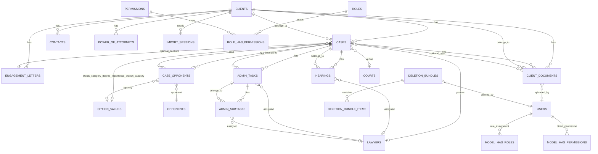

# OPAL PROMPT — Centralized Litigation Management (CLMS)

## Index
- [A. Product Vision](#a-product-vision)
- [B. Canonical Data Model](#b-canonical-data-model)
  - [B1. Entity Table](#b1-entity-table)
  - [B2. Machine-Readable Schema](#b2-machine-readable-schema-authoritative)
- [C. RBAC & Security](#c-rbac--security)
- [D. Validations](#d-validations)
- [E. Workflows](#e-workflows)
- [F. UI/UX — Screens](#f-uiux--screens)
- [G. APIs & Integrations](#g-apis--integrations)
- [H. Non-Functional Requirements](#h-non-functional-requirements)
- [I. DevOps & Deployment](#i-devops--deployment)
- [J. Data Import/Export](#j-data-importexport)
- [K. Gaps & Assumptions](#k-gaps--assumptions)
- [Appendix — Mermaid ERD](#appendix--mermaid-erd)
- [Appendix — Roles × Permissions](#appendix--roles--permissions)
- [Appendix — Screen Inventory](#appendix--screen-inventory)
- [Appendix — Authoritative DDL](#appendix--authoritative-ddl)
- [Acceptance Checklist](#acceptance-checklist)

### A. Product Vision
- Deliver a centralized bilingual (English/Arabic with RTL) litigation management platform for a single law firm in Egypt (timezone Africa/Cairo), replacing legacy MS Access spreadsheets with a secure web system.
- Support end-to-end case lifecycle (clients, matters, hearings, documents, administrative tasks) with enterprise controls: RBAC, audit logging, signed downloads, restorable trash, and rigorous data migration tooling.
- Operate on Laravel 10.49.1, PHP 8.4, MySQL 9.1.0, Bootstrap 5, while remaining compatible with GoDaddy-style shared hosting constraints and future integrations (Outlook, SMS, billing).

### B. Canonical Data Model

#### B1. Entity Table
| Entity | Purpose | Key Fields | Required | Unique | Relations |
|---|---|---|---|---|---|
| Client | Organization or individual retaining the firm | client_name_ar, client_name_en, status_id, contact_lawyer_id | client_name_(ar or en), status_id | client_code | 1..n cases, contacts, engagement_letters, power_of_attorneys, documents |
| Case | Litigated matter with full lifecycle metadata | client_id, matter_name_ar, matter_name_en, matter_status_id, court_id, opponent refs | client_id, matter_name_(ar or en) | id (legacy), optional engagement_letter_no | n..m opponents via case_opponents, 1..n hearings, admin_tasks, documents |
| Hearing | Court session scheduled within a case | matter_id, date, decision, next_hearing | matter_id, date | — | belongs to case, optional lawyer |
| AdminTask | Administrative follow-up linked to case | matter_id, required_work, status | matter_id | — | has many admin_subtasks, optional lawyer |
| AdminSubtask | Granular task step | task_id, performer | task_id | — | belongs to admin_task |
| ClientDocument | Metadata for physical/digital documents | client_id, document_storage_type, document_type, deposit_date | client_id, document_storage_type, deposit_date | — | belongs to client, optional case |
| Lawyer | Firm lawyer/staff profile | lawyer_name_ar/en, title_id | lawyer_name_(ar or en) | — | assigned to hearings, tasks, partner on cases |
| Opponent | Counterparty directory | opponent_name_ar/en, is_active | — | — | n..m cases via case_opponents |
| CaseOpponent | Pivot mapping opponents to cases | case_id, opponent_id, capacity_id, is_primary | case_id, opponent_id | — | belongs to case & opponent |
| OptionSet/OptionValue | Lookup catalogs (statuses, capacities, circuits) | key, name_en/ar; code, label_en/ar | key; set_id, code | key | referenced by many FKs |
| DeletionBundle | Trash snapshot root | id (UUID), root_type, root_id, snapshot_json | root_type, root_id, snapshot_json | id | has many deletion_bundle_items |
| DeletionBundleItem | Snapshot entry in bundle | bundle_id, model, payload_json | bundle_id, model | id | belongs to deletion_bundle |
| ImportSession | Tracks ETL runs | session_id, table_name, status | session_id, table_name, status | session_id | has many import_choices |
| EngagementLetter | Fee agreement | client_id, contract_date, status | client_id | — | optional 1..n cases |
| PowerOfAttorney | POA record | client_id, principal_name | client_id, principal_name | — | belongs to client |
| Contact | Client contact person | client_id, email | client_id | — | belongs to client |

#### B2. Machine-Readable Schema (authoritative)
```sql
-- activity_log

  `id` bigint UNSIGNED NOT NULL AUTO_INCREMENT,
  `log_name` varchar(191) COLLATE utf8mb4_unicode_ci DEFAULT NULL,
  `description` text COLLATE utf8mb4_unicode_ci NOT NULL,
  `subject_type` varchar(191) COLLATE utf8mb4_unicode_ci DEFAULT NULL,
  `event` varchar(191) COLLATE utf8mb4_unicode_ci DEFAULT NULL,
  `subject_id` bigint UNSIGNED DEFAULT NULL,
  `causer_type` varchar(191) COLLATE utf8mb4_unicode_ci DEFAULT NULL,
  `causer_id` bigint UNSIGNED DEFAULT NULL,
  `properties` json DEFAULT NULL,
  `batch_uuid` char(36) COLLATE utf8mb4_unicode_ci DEFAULT NULL,
  `created_at` timestamp NULL DEFAULT NULL,
  `updated_at` timestamp NULL DEFAULT NULL,
  PRIMARY KEY (`id`),
  KEY `subject` (`subject_type`,`subject_id`),
  KEY `causer` (`causer_type`,`causer_id`),
  KEY `activity_log_log_name_index` (`log_name`)
);

-- admin_subtasks

  `id` int NOT NULL,
  `task_id` bigint UNSIGNED NOT NULL,
  `lawyer_id` bigint UNSIGNED DEFAULT NULL,
  `performer` varchar(191) COLLATE utf8mb4_unicode_ci DEFAULT NULL,
  `next_date` date DEFAULT NULL,
  `result` text COLLATE utf8mb4_unicode_ci,
  `procedure_date` date DEFAULT NULL,
  `report` tinyint(1) NOT NULL DEFAULT '0',
  `created_by` bigint UNSIGNED DEFAULT NULL,
  `updated_by` bigint UNSIGNED DEFAULT NULL,
  `created_at` timestamp NULL DEFAULT NULL,
  `updated_at` timestamp NULL DEFAULT NULL,
  `deleted_at` timestamp NULL DEFAULT NULL,
  PRIMARY KEY (`id`),
  KEY `admin_subtasks_task_id_index` (`task_id`),
  KEY `admin_subtasks_lawyer_id_index` (`lawyer_id`),
  KEY `admin_subtasks_next_date_index` (`next_date`),
  KEY `admin_subtasks_created_by_foreign` (`created_by`),
  KEY `admin_subtasks_updated_by_foreign` (`updated_by`)
);

-- admin_tasks

  `id` int NOT NULL,
  `matter_id` bigint UNSIGNED NOT NULL,
  `lawyer_id` bigint UNSIGNED DEFAULT NULL,
  `last_follow_up` text COLLATE utf8mb4_unicode_ci,
  `last_date` date DEFAULT NULL,
  `authority` varchar(191) COLLATE utf8mb4_unicode_ci DEFAULT NULL,
  `status` varchar(191) COLLATE utf8mb4_unicode_ci DEFAULT NULL,
  `circuit` varchar(191) COLLATE utf8mb4_unicode_ci DEFAULT NULL,
  `required_work` text COLLATE utf8mb4_unicode_ci,
  `performer` varchar(191) COLLATE utf8mb4_unicode_ci DEFAULT NULL,
  `previous_decision` text COLLATE utf8mb4_unicode_ci,
  `court` varchar(191) COLLATE utf8mb4_unicode_ci DEFAULT NULL,
  `result` text COLLATE utf8mb4_unicode_ci,
  `creation_date` datetime DEFAULT NULL,
  `execution_date` datetime DEFAULT NULL,
  `alert` tinyint(1) NOT NULL DEFAULT '0',
  `created_by` bigint UNSIGNED DEFAULT NULL,
  `updated_by` bigint UNSIGNED DEFAULT NULL,
  `created_at` timestamp NULL DEFAULT NULL,
  `updated_at` timestamp NULL DEFAULT NULL,
  `deleted_at` timestamp NULL DEFAULT NULL,
  PRIMARY KEY (`id`),
  KEY `admin_tasks_matter_id_status_index` (`matter_id`,`status`),
  KEY `admin_tasks_lawyer_id_index` (`lawyer_id`),
  KEY `admin_tasks_execution_date_index` (`execution_date`),
  KEY `admin_tasks_created_by_foreign` (`created_by`),
  KEY `admin_tasks_updated_by_foreign` (`updated_by`)
);

-- cases

  `id` int NOT NULL,
  `client_id` bigint UNSIGNED NOT NULL,
  `client_in_case_name` varchar(191) COLLATE utf8mb4_unicode_ci DEFAULT NULL,
  `opponent_in_case_name` varchar(191) COLLATE utf8mb4_unicode_ci DEFAULT NULL,
  `contract_id` bigint UNSIGNED DEFAULT NULL,
  `engagement_letter_no` varchar(191) COLLATE utf8mb4_unicode_ci DEFAULT NULL,
  `matter_name_ar` varchar(191) COLLATE utf8mb4_unicode_ci NOT NULL,
  `matter_name_en` varchar(191) COLLATE utf8mb4_unicode_ci NOT NULL,
  `matter_description` text COLLATE utf8mb4_unicode_ci,
  `matter_status` varchar(191) COLLATE utf8mb4_unicode_ci DEFAULT NULL,
  `matter_status_id` bigint UNSIGNED DEFAULT NULL,
  `matter_category` varchar(191) COLLATE utf8mb4_unicode_ci DEFAULT NULL,
  `matter_category_id` bigint UNSIGNED DEFAULT NULL,
  `court_id` bigint UNSIGNED DEFAULT NULL,
  `circuit_name_id` bigint UNSIGNED DEFAULT NULL,
  `circuit_serial_id` bigint UNSIGNED DEFAULT NULL,
  `circuit_shift_id` bigint UNSIGNED DEFAULT '221',
  `matter_circuit_legacy` bigint UNSIGNED DEFAULT NULL,
  `circuit_secretary` bigint UNSIGNED DEFAULT NULL,
  `court_floor` bigint UNSIGNED DEFAULT NULL,
  `court_hall` bigint UNSIGNED DEFAULT NULL,
  `matter_degree` varchar(191) COLLATE utf8mb4_unicode_ci DEFAULT NULL,
  `matter_degree_id` bigint UNSIGNED DEFAULT NULL,
  `matter_court_text` varchar(191) COLLATE utf8mb4_unicode_ci DEFAULT NULL,
  `matter_destination` varchar(191) COLLATE utf8mb4_unicode_ci DEFAULT NULL,
  `matter_destination_id` bigint UNSIGNED DEFAULT NULL,
  `matter_importance` varchar(191) COLLATE utf8mb4_unicode_ci DEFAULT NULL,
  `matter_importance_id` bigint UNSIGNED DEFAULT NULL,
  `matter_evaluation` varchar(191) COLLATE utf8mb4_unicode_ci DEFAULT NULL,
  `matter_start_date` date DEFAULT NULL,
  `matter_end_date` date DEFAULT NULL,
  `matter_asked_amount` decimal(15,2) DEFAULT NULL,
  `matter_judged_amount` decimal(15,2) DEFAULT NULL,
  `matter_shelf` varchar(10) COLLATE utf8mb4_unicode_ci DEFAULT NULL,
  `matter_partner` varchar(191) COLLATE utf8mb4_unicode_ci DEFAULT NULL,
  `matter_partner_id` bigint UNSIGNED DEFAULT NULL,
  `lawyer_a` varchar(191) COLLATE utf8mb4_unicode_ci DEFAULT NULL,
  `lawyer_b` varchar(191) COLLATE utf8mb4_unicode_ci DEFAULT NULL,
  `fee_letter` decimal(15,2) DEFAULT NULL,
  `allocated_budget` text COLLATE utf8mb4_unicode_ci,
  `team_id` int DEFAULT NULL,
  `legal_opinion` text COLLATE utf8mb4_unicode_ci,
  `financial_provision` text COLLATE utf8mb4_unicode_ci,
  `current_status` text COLLATE utf8mb4_unicode_ci,
  `notes_1` text COLLATE utf8mb4_unicode_ci,
  `notes_2` text COLLATE utf8mb4_unicode_ci,
  `client_and_capacity` text COLLATE utf8mb4_unicode_ci,
  `client_capacity_id` bigint UNSIGNED DEFAULT NULL,
  `opponent_and_capacity` text COLLATE utf8mb4_unicode_ci,
  `opponent_id` bigint UNSIGNED DEFAULT NULL,
  `opponent_capacity_id` bigint UNSIGNED DEFAULT NULL,
  `client_branch` varchar(191) COLLATE utf8mb4_unicode_ci DEFAULT NULL,
  `matter_branch_id` bigint UNSIGNED DEFAULT NULL,
  `client_type` varchar(191) COLLATE utf8mb4_unicode_ci DEFAULT NULL,
  `client_type_id` bigint UNSIGNED DEFAULT NULL,
  `matter_select` tinyint(1) NOT NULL DEFAULT '1',
  `created_by` bigint UNSIGNED DEFAULT NULL,
  `updated_by` bigint UNSIGNED DEFAULT NULL,
  `created_at` timestamp NULL DEFAULT NULL,
  `updated_at` timestamp NULL DEFAULT NULL,
  `deleted_at` timestamp NULL DEFAULT NULL,
  `client_capacity_note` text COLLATE utf8mb4_unicode_ci,
  `opponent_capacity_note` text COLLATE utf8mb4_unicode_ci,
  PRIMARY KEY (`id`),
  KEY `cases_client_id_matter_status_index` (`client_id`,`matter_status`),
  KEY `cases_matter_name_ar_index` (`matter_name_ar`),
  KEY `cases_matter_name_en_index` (`matter_name_en`),
  KEY `cases_matter_status_index` (`matter_status`),
  KEY `cases_matter_start_date_index` (`matter_start_date`),
  KEY `cases_contract_id_index` (`contract_id`),
  KEY `cases_created_by_foreign` (`created_by`),
  KEY `cases_updated_by_foreign` (`updated_by`),
  KEY `cases_court_id_foreign` (`court_id`),
  KEY `cases_circuit_secretary_foreign` (`circuit_secretary`),
  KEY `cases_court_floor_foreign` (`court_floor`),
  KEY `cases_court_hall_foreign` (`court_hall`),
  KEY `cases_circuit_name_id_index` (`circuit_name_id`),
  KEY `cases_circuit_serial_id_index` (`circuit_serial_id`),
  KEY `cases_circuit_shift_id_index` (`circuit_shift_id`),
  KEY `cases_matter_category_id_foreign` (`matter_category_id`),
  KEY `cases_matter_degree_id_foreign` (`matter_degree_id`),
  KEY `cases_matter_status_id_foreign` (`matter_status_id`),
  KEY `cases_matter_importance_id_foreign` (`matter_importance_id`),
  KEY `cases_matter_branch_id_foreign` (`matter_branch_id`),
  KEY `cases_client_capacity_id_foreign` (`client_capacity_id`),
  KEY `cases_client_type_id_foreign` (`client_type_id`),
  KEY `cases_opponent_capacity_id_foreign` (`opponent_capacity_id`),
  KEY `cases_matter_destination_id_foreign` (`matter_destination_id`),
  KEY `cases_matter_partner_id_foreign` (`matter_partner_id`),
  KEY `cases_opponent_id_foreign` (`opponent_id`)
);

-- clients

  `id` int NOT NULL,
  `mfiles_id` int DEFAULT NULL COMMENT 'MFiles system identifier',
  `client_code` varchar(50) COLLATE utf8mb4_unicode_ci DEFAULT NULL COMMENT 'Unique client code for identification',
  `client_name_ar` varchar(191) COLLATE utf8mb4_unicode_ci NOT NULL,
  `client_name_en` varchar(191) COLLATE utf8mb4_unicode_ci DEFAULT NULL,
  `client_print_name` varchar(191) COLLATE utf8mb4_unicode_ci NOT NULL,
  `status` varchar(191) COLLATE utf8mb4_unicode_ci DEFAULT 'Active',
  `cash_or_probono` varchar(191) COLLATE utf8mb4_unicode_ci DEFAULT NULL,
  `client_start` date DEFAULT NULL,
  `client_end` date DEFAULT NULL,
  `contact_lawyer` varchar(191) COLLATE utf8mb4_unicode_ci DEFAULT NULL,
  `contact_lawyer_id` bigint UNSIGNED DEFAULT NULL,
  `logo` varchar(191) COLLATE utf8mb4_unicode_ci DEFAULT NULL,
  `power_of_attorney_location` varchar(191) COLLATE utf8mb4_unicode_ci DEFAULT NULL,
  `documents_location` varchar(191) COLLATE utf8mb4_unicode_ci DEFAULT NULL,
  `created_by` bigint UNSIGNED DEFAULT NULL,
  `updated_by` bigint UNSIGNED DEFAULT NULL,
  `created_at` timestamp NULL DEFAULT NULL,
  `updated_at` timestamp NULL DEFAULT NULL,
  `deleted_at` timestamp NULL DEFAULT NULL,
  `cash_or_probono_id` bigint UNSIGNED DEFAULT NULL,
  `status_id` bigint UNSIGNED DEFAULT NULL,
  `power_of_attorney_location_id` bigint UNSIGNED DEFAULT NULL,
  `documents_location_id` bigint UNSIGNED DEFAULT NULL,
  PRIMARY KEY (`id`),
  UNIQUE KEY `clients_client_code_unique` (`client_code`),
  KEY `clients_client_name_ar_index` (`client_name_ar`),
  KEY `clients_client_name_en_index` (`client_name_en`),
  KEY `clients_status_index` (`status`),
  KEY `clients_client_start_index` (`client_start`),
  KEY `clients_created_by_foreign` (`created_by`),
  KEY `clients_updated_by_foreign` (`updated_by`),
  KEY `clients_cash_or_probono_id_index` (`cash_or_probono_id`),
  KEY `clients_status_id_index` (`status_id`),
  KEY `clients_power_of_attorney_location_id_index` (`power_of_attorney_location_id`),
  KEY `clients_documents_location_id_index` (`documents_location_id`),
  KEY `clients_contact_lawyer_id_index` (`contact_lawyer_id`)
);

-- client_documents

  `id` int NOT NULL,
  `client_id` bigint UNSIGNED NOT NULL,
  `matter_id` bigint UNSIGNED DEFAULT NULL,
  `client_name` varchar(191) COLLATE utf8mb4_unicode_ci DEFAULT NULL,
  `document_name` varchar(191) COLLATE utf8mb4_unicode_ci DEFAULT NULL,
  `document_type` varchar(191) COLLATE utf8mb4_unicode_ci DEFAULT NULL,
  `file_path` varchar(191) COLLATE utf8mb4_unicode_ci DEFAULT NULL,
  `file_size` bigint DEFAULT NULL,
  `mime_type` varchar(191) COLLATE utf8mb4_unicode_ci DEFAULT NULL,
  `document_storage_type` enum('physical','digital','both') COLLATE utf8mb4_unicode_ci NOT NULL DEFAULT 'physical',
  `mfiles_uploaded` tinyint(1) NOT NULL DEFAULT '0',
  `mfiles_id` varchar(191) COLLATE utf8mb4_unicode_ci DEFAULT NULL,
  `responsible_lawyer` varchar(191) COLLATE utf8mb4_unicode_ci DEFAULT NULL,
  `movement_card` tinyint(1) NOT NULL DEFAULT '0',
  `document_description` text COLLATE utf8mb4_unicode_ci,
  `deposit_date` date NOT NULL,
  `document_date` date DEFAULT NULL,
  `case_number` varchar(191) COLLATE utf8mb4_unicode_ci DEFAULT NULL,
  `pages_count` varchar(191) COLLATE utf8mb4_unicode_ci DEFAULT NULL,
  `notes` text COLLATE utf8mb4_unicode_ci,
  `created_by` bigint UNSIGNED DEFAULT NULL,
  `updated_by` bigint UNSIGNED DEFAULT NULL,
  `created_at` timestamp NULL DEFAULT NULL,
  `updated_at` timestamp NULL DEFAULT NULL,
  `deleted_at` timestamp NULL DEFAULT NULL,
  PRIMARY KEY (`id`),
  KEY `client_documents_matter_id_foreign` (`matter_id`),
  KEY `client_documents_client_id_matter_id_deposit_date_index` (`client_id`,`matter_id`,`deposit_date`),
  KEY `client_documents_deposit_date_index` (`deposit_date`),
  KEY `client_documents_created_by_foreign` (`created_by`),
  KEY `client_documents_updated_by_foreign` (`updated_by`),
  KEY `client_documents_document_type_index` (`document_type`),
  KEY `client_documents_mime_type_index` (`mime_type`)
);

-- contacts

  `id` int NOT NULL,
  `client_id` bigint UNSIGNED NOT NULL,
  `contact_name` varchar(191) COLLATE utf8mb4_unicode_ci DEFAULT NULL,
  `full_name` varchar(191) COLLATE utf8mb4_unicode_ci DEFAULT NULL,
  `job_title` varchar(191) COLLATE utf8mb4_unicode_ci DEFAULT NULL,
  `address` varchar(191) COLLATE utf8mb4_unicode_ci DEFAULT NULL,
  `city` varchar(191) COLLATE utf8mb4_unicode_ci DEFAULT NULL,
  `state` varchar(191) COLLATE utf8mb4_unicode_ci DEFAULT NULL,
  `country` varchar(191) COLLATE utf8mb4_unicode_ci DEFAULT NULL,
  `zip_code` varchar(191) COLLATE utf8mb4_unicode_ci DEFAULT NULL,
  `business_phone` varchar(191) COLLATE utf8mb4_unicode_ci DEFAULT NULL,
  `home_phone` varchar(191) COLLATE utf8mb4_unicode_ci DEFAULT NULL,
  `mobile_phone` varchar(191) COLLATE utf8mb4_unicode_ci DEFAULT NULL,
  `fax_number` varchar(191) COLLATE utf8mb4_unicode_ci DEFAULT NULL,
  `email` varchar(191) COLLATE utf8mb4_unicode_ci DEFAULT NULL,
  `web_page` varchar(191) COLLATE utf8mb4_unicode_ci DEFAULT NULL,
  `attachments` text COLLATE utf8mb4_unicode_ci,
  `created_by` bigint UNSIGNED DEFAULT NULL,
  `updated_by` bigint UNSIGNED DEFAULT NULL,
  `created_at` timestamp NULL DEFAULT NULL,
  `updated_at` timestamp NULL DEFAULT NULL,
  `deleted_at` timestamp NULL DEFAULT NULL,
  PRIMARY KEY (`id`),
  KEY `contacts_client_id_index` (`client_id`),
  KEY `contacts_email_index` (`email`),
  KEY `contacts_created_by_foreign` (`created_by`),
  KEY `contacts_updated_by_foreign` (`updated_by`)
);

-- courts

  `id` int NOT NULL,
  `court_name_ar` varchar(191) COLLATE utf8mb4_unicode_ci DEFAULT NULL,
  `court_name_en` varchar(191) COLLATE utf8mb4_unicode_ci DEFAULT NULL,
  `is_active` tinyint(1) NOT NULL DEFAULT '1',
  `created_by` bigint UNSIGNED DEFAULT NULL,
  `updated_by` bigint UNSIGNED DEFAULT NULL,
  `created_at` timestamp NULL DEFAULT NULL,
  `updated_at` timestamp NULL DEFAULT NULL,
  `deleted_at` timestamp NULL DEFAULT NULL,
  PRIMARY KEY (`id`),
  KEY `courts_court_name_ar_index` (`court_name_ar`),
  KEY `courts_court_name_en_index` (`court_name_en`),
  KEY `courts_is_active_index` (`is_active`),
  KEY `courts_created_by_foreign` (`created_by`),
  KEY `courts_updated_by_foreign` (`updated_by`)
);

-- court_circuit

  `id` bigint UNSIGNED NOT NULL AUTO_INCREMENT,
  `court_id` bigint UNSIGNED NOT NULL,
  `circuit_name_id` bigint UNSIGNED NOT NULL,
  `circuit_serial_id` bigint UNSIGNED DEFAULT NULL,
  `circuit_shift_id` bigint UNSIGNED NOT NULL,
  `created_at` timestamp NULL DEFAULT NULL,
  `updated_at` timestamp NULL DEFAULT NULL,
  PRIMARY KEY (`id`),
  UNIQUE KEY `unique_court_circuit_combo` (`court_id`,`circuit_name_id`,`circuit_serial_id`,`circuit_shift_id`),
  KEY `court_circuit_court_id_index` (`court_id`),
  KEY `court_circuit_circuit_name_id_index` (`circuit_name_id`),
  KEY `court_circuit_circuit_serial_id_index` (`circuit_serial_id`),
  KEY `court_circuit_circuit_shift_id_index` (`circuit_shift_id`)
);

-- court_floor

  `id` bigint UNSIGNED NOT NULL AUTO_INCREMENT,
  `court_id` bigint UNSIGNED NOT NULL,
  `option_value_id` bigint UNSIGNED NOT NULL,
  `created_at` timestamp NULL DEFAULT NULL,
  `updated_at` timestamp NULL DEFAULT NULL,
  PRIMARY KEY (`id`),
  UNIQUE KEY `court_floor_court_id_option_value_id_unique` (`court_id`,`option_value_id`),
  KEY `court_floor_court_id_index` (`court_id`),
  KEY `court_floor_option_value_id_index` (`option_value_id`)
);

-- court_hall

  `id` bigint UNSIGNED NOT NULL AUTO_INCREMENT,
  `court_id` bigint UNSIGNED NOT NULL,
  `option_value_id` bigint UNSIGNED NOT NULL,
  `created_at` timestamp NULL DEFAULT NULL,
  `updated_at` timestamp NULL DEFAULT NULL,
  PRIMARY KEY (`id`),
  UNIQUE KEY `court_hall_court_id_option_value_id_unique` (`court_id`,`option_value_id`),
  KEY `court_hall_court_id_index` (`court_id`),
  KEY `court_hall_option_value_id_index` (`option_value_id`)
);

-- court_secretary

  `id` bigint UNSIGNED NOT NULL AUTO_INCREMENT,
  `court_id` bigint UNSIGNED NOT NULL,
  `option_value_id` bigint UNSIGNED NOT NULL,
  `created_at` timestamp NULL DEFAULT NULL,
  `updated_at` timestamp NULL DEFAULT NULL,
  PRIMARY KEY (`id`),
  UNIQUE KEY `court_secretary_court_id_option_value_id_unique` (`court_id`,`option_value_id`),
  KEY `court_secretary_court_id_index` (`court_id`),
  KEY `court_secretary_option_value_id_index` (`option_value_id`)
);

-- deletion_bundles

  `id` char(36) COLLATE utf8mb4_unicode_ci NOT NULL,
  `root_type` varchar(191) COLLATE utf8mb4_unicode_ci NOT NULL,
  `root_id` bigint UNSIGNED NOT NULL,
  `root_label` varchar(191) COLLATE utf8mb4_unicode_ci NOT NULL,
  `snapshot_json` json NOT NULL,
  `files_json` json DEFAULT NULL,
  `cascade_count` int NOT NULL DEFAULT '0',
  `deleted_by` bigint UNSIGNED NOT NULL,
  `reason` text COLLATE utf8mb4_unicode_ci,
  `status` enum('trashed','restored','purged') COLLATE utf8mb4_unicode_ci NOT NULL DEFAULT 'trashed',
  `ttl_at` datetime DEFAULT NULL,
  `restored_at` datetime DEFAULT NULL,
  `restore_notes` text COLLATE utf8mb4_unicode_ci,
  `created_at` timestamp NULL DEFAULT NULL,
  `updated_at` timestamp NULL DEFAULT NULL,
  PRIMARY KEY (`id`),
  KEY `deletion_bundles_root_type_root_id_index` (`root_type`,`root_id`),
  KEY `deletion_bundles_status_index` (`status`),
  KEY `deletion_bundles_deleted_by_index` (`deleted_by`),
  KEY `deletion_bundles_ttl_at_index` (`ttl_at`),
  KEY `deletion_bundles_created_at_index` (`created_at`)
);

-- deletion_bundle_items

  `id` char(36) COLLATE utf8mb4_unicode_ci NOT NULL,
  `bundle_id` char(36) COLLATE utf8mb4_unicode_ci NOT NULL,
  `model` varchar(191) COLLATE utf8mb4_unicode_ci NOT NULL,
  `model_id` bigint UNSIGNED DEFAULT NULL,
  `payload_json` json NOT NULL,
  `created_at` timestamp NULL DEFAULT NULL,
  `updated_at` timestamp NULL DEFAULT NULL,
  PRIMARY KEY (`id`),
  KEY `deletion_bundle_items_bundle_id_index` (`bundle_id`),
  KEY `deletion_bundle_items_model_model_id_index` (`model`,`model_id`)
);

-- engagement_letters

  `id` int NOT NULL,
  `client_id` bigint UNSIGNED NOT NULL,
  `client_name` varchar(191) COLLATE utf8mb4_unicode_ci DEFAULT NULL,
  `contract_date` datetime DEFAULT NULL,
  `contract_details` text COLLATE utf8mb4_unicode_ci,
  `contract_structure` text COLLATE utf8mb4_unicode_ci,
  `contract_type` varchar(191) COLLATE utf8mb4_unicode_ci DEFAULT NULL,
  `matters` text COLLATE utf8mb4_unicode_ci,
  `status` varchar(191) COLLATE utf8mb4_unicode_ci DEFAULT NULL,
  `mfiles_id` int DEFAULT NULL,
  `created_by` bigint UNSIGNED DEFAULT NULL,
  `updated_by` bigint UNSIGNED DEFAULT NULL,
  `created_at` timestamp NULL DEFAULT NULL,
  `updated_at` timestamp NULL DEFAULT NULL,
  `deleted_at` timestamp NULL DEFAULT NULL,
  PRIMARY KEY (`id`),
  KEY `engagement_letters_client_id_index` (`client_id`),
  KEY `engagement_letters_contract_date_index` (`contract_date`),
  KEY `engagement_letters_status_index` (`status`),
  KEY `engagement_letters_created_by_foreign` (`created_by`),
  KEY `engagement_letters_updated_by_foreign` (`updated_by`)
);

-- failed_jobs

  `id` bigint UNSIGNED NOT NULL AUTO_INCREMENT,
  `uuid` varchar(191) COLLATE utf8mb4_unicode_ci NOT NULL,
  `connection` text COLLATE utf8mb4_unicode_ci NOT NULL,
  `queue` text COLLATE utf8mb4_unicode_ci NOT NULL,
  `payload` longtext COLLATE utf8mb4_unicode_ci NOT NULL,
  `exception` longtext COLLATE utf8mb4_unicode_ci NOT NULL,
  `failed_at` timestamp NOT NULL DEFAULT CURRENT_TIMESTAMP,
  PRIMARY KEY (`id`),
  UNIQUE KEY `failed_jobs_uuid_unique` (`uuid`)
);

-- hearings

  `id` int NOT NULL,
  `matter_id` bigint UNSIGNED NOT NULL,
  `lawyer_id` bigint UNSIGNED DEFAULT NULL,
  `date` date DEFAULT NULL,
  `procedure` varchar(191) COLLATE utf8mb4_unicode_ci DEFAULT NULL,
  `court` varchar(191) COLLATE utf8mb4_unicode_ci DEFAULT NULL,
  `circuit` varchar(191) COLLATE utf8mb4_unicode_ci DEFAULT NULL,
  `destination` varchar(191) COLLATE utf8mb4_unicode_ci DEFAULT NULL,
  `decision` text COLLATE utf8mb4_unicode_ci,
  `short_decision` varchar(191) COLLATE utf8mb4_unicode_ci DEFAULT NULL,
  `last_decision` varchar(191) COLLATE utf8mb4_unicode_ci DEFAULT NULL,
  `next_hearing` date DEFAULT NULL,
  `report` tinyint(1) NOT NULL DEFAULT '0',
  `notify_client` tinyint(1) NOT NULL DEFAULT '0',
  `attendee` varchar(191) COLLATE utf8mb4_unicode_ci DEFAULT NULL,
  `attendee_1` varchar(191) COLLATE utf8mb4_unicode_ci DEFAULT NULL,
  `attendee_2` varchar(191) COLLATE utf8mb4_unicode_ci DEFAULT NULL,
  `attendee_3` varchar(191) COLLATE utf8mb4_unicode_ci DEFAULT NULL,
  `attendee_4` varchar(191) COLLATE utf8mb4_unicode_ci DEFAULT NULL,
  `next_attendee` varchar(191) COLLATE utf8mb4_unicode_ci DEFAULT NULL,
  `evaluation` varchar(191) COLLATE utf8mb4_unicode_ci DEFAULT NULL,
  `notes` text COLLATE utf8mb4_unicode_ci,
  `created_by` bigint UNSIGNED DEFAULT NULL,
  `updated_by` bigint UNSIGNED DEFAULT NULL,
  `created_at` timestamp NULL DEFAULT NULL,
  `updated_at` timestamp NULL DEFAULT NULL,
  `deleted_at` timestamp NULL DEFAULT NULL,
  PRIMARY KEY (`id`),
  KEY `hearings_matter_id_date_index` (`matter_id`,`date`),
  KEY `hearings_next_hearing_index` (`next_hearing`),
  KEY `hearings_lawyer_id_index` (`lawyer_id`),
  KEY `hearings_created_by_foreign` (`created_by`),
  KEY `hearings_updated_by_foreign` (`updated_by`)
);

-- import_sessions

  `id` bigint UNSIGNED NOT NULL AUTO_INCREMENT,
  `session_id` varchar(36) COLLATE utf8mb4_unicode_ci NOT NULL,
  `table_name` varchar(64) COLLATE utf8mb4_unicode_ci NOT NULL,
  `original_filename` varchar(191) COLLATE utf8mb4_unicode_ci NOT NULL,
  `stored_filename` varchar(191) COLLATE utf8mb4_unicode_ci NOT NULL,
  `status` enum('uploaded','mapped','validated','importing','completed','failed','cancelled') COLLATE utf8mb4_unicode_ci NOT NULL DEFAULT 'uploaded',
  `file_type` varchar(10) COLLATE utf8mb4_unicode_ci NOT NULL,
  `file_size` int UNSIGNED NOT NULL,
  `file_hash` varchar(64) COLLATE utf8mb4_unicode_ci NOT NULL,
  `total_rows` int UNSIGNED DEFAULT NULL,
  `header_row` int UNSIGNED NOT NULL DEFAULT '1',
  `column_mapping` json DEFAULT NULL,
  `transforms` json DEFAULT NULL,
  `preflight_errors` json DEFAULT NULL,
  `preflight_error_count` int UNSIGNED NOT NULL DEFAULT '0',
  `preflight_warning_count` int UNSIGNED NOT NULL DEFAULT '0',
  `imported_count` int UNSIGNED NOT NULL DEFAULT '0',
  `failed_count` int UNSIGNED NOT NULL DEFAULT '0',
  `skipped_count` int UNSIGNED NOT NULL DEFAULT '0',
  `import_errors` json DEFAULT NULL,
  `backup_file` varchar(191) COLLATE utf8mb4_unicode_ci DEFAULT NULL,
  `backup_size` bigint UNSIGNED DEFAULT NULL,
  `backup_created_at` timestamp NULL DEFAULT NULL,
  `started_at` timestamp NULL DEFAULT NULL,
  `completed_at` timestamp NULL DEFAULT NULL,
  `duration_seconds` int UNSIGNED DEFAULT NULL,
  `user_id` bigint UNSIGNED NOT NULL,
  `created_at` timestamp NULL DEFAULT NULL,
  `updated_at` timestamp NULL DEFAULT NULL,
  `deleted_at` timestamp NULL DEFAULT NULL,
  PRIMARY KEY (`id`),
  UNIQUE KEY `import_sessions_session_id_unique` (`session_id`),
  KEY `import_sessions_user_id_created_at_index` (`user_id`,`created_at`),
  KEY `import_sessions_created_at_index` (`created_at`),
  KEY `import_sessions_table_name_index` (`table_name`),
  KEY `import_sessions_status_index` (`status`)
);

-- lawyers

  `id` int NOT NULL,
  `lawyer_name_ar` varchar(191) COLLATE utf8mb4_unicode_ci NOT NULL,
  `lawyer_name_en` varchar(191) COLLATE utf8mb4_unicode_ci NOT NULL,
  `lawyer_name_title` varchar(191) COLLATE utf8mb4_unicode_ci DEFAULT NULL,
  `title_id` bigint UNSIGNED DEFAULT NULL,
  `lawyer_email` varchar(191) COLLATE utf8mb4_unicode_ci DEFAULT NULL,
  `attendance_track` tinyint(1) NOT NULL DEFAULT '0',
  `created_by` bigint UNSIGNED DEFAULT NULL,
  `updated_by` bigint UNSIGNED DEFAULT NULL,
  `created_at` timestamp NULL DEFAULT NULL,
  `updated_at` timestamp NULL DEFAULT NULL,
  `deleted_at` timestamp NULL DEFAULT NULL,
  PRIMARY KEY (`id`),
  KEY `lawyers_lawyer_name_ar_index` (`lawyer_name_ar`),
  KEY `lawyers_lawyer_name_en_index` (`lawyer_name_en`),
  KEY `lawyers_lawyer_email_index` (`lawyer_email`),
  KEY `lawyers_created_by_foreign` (`created_by`),
  KEY `lawyers_updated_by_foreign` (`updated_by`),
  KEY `lawyers_title_id_foreign` (`title_id`)
);

-- migrations

  `id` int UNSIGNED NOT NULL AUTO_INCREMENT,
  `migration` varchar(191) COLLATE utf8mb4_unicode_ci NOT NULL,
  `batch` int NOT NULL,
  PRIMARY KEY (`id`)
);

-- model_has_permissions

  `permission_id` bigint UNSIGNED NOT NULL,
  `model_type` varchar(191) COLLATE utf8mb4_unicode_ci NOT NULL,
  `model_id` bigint UNSIGNED NOT NULL,
  PRIMARY KEY (`permission_id`,`model_id`,`model_type`),
  KEY `model_has_permissions_model_id_model_type_index` (`model_id`,`model_type`)
);

-- model_has_roles

  `role_id` bigint UNSIGNED NOT NULL,
  `model_type` varchar(191) COLLATE utf8mb4_unicode_ci NOT NULL,
  `model_id` bigint UNSIGNED NOT NULL,
  PRIMARY KEY (`role_id`,`model_id`,`model_type`),
  KEY `model_has_roles_model_id_model_type_index` (`model_id`,`model_type`)
);

-- opponents

  `id` bigint UNSIGNED NOT NULL AUTO_INCREMENT,
  `opponent_name_ar` varchar(191) COLLATE utf8mb4_unicode_ci DEFAULT NULL,
  `opponent_name_en` varchar(191) COLLATE utf8mb4_unicode_ci DEFAULT NULL,
  `normalized_name` varchar(512) CHARACTER SET utf8mb4 COLLATE utf8mb4_unicode_ci DEFAULT NULL,
  `is_active` tinyint(1) NOT NULL DEFAULT '1',
  `description` text COLLATE utf8mb4_unicode_ci,
  `notes` text COLLATE utf8mb4_unicode_ci,
  `created_by` bigint UNSIGNED DEFAULT NULL,
  `updated_by` bigint UNSIGNED DEFAULT NULL,
  `created_at` timestamp NULL DEFAULT NULL,
  `updated_at` timestamp NULL DEFAULT NULL,
  `deleted_at` timestamp NULL DEFAULT NULL,
  `first_token` varchar(64) CHARACTER SET utf8mb4 COLLATE utf8mb4_unicode_ci DEFAULT NULL,
  `last_token` varchar(64) CHARACTER SET utf8mb4 COLLATE utf8mb4_unicode_ci DEFAULT NULL,
  `token_count` tinyint UNSIGNED DEFAULT NULL,
  `latin_key` varchar(64) CHARACTER SET utf8mb4 COLLATE utf8mb4_unicode_ci DEFAULT NULL,
  PRIMARY KEY (`id`),
  KEY `opponents_opponent_name_ar_index` (`opponent_name_ar`),
  KEY `opponents_opponent_name_en_index` (`opponent_name_en`),
  KEY `opponents_is_active_index` (`is_active`),
  KEY `opponents_created_by_foreign` (`created_by`),
  KEY `opponents_updated_by_foreign` (`updated_by`),
  KEY `opponents_normalized_name_prefix` (`normalized_name`(191)),
  KEY `opponents_first_token_index` (`first_token`),
  KEY `opponents_last_token_index` (`last_token`),
  KEY `opponents_token_count_index` (`token_count`),
  KEY `opponents_latin_key_index` (`latin_key`)
);

-- opponent_aliases

  `id` bigint UNSIGNED NOT NULL AUTO_INCREMENT,
  `opponent_id` bigint UNSIGNED NOT NULL,
  `alias_normalized` varchar(512) CHARACTER SET utf8mb4 COLLATE utf8mb4_unicode_ci NOT NULL,
  `created_at` timestamp NULL DEFAULT NULL,
  `updated_at` timestamp NULL DEFAULT NULL,
  PRIMARY KEY (`id`),
  UNIQUE KEY `opponent_alias_unique` (`opponent_id`,`alias_normalized`(191)),
  KEY `opponent_aliases_opponent_id_index` (`opponent_id`)
);

-- opponent_trigrams

  `opponent_id` bigint UNSIGNED NOT NULL,
  `tri` char(3) COLLATE utf8mb4_unicode_ci NOT NULL,
  PRIMARY KEY (`opponent_id`,`tri`),
  KEY `opponent_trigrams_tri_index` (`tri`)
);

-- option_sets

  `id` int NOT NULL,
  `key` varchar(191) COLLATE utf8mb4_unicode_ci NOT NULL,
  `name_en` varchar(191) COLLATE utf8mb4_unicode_ci NOT NULL,
  `name_ar` varchar(191) COLLATE utf8mb4_unicode_ci NOT NULL,
  `description_en` text COLLATE utf8mb4_unicode_ci,
  `description_ar` text COLLATE utf8mb4_unicode_ci,
  `is_active` tinyint(1) NOT NULL DEFAULT '1',
  `created_at` timestamp NULL DEFAULT NULL,
  `updated_at` timestamp NULL DEFAULT NULL,
  PRIMARY KEY (`id`),
  UNIQUE KEY `option_sets_key_unique` (`key`)
);

-- option_values

  `id` int NOT NULL AUTO_INCREMENT,
  `set_id` bigint UNSIGNED NOT NULL,
  `code` varchar(191) COLLATE utf8mb4_unicode_ci NOT NULL,
  `label_en` varchar(191) COLLATE utf8mb4_unicode_ci NOT NULL,
  `label_ar` varchar(191) COLLATE utf8mb4_unicode_ci NOT NULL,
  `position` int NOT NULL DEFAULT '0',
  `is_active` tinyint(1) NOT NULL DEFAULT '1',
  `created_at` timestamp NULL DEFAULT NULL,
  `updated_at` timestamp NULL DEFAULT NULL,
  PRIMARY KEY (`id`),
  UNIQUE KEY `option_values_set_id_code_unique` (`set_id`,`code`),
  KEY `option_values_set_id_is_active_position_index` (`set_id`,`is_active`,`position`)
);

-- password_resets

  `email` varchar(191) COLLATE utf8mb4_unicode_ci NOT NULL,
  `token` varchar(191) COLLATE utf8mb4_unicode_ci NOT NULL,
  `created_at` timestamp NULL DEFAULT NULL,
  KEY `password_resets_email_index` (`email`)
);

-- password_reset_tokens

  `email` varchar(191) COLLATE utf8mb4_unicode_ci NOT NULL,
  `token` varchar(191) COLLATE utf8mb4_unicode_ci NOT NULL,
  `created_at` timestamp NULL DEFAULT NULL,
  PRIMARY KEY (`email`)
);

-- permissions

  `id` bigint UNSIGNED NOT NULL AUTO_INCREMENT,
  `name` varchar(125) COLLATE utf8mb4_unicode_ci NOT NULL,
  `guard_name` varchar(125) COLLATE utf8mb4_unicode_ci NOT NULL,
  `created_at` timestamp NULL DEFAULT NULL,
  `updated_at` timestamp NULL DEFAULT NULL,
  PRIMARY KEY (`id`),
  UNIQUE KEY `permissions_name_guard_name_unique` (`name`,`guard_name`)
);

-- personal_access_tokens

  `id` bigint UNSIGNED NOT NULL AUTO_INCREMENT,
  `tokenable_type` varchar(191) COLLATE utf8mb4_unicode_ci NOT NULL,
  `tokenable_id` bigint UNSIGNED NOT NULL,
  `name` varchar(191) COLLATE utf8mb4_unicode_ci NOT NULL,
  `token` varchar(64) COLLATE utf8mb4_unicode_ci NOT NULL,
  `abilities` text COLLATE utf8mb4_unicode_ci,
  `last_used_at` timestamp NULL DEFAULT NULL,
  `expires_at` timestamp NULL DEFAULT NULL,
  `created_at` timestamp NULL DEFAULT NULL,
  `updated_at` timestamp NULL DEFAULT NULL,
  PRIMARY KEY (`id`),
  UNIQUE KEY `personal_access_tokens_token_unique` (`token`),
  KEY `personal_access_tokens_tokenable_type_tokenable_id_index` (`tokenable_type`,`tokenable_id`)
);

-- power_of_attorneys

  `id` int NOT NULL,
  `client_id` bigint UNSIGNED NOT NULL,
  `client_print_name` varchar(191) COLLATE utf8mb4_unicode_ci DEFAULT NULL,
  `principal_name` varchar(191) COLLATE utf8mb4_unicode_ci NOT NULL,
  `year` int DEFAULT NULL,
  `capacity` varchar(191) COLLATE utf8mb4_unicode_ci DEFAULT NULL,
  `authorized_lawyers` text COLLATE utf8mb4_unicode_ci,
  `issue_date` date DEFAULT NULL,
  `inventory` tinyint(1) NOT NULL DEFAULT '1',
  `issuing_authority` varchar(191) COLLATE utf8mb4_unicode_ci DEFAULT NULL,
  `letter` varchar(191) COLLATE utf8mb4_unicode_ci DEFAULT NULL,
  `poa_number` int DEFAULT NULL,
  `principal_capacity` varchar(191) COLLATE utf8mb4_unicode_ci DEFAULT NULL,
  `copies_count` int DEFAULT NULL,
  `serial` varchar(191) COLLATE utf8mb4_unicode_ci DEFAULT NULL,
  `notes` text COLLATE utf8mb4_unicode_ci,
  `created_by` bigint UNSIGNED DEFAULT NULL,
  `updated_by` bigint UNSIGNED DEFAULT NULL,
  `created_at` timestamp NULL DEFAULT NULL,
  `updated_at` timestamp NULL DEFAULT NULL,
  `deleted_at` timestamp NULL DEFAULT NULL,
  PRIMARY KEY (`id`),
  KEY `power_of_attorneys_client_id_index` (`client_id`),
  KEY `power_of_attorneys_issue_date_index` (`issue_date`),
  KEY `power_of_attorneys_poa_number_index` (`poa_number`),
  KEY `power_of_attorneys_created_by_foreign` (`created_by`),
  KEY `power_of_attorneys_updated_by_foreign` (`updated_by`)
);

-- roles

  `id` bigint UNSIGNED NOT NULL AUTO_INCREMENT,
  `name` varchar(125) COLLATE utf8mb4_unicode_ci NOT NULL,
  `guard_name` varchar(125) COLLATE utf8mb4_unicode_ci NOT NULL,
  `created_at` timestamp NULL DEFAULT NULL,
  `updated_at` timestamp NULL DEFAULT NULL,
  PRIMARY KEY (`id`),
  UNIQUE KEY `roles_name_guard_name_unique` (`name`,`guard_name`)
);

-- role_has_permissions

  `permission_id` bigint UNSIGNED NOT NULL,
  `role_id` bigint UNSIGNED NOT NULL,
  PRIMARY KEY (`permission_id`,`role_id`),
  KEY `role_has_permissions_role_id_foreign` (`role_id`)
);

-- users

  `id` bigint UNSIGNED NOT NULL AUTO_INCREMENT,
  `name` varchar(191) COLLATE utf8mb4_unicode_ci NOT NULL,
  `email` varchar(191) COLLATE utf8mb4_unicode_ci NOT NULL,
  `email_verified_at` timestamp NULL DEFAULT NULL,
  `password` varchar(191) COLLATE utf8mb4_unicode_ci NOT NULL,
  `locale` varchar(2) COLLATE utf8mb4_unicode_ci NOT NULL DEFAULT 'en',
  `remember_token` varchar(100) COLLATE utf8mb4_unicode_ci DEFAULT NULL,
  `created_at` timestamp NULL DEFAULT NULL,
  `updated_at` timestamp NULL DEFAULT NULL,
  PRIMARY KEY (`id`),
  UNIQUE KEY `users_email_unique` (`email`)
);
```

### C. RBAC & Security
- Roles: super_admin, admin, lawyer, staff, client_portal. Super admin manages users/roles, trash lifecycle, imports, audits; admin mirrors minus user/role management; lawyer/staff handle casework; client_portal reserved for future read-only portal.
- Permissions: cases.*, hearings.*, documents.view/upload/edit/delete, clients.*, trash.view/restore/purge, import.view/create/execute/cancel/delete/view_template, export.view/create/download, admin.users.manage, admin.roles.manage, admin.audit.view, admin.tools.manage, cases.opponents.view/edit/attach/detach.
- Enforce middleware per route and policies on controllers; document downloads use signed routes. Activity logging (Spatie) captures CRUD/trash actions with causer metadata. Sessions protected via CSRF, login throttling, secure cookies; timeout 120 minutes.
- Trash system snapshots deletions into JSON bundles (TTL 90 days) with dry-run restore and conflict strategies (skip, overwrite, new_copy) plus CLI tooling (`trash:list`, `trash:restore`, `trash:purge`).
- Secrets via `.env`; document uploads constrained to 10 MB MIME whitelist. Plan for future 2FA, IP whitelisting, penetration testing, antivirus scanning.

### D. Validations
- ClientRequest: bilingual name requirement (`required_without`), unique client_code, numeric mfiles_id, chronological client_start/client_end, logo image ≤2 MB.
- CaseRequest: require client_id and one of matter_name_ar/en; validate numerous lookup FKs (`exists:option_values,id`); ensure date sequencing and non-negative monetary amounts; opponent/court references validated.
- HearingRequest: require matter_id exists, hearing date, `next_hearing` ≥ date, boolean report/notify flags.
- LawyerRequest: require at least one localized name, optional title lookup, email format.
- DocumentUploadRequest: enforce storage_type, conditional file upload with MIME/size cap, mfiles_id when flagged, client exists/matter optional.
- AdminTask/Subtask Requests: validate parent existence, date fields, boolean flags.
- EngagementLetter, PowerOfAttorney, Contact, Court, Opponent Requests: enforce foreign keys, numeric ranges, email/URL validation, localized names.

### E. Workflows
- Case lifecycle: intake client → create case → attach opponents (`case_opponents`) → schedule hearings → log admin tasks/subtasks → upload documents → adjust status/importance → close or delete (trash bundle).
- Document lifecycle: upload (validate storage type) → store metadata and file under `public/uploads/` → serve via signed download/inline if permitted → deletion retains bundle until purge.
- Trash lifecycle: soft delete triggers bundle with cascade graph; admins review `/trash`, run dry-run, restore with chosen strategy, or purge. CLI mirrors UI; cron for TTL purge planned.
- ETL pipeline: upload Access export → map columns → resolve lookups (choices persisted) → preflight validation (reject logs) → execute import logging counts; templates regenerated via artisan commands.
- Data quality dashboard: metrics for counts, referential integrity, completeness guiding remediation.

### F. UI/UX — Screens
- Bootstrap 5 layout with locale switcher (`/locale/{locale}`) toggling EN/AR + RTL; tables paginated (~20 rows) with status badges; forms mirror validation rules with localized labels.
- Core screens: dashboard, clients CRUD, case detail tabs (hearings, tasks, documents, opponents), hearings index, document repository/upload, admin tasks/subtasks, import wizard (upload→mapping→choices→preflight→run), template downloads, trash manager, data-quality dashboard, audit logs, courts, opponents, option sets admin, import profiles.

### G. APIs & Integrations
- Web routes cover CRUD modules, import flows, trash management, signed document downloads, locale switching.
- API currently exposes `GET /api/user` via Sanctum; Opal implementation must design additional REST endpoints for cases, hearings, documents, imports.
- Integrations: M-Files metadata capture, Excel/CSV import (Laravel Excel), GoDaddy-compatible file storage. Planned: Outlook/Exchange calendar sync, SMS gateway, LawPay billing, per-user rate limiting.

### H. Non-Functional Requirements
- Performance: target <2s page loads; indexes on `cases`, `hearings`, `admin_tasks`, `client_documents`; eager load relationships.
- Reliability: Soft deletes + deletion bundles; restore transactions with conflict reporting; manual TTL purge (cron planned).
- Security: RBAC enforcement, signed downloads, audit logging, CSRF, login throttling; roadmap for 2FA, IP whitelisting, pen tests, antivirus scanning.
- Localization & RTL: EN/AR parity, RTL layout, UTF-8 data, bilingual lookup labels.
- Accessibility: Screen-reader friendly dashboard per checklist; leverage semantic Bootstrap components.
- Hosting constraints: Single-tenant, shared hosting (no storage symlink), PHP 8.4, MySQL 9.1.0, `public/uploads/` storage.

### I. DevOps & Deployment
- Setup: `composer install`, `npm install && npm run build`, copy `.env`, `php artisan key:generate`, `php artisan migrate:fresh --seed`.
- Environments: local WAMP; staging/production planned on Linux with hardened MySQL and backup automation.
- Queues/Schedule: none active; implement cron for trash purge, backups, audit exports.
- CLI toolkit: `import:*`, template generators, trash commands, opponent normalization, data-quality reports.
- File permissions: ensure `public/uploads/` and storage subdirectories writable (755); secrets in `.env`.

### J. Data Import/Export
- Sources: Access exports in `Access_Data_Export/` (clients, cases, opponents, tasks, hearings, documents, etc.).
- Import wizard: upload → mapping → choice resolution (fuzzy matching) → preflight → execution; metrics stored in `import_sessions`, rejects logged.
- Templates: Standard/extended case templates, case opponent companion, hearings templates downloadable via routes or artisan commands.
- Exports: Audit log CSV available; plan data-quality exports and functional entity exports.
- Idempotency: Upserts + persisted mapping choices enable reruns; manual remediation for rejects. CSV templates use UTF-8 with Arabic labels.

### K. Gaps & Assumptions
- No automated cron jobs yet (trash purge, backups, notifications) — schedule in Opal implementation.
- REST API beyond `/api/user` absent — design full API contracts.
- Finance/billing modules referenced in roadmap missing — scope for future phase.
- Antivirus scanning for documents absent — integrate as needed.
- System is single-tenant; multi-tenant requirements would need redesign.
- Import pipeline assumes Access files conform to templates; automated retries lacking.
- Court/circuit lookup data seeded from legacy exports; validate completeness with stakeholders.

### Appendix — Mermaid ERD


### Appendix — Roles × Permissions
| Role | Cases | Hearings | Documents | Clients | Trash | Import/Export | Admin Tools |
|---|---|---|---|---|---|---|---|
| super_admin | CRUD | CRUD | view/upload/edit/delete | CRUD | view/restore/purge | full lifecycle | manage users/roles/audit/tools |
| admin | CRUD | CRUD | view/upload/edit/delete | CRUD | view/restore/purge | full lifecycle | audit view, tools manage |
| lawyer | view/create/edit | CRUD | view/upload | view/edit | — | — | — |
| staff | view/create | view | view/upload | view/create | — | — | — |
| client_portal | scoped view | — | — | — | — | — | — |

### Appendix — Screen Inventory
| Screen | Route | Purpose | Key Widgets | Filters | Columns/Fields | Actions |
|---|---|---|---|---|---|---|
| Dashboard | `/home` | KPIs, upcoming hearings/tasks | metric cards, upcoming list | role toggles | counts, timeline | module shortcuts |
| Clients Index | `/clients` | Manage clients | search, pagination, locale toggle | status, cash/probono | client name EN/AR, contact lawyer, status, updated_at | view, edit, delete |
| Client Detail | `/clients/{id}` | Client profile | tabbed related sections | N/A | client fields, related cases/contacts/documents | edit, delete, upload logo |
| Cases Index | `/cases` | Browse matters | search, multi-select filters | status, degree, branch, client | matter names, client, status, next hearing, partner | view, edit, delete, manage opponents |
| Case Detail | `/cases/{id}` | Matter hub | tabs (overview, hearings, tasks, documents, opponents) | opponent filter, timeline | case fields, related lists | edit, attach opponent, add hearing/task/document |
| Hearings | `/hearings` | Manage sessions | calendar/list toggle, date picker | date range, lawyer, court | date, court, decision, next hearing | view, edit, delete |
| Documents | `/documents` | Document repository | storage badges, signed downloads | storage type, client, case, doc type | document name, client, case, storage type, deposit_date | upload, download, inline, edit, delete |
| Document Upload | `/documents/create` | Capture metadata & file | conditional file input, M-Files toggle | storage type | storage type, client, case, doc type, dates | save, cancel |
| Admin Tasks | `/admin-tasks` | Track follow-ups | table with status badges | status, court, lawyer | required_work, status, performer, execution_date | view, edit, delete |
| Admin Subtasks | `/admin-subtasks` | Granular steps | table list | next_date | performer, result, procedure_date | view, edit, delete |
| Import Wizard | `/import` + steps | ETL pipeline | stepper, progress indicators | file status | session metadata, logs | upload, map, save choices, run, cancel |
| Template Downloads | `/cases/import/template/...` etc. | Provide templates | action buttons | N/A | template descriptions | download |
| Trash | `/trash` | Manage bundles | filter panel, bundle table | type, status, deleted_by | bundle id, root label, deleted_at, ttl, cascade_count | view, dry-run, restore, purge |
| Trash Detail | `/trash/{uuid}` | Inspect bundle | accordions by entity, conflict summary | strategy selector | snapshot JSON summary | dry-run, restore, purge |
| Data Quality Dashboard | `/data-quality` | Migration health | metric cards, progress bars | N/A | counts, referential integrity table | export CSV (planned) |
| Audit Logs | `/audit-logs` | Review activity | filters for log name, user, date | log name, user | description, subject, causer, timestamp | view detail, export CSV |
| Courts | `/courts` | Manage courts & circuits | forms with multi-select lookups | active flag | court names, circuits, floors, halls | create, edit, delete |
| Opponents | `/opponents` | Manage opponents | search, pagination | active flag | opponent names, notes | create, edit, delete |
| Option Sets Admin | `/admin/options` | Manage lookup sets | accordions for sets/values | none | set metadata, values table | add/edit/delete sets & values |
| Import Profiles | `/admin/import/profiles` | Manage saved mappings | table list | target table | profile name, target table, updated_at | create, export, run |

### Appendix — Authoritative DDL
```sql
-- activity_log

  `id` bigint UNSIGNED NOT NULL AUTO_INCREMENT,
  `log_name` varchar(191) COLLATE utf8mb4_unicode_ci DEFAULT NULL,
  `description` text COLLATE utf8mb4_unicode_ci NOT NULL,
  `subject_type` varchar(191) COLLATE utf8mb4_unicode_ci DEFAULT NULL,
  `event` varchar(191) COLLATE utf8mb4_unicode_ci DEFAULT NULL,
  `subject_id` bigint UNSIGNED DEFAULT NULL,
  `causer_type` varchar(191) COLLATE utf8mb4_unicode_ci DEFAULT NULL,
  `causer_id` bigint UNSIGNED DEFAULT NULL,
  `properties` json DEFAULT NULL,
  `batch_uuid` char(36) COLLATE utf8mb4_unicode_ci DEFAULT NULL,
  `created_at` timestamp NULL DEFAULT NULL,
  `updated_at` timestamp NULL DEFAULT NULL,
  PRIMARY KEY (`id`),
  KEY `subject` (`subject_type`,`subject_id`),
  KEY `causer` (`causer_type`,`causer_id`),
  KEY `activity_log_log_name_index` (`log_name`)
);

-- admin_subtasks

  `id` int NOT NULL,
  `task_id` bigint UNSIGNED NOT NULL,
  `lawyer_id` bigint UNSIGNED DEFAULT NULL,
  `performer` varchar(191) COLLATE utf8mb4_unicode_ci DEFAULT NULL,
  `next_date` date DEFAULT NULL,
  `result` text COLLATE utf8mb4_unicode_ci,
  `procedure_date` date DEFAULT NULL,
  `report` tinyint(1) NOT NULL DEFAULT '0',
  `created_by` bigint UNSIGNED DEFAULT NULL,
  `updated_by` bigint UNSIGNED DEFAULT NULL,
  `created_at` timestamp NULL DEFAULT NULL,
  `updated_at` timestamp NULL DEFAULT NULL,
  `deleted_at` timestamp NULL DEFAULT NULL,
  PRIMARY KEY (`id`),
  KEY `admin_subtasks_task_id_index` (`task_id`),
  KEY `admin_subtasks_lawyer_id_index` (`lawyer_id`),
  KEY `admin_subtasks_next_date_index` (`next_date`),
  KEY `admin_subtasks_created_by_foreign` (`created_by`),
  KEY `admin_subtasks_updated_by_foreign` (`updated_by`)
);

-- admin_tasks

  `id` int NOT NULL,
  `matter_id` bigint UNSIGNED NOT NULL,
  `lawyer_id` bigint UNSIGNED DEFAULT NULL,
  `last_follow_up` text COLLATE utf8mb4_unicode_ci,
  `last_date` date DEFAULT NULL,
  `authority` varchar(191) COLLATE utf8mb4_unicode_ci DEFAULT NULL,
  `status` varchar(191) COLLATE utf8mb4_unicode_ci DEFAULT NULL,
  `circuit` varchar(191) COLLATE utf8mb4_unicode_ci DEFAULT NULL,
  `required_work` text COLLATE utf8mb4_unicode_ci,
  `performer` varchar(191) COLLATE utf8mb4_unicode_ci DEFAULT NULL,
  `previous_decision` text COLLATE utf8mb4_unicode_ci,
  `court` varchar(191) COLLATE utf8mb4_unicode_ci DEFAULT NULL,
  `result` text COLLATE utf8mb4_unicode_ci,
  `creation_date` datetime DEFAULT NULL,
  `execution_date` datetime DEFAULT NULL,
  `alert` tinyint(1) NOT NULL DEFAULT '0',
  `created_by` bigint UNSIGNED DEFAULT NULL,
  `updated_by` bigint UNSIGNED DEFAULT NULL,
  `created_at` timestamp NULL DEFAULT NULL,
  `updated_at` timestamp NULL DEFAULT NULL,
  `deleted_at` timestamp NULL DEFAULT NULL,
  PRIMARY KEY (`id`),
  KEY `admin_tasks_matter_id_status_index` (`matter_id`,`status`),
  KEY `admin_tasks_lawyer_id_index` (`lawyer_id`),
  KEY `admin_tasks_execution_date_index` (`execution_date`),
  KEY `admin_tasks_created_by_foreign` (`created_by`),
  KEY `admin_tasks_updated_by_foreign` (`updated_by`)
);

-- cases

  `id` int NOT NULL,
  `client_id` bigint UNSIGNED NOT NULL,
  `client_in_case_name` varchar(191) COLLATE utf8mb4_unicode_ci DEFAULT NULL,
  `opponent_in_case_name` varchar(191) COLLATE utf8mb4_unicode_ci DEFAULT NULL,
  `contract_id` bigint UNSIGNED DEFAULT NULL,
  `engagement_letter_no` varchar(191) COLLATE utf8mb4_unicode_ci DEFAULT NULL,
  `matter_name_ar` varchar(191) COLLATE utf8mb4_unicode_ci NOT NULL,
  `matter_name_en` varchar(191) COLLATE utf8mb4_unicode_ci NOT NULL,
  `matter_description` text COLLATE utf8mb4_unicode_ci,
  `matter_status` varchar(191) COLLATE utf8mb4_unicode_ci DEFAULT NULL,
  `matter_status_id` bigint UNSIGNED DEFAULT NULL,
  `matter_category` varchar(191) COLLATE utf8mb4_unicode_ci DEFAULT NULL,
  `matter_category_id` bigint UNSIGNED DEFAULT NULL,
  `court_id` bigint UNSIGNED DEFAULT NULL,
  `circuit_name_id` bigint UNSIGNED DEFAULT NULL,
  `circuit_serial_id` bigint UNSIGNED DEFAULT NULL,
  `circuit_shift_id` bigint UNSIGNED DEFAULT '221',
  `matter_circuit_legacy` bigint UNSIGNED DEFAULT NULL,
  `circuit_secretary` bigint UNSIGNED DEFAULT NULL,
  `court_floor` bigint UNSIGNED DEFAULT NULL,
  `court_hall` bigint UNSIGNED DEFAULT NULL,
  `matter_degree` varchar(191) COLLATE utf8mb4_unicode_ci DEFAULT NULL,
  `matter_degree_id` bigint UNSIGNED DEFAULT NULL,
  `matter_court_text` varchar(191) COLLATE utf8mb4_unicode_ci DEFAULT NULL,
  `matter_destination` varchar(191) COLLATE utf8mb4_unicode_ci DEFAULT NULL,
  `matter_destination_id` bigint UNSIGNED DEFAULT NULL,
  `matter_importance` varchar(191) COLLATE utf8mb4_unicode_ci DEFAULT NULL,
  `matter_importance_id` bigint UNSIGNED DEFAULT NULL,
  `matter_evaluation` varchar(191) COLLATE utf8mb4_unicode_ci DEFAULT NULL,
  `matter_start_date` date DEFAULT NULL,
  `matter_end_date` date DEFAULT NULL,
  `matter_asked_amount` decimal(15,2) DEFAULT NULL,
  `matter_judged_amount` decimal(15,2) DEFAULT NULL,
  `matter_shelf` varchar(10) COLLATE utf8mb4_unicode_ci DEFAULT NULL,
  `matter_partner` varchar(191) COLLATE utf8mb4_unicode_ci DEFAULT NULL,
  `matter_partner_id` bigint UNSIGNED DEFAULT NULL,
  `lawyer_a` varchar(191) COLLATE utf8mb4_unicode_ci DEFAULT NULL,
  `lawyer_b` varchar(191) COLLATE utf8mb4_unicode_ci DEFAULT NULL,
  `fee_letter` decimal(15,2) DEFAULT NULL,
  `allocated_budget` text COLLATE utf8mb4_unicode_ci,
  `team_id` int DEFAULT NULL,
  `legal_opinion` text COLLATE utf8mb4_unicode_ci,
  `financial_provision` text COLLATE utf8mb4_unicode_ci,
  `current_status` text COLLATE utf8mb4_unicode_ci,
  `notes_1` text COLLATE utf8mb4_unicode_ci,
  `notes_2` text COLLATE utf8mb4_unicode_ci,
  `client_and_capacity` text COLLATE utf8mb4_unicode_ci,
  `client_capacity_id` bigint UNSIGNED DEFAULT NULL,
  `opponent_and_capacity` text COLLATE utf8mb4_unicode_ci,
  `opponent_id` bigint UNSIGNED DEFAULT NULL,
  `opponent_capacity_id` bigint UNSIGNED DEFAULT NULL,
  `client_branch` varchar(191) COLLATE utf8mb4_unicode_ci DEFAULT NULL,
  `matter_branch_id` bigint UNSIGNED DEFAULT NULL,
  `client_type` varchar(191) COLLATE utf8mb4_unicode_ci DEFAULT NULL,
  `client_type_id` bigint UNSIGNED DEFAULT NULL,
  `matter_select` tinyint(1) NOT NULL DEFAULT '1',
  `created_by` bigint UNSIGNED DEFAULT NULL,
  `updated_by` bigint UNSIGNED DEFAULT NULL,
  `created_at` timestamp NULL DEFAULT NULL,
  `updated_at` timestamp NULL DEFAULT NULL,
  `deleted_at` timestamp NULL DEFAULT NULL,
  `client_capacity_note` text COLLATE utf8mb4_unicode_ci,
  `opponent_capacity_note` text COLLATE utf8mb4_unicode_ci,
  PRIMARY KEY (`id`),
  KEY `cases_client_id_matter_status_index` (`client_id`,`matter_status`),
  KEY `cases_matter_name_ar_index` (`matter_name_ar`),
  KEY `cases_matter_name_en_index` (`matter_name_en`),
  KEY `cases_matter_status_index` (`matter_status`),
  KEY `cases_matter_start_date_index` (`matter_start_date`),
  KEY `cases_contract_id_index` (`contract_id`),
  KEY `cases_created_by_foreign` (`created_by`),
  KEY `cases_updated_by_foreign` (`updated_by`),
  KEY `cases_court_id_foreign` (`court_id`),
  KEY `cases_circuit_secretary_foreign` (`circuit_secretary`),
  KEY `cases_court_floor_foreign` (`court_floor`),
  KEY `cases_court_hall_foreign` (`court_hall`),
  KEY `cases_circuit_name_id_index` (`circuit_name_id`),
  KEY `cases_circuit_serial_id_index` (`circuit_serial_id`),
  KEY `cases_circuit_shift_id_index` (`circuit_shift_id`),
  KEY `cases_matter_category_id_foreign` (`matter_category_id`),
  KEY `cases_matter_degree_id_foreign` (`matter_degree_id`),
  KEY `cases_matter_status_id_foreign` (`matter_status_id`),
  KEY `cases_matter_importance_id_foreign` (`matter_importance_id`),
  KEY `cases_matter_branch_id_foreign` (`matter_branch_id`),
  KEY `cases_client_capacity_id_foreign` (`client_capacity_id`),
  KEY `cases_client_type_id_foreign` (`client_type_id`),
  KEY `cases_opponent_capacity_id_foreign` (`opponent_capacity_id`),
  KEY `cases_matter_destination_id_foreign` (`matter_destination_id`),
  KEY `cases_matter_partner_id_foreign` (`matter_partner_id`),
  KEY `cases_opponent_id_foreign` (`opponent_id`)
);

-- clients

  `id` int NOT NULL,
  `mfiles_id` int DEFAULT NULL COMMENT 'MFiles system identifier',
  `client_code` varchar(50) COLLATE utf8mb4_unicode_ci DEFAULT NULL COMMENT 'Unique client code for identification',
  `client_name_ar` varchar(191) COLLATE utf8mb4_unicode_ci NOT NULL,
  `client_name_en` varchar(191) COLLATE utf8mb4_unicode_ci DEFAULT NULL,
  `client_print_name` varchar(191) COLLATE utf8mb4_unicode_ci NOT NULL,
  `status` varchar(191) COLLATE utf8mb4_unicode_ci DEFAULT 'Active',
  `cash_or_probono` varchar(191) COLLATE utf8mb4_unicode_ci DEFAULT NULL,
  `client_start` date DEFAULT NULL,
  `client_end` date DEFAULT NULL,
  `contact_lawyer` varchar(191) COLLATE utf8mb4_unicode_ci DEFAULT NULL,
  `contact_lawyer_id` bigint UNSIGNED DEFAULT NULL,
  `logo` varchar(191) COLLATE utf8mb4_unicode_ci DEFAULT NULL,
  `power_of_attorney_location` varchar(191) COLLATE utf8mb4_unicode_ci DEFAULT NULL,
  `documents_location` varchar(191) COLLATE utf8mb4_unicode_ci DEFAULT NULL,
  `created_by` bigint UNSIGNED DEFAULT NULL,
  `updated_by` bigint UNSIGNED DEFAULT NULL,
  `created_at` timestamp NULL DEFAULT NULL,
  `updated_at` timestamp NULL DEFAULT NULL,
  `deleted_at` timestamp NULL DEFAULT NULL,
  `cash_or_probono_id` bigint UNSIGNED DEFAULT NULL,
  `status_id` bigint UNSIGNED DEFAULT NULL,
  `power_of_attorney_location_id` bigint UNSIGNED DEFAULT NULL,
  `documents_location_id` bigint UNSIGNED DEFAULT NULL,
  PRIMARY KEY (`id`),
  UNIQUE KEY `clients_client_code_unique` (`client_code`),
  KEY `clients_client_name_ar_index` (`client_name_ar`),
  KEY `clients_client_name_en_index` (`client_name_en`),
  KEY `clients_status_index` (`status`),
  KEY `clients_client_start_index` (`client_start`),
  KEY `clients_created_by_foreign` (`created_by`),
  KEY `clients_updated_by_foreign` (`updated_by`),
  KEY `clients_cash_or_probono_id_index` (`cash_or_probono_id`),
  KEY `clients_status_id_index` (`status_id`),
  KEY `clients_power_of_attorney_location_id_index` (`power_of_attorney_location_id`),
  KEY `clients_documents_location_id_index` (`documents_location_id`),
  KEY `clients_contact_lawyer_id_index` (`contact_lawyer_id`)
);

-- client_documents

  `id` int NOT NULL,
  `client_id` bigint UNSIGNED NOT NULL,
  `matter_id` bigint UNSIGNED DEFAULT NULL,
  `client_name` varchar(191) COLLATE utf8mb4_unicode_ci DEFAULT NULL,
  `document_name` varchar(191) COLLATE utf8mb4_unicode_ci DEFAULT NULL,
  `document_type` varchar(191) COLLATE utf8mb4_unicode_ci DEFAULT NULL,
  `file_path` varchar(191) COLLATE utf8mb4_unicode_ci DEFAULT NULL,
  `file_size` bigint DEFAULT NULL,
  `mime_type` varchar(191) COLLATE utf8mb4_unicode_ci DEFAULT NULL,
  `document_storage_type` enum('physical','digital','both') COLLATE utf8mb4_unicode_ci NOT NULL DEFAULT 'physical',
  `mfiles_uploaded` tinyint(1) NOT NULL DEFAULT '0',
  `mfiles_id` varchar(191) COLLATE utf8mb4_unicode_ci DEFAULT NULL,
  `responsible_lawyer` varchar(191) COLLATE utf8mb4_unicode_ci DEFAULT NULL,
  `movement_card` tinyint(1) NOT NULL DEFAULT '0',
  `document_description` text COLLATE utf8mb4_unicode_ci,
  `deposit_date` date NOT NULL,
  `document_date` date DEFAULT NULL,
  `case_number` varchar(191) COLLATE utf8mb4_unicode_ci DEFAULT NULL,
  `pages_count` varchar(191) COLLATE utf8mb4_unicode_ci DEFAULT NULL,
  `notes` text COLLATE utf8mb4_unicode_ci,
  `created_by` bigint UNSIGNED DEFAULT NULL,
  `updated_by` bigint UNSIGNED DEFAULT NULL,
  `created_at` timestamp NULL DEFAULT NULL,
  `updated_at` timestamp NULL DEFAULT NULL,
  `deleted_at` timestamp NULL DEFAULT NULL,
  PRIMARY KEY (`id`),
  KEY `client_documents_matter_id_foreign` (`matter_id`),
  KEY `client_documents_client_id_matter_id_deposit_date_index` (`client_id`,`matter_id`,`deposit_date`),
  KEY `client_documents_deposit_date_index` (`deposit_date`),
  KEY `client_documents_created_by_foreign` (`created_by`),
  KEY `client_documents_updated_by_foreign` (`updated_by`),
  KEY `client_documents_document_type_index` (`document_type`),
  KEY `client_documents_mime_type_index` (`mime_type`)
);

-- contacts

  `id` int NOT NULL,
  `client_id` bigint UNSIGNED NOT NULL,
  `contact_name` varchar(191) COLLATE utf8mb4_unicode_ci DEFAULT NULL,
  `full_name` varchar(191) COLLATE utf8mb4_unicode_ci DEFAULT NULL,
  `job_title` varchar(191) COLLATE utf8mb4_unicode_ci DEFAULT NULL,
  `address` varchar(191) COLLATE utf8mb4_unicode_ci DEFAULT NULL,
  `city` varchar(191) COLLATE utf8mb4_unicode_ci DEFAULT NULL,
  `state` varchar(191) COLLATE utf8mb4_unicode_ci DEFAULT NULL,
  `country` varchar(191) COLLATE utf8mb4_unicode_ci DEFAULT NULL,
  `zip_code` varchar(191) COLLATE utf8mb4_unicode_ci DEFAULT NULL,
  `business_phone` varchar(191) COLLATE utf8mb4_unicode_ci DEFAULT NULL,
  `home_phone` varchar(191) COLLATE utf8mb4_unicode_ci DEFAULT NULL,
  `mobile_phone` varchar(191) COLLATE utf8mb4_unicode_ci DEFAULT NULL,
  `fax_number` varchar(191) COLLATE utf8mb4_unicode_ci DEFAULT NULL,
  `email` varchar(191) COLLATE utf8mb4_unicode_ci DEFAULT NULL,
  `web_page` varchar(191) COLLATE utf8mb4_unicode_ci DEFAULT NULL,
  `attachments` text COLLATE utf8mb4_unicode_ci,
  `created_by` bigint UNSIGNED DEFAULT NULL,
  `updated_by` bigint UNSIGNED DEFAULT NULL,
  `created_at` timestamp NULL DEFAULT NULL,
  `updated_at` timestamp NULL DEFAULT NULL,
  `deleted_at` timestamp NULL DEFAULT NULL,
  PRIMARY KEY (`id`),
  KEY `contacts_client_id_index` (`client_id`),
  KEY `contacts_email_index` (`email`),
  KEY `contacts_created_by_foreign` (`created_by`),
  KEY `contacts_updated_by_foreign` (`updated_by`)
);

-- courts

  `id` int NOT NULL,
  `court_name_ar` varchar(191) COLLATE utf8mb4_unicode_ci DEFAULT NULL,
  `court_name_en` varchar(191) COLLATE utf8mb4_unicode_ci DEFAULT NULL,
  `is_active` tinyint(1) NOT NULL DEFAULT '1',
  `created_by` bigint UNSIGNED DEFAULT NULL,
  `updated_by` bigint UNSIGNED DEFAULT NULL,
  `created_at` timestamp NULL DEFAULT NULL,
  `updated_at` timestamp NULL DEFAULT NULL,
  `deleted_at` timestamp NULL DEFAULT NULL,
  PRIMARY KEY (`id`),
  KEY `courts_court_name_ar_index` (`court_name_ar`),
  KEY `courts_court_name_en_index` (`court_name_en`),
  KEY `courts_is_active_index` (`is_active`),
  KEY `courts_created_by_foreign` (`created_by`),
  KEY `courts_updated_by_foreign` (`updated_by`)
);

-- court_circuit

  `id` bigint UNSIGNED NOT NULL AUTO_INCREMENT,
  `court_id` bigint UNSIGNED NOT NULL,
  `circuit_name_id` bigint UNSIGNED NOT NULL,
  `circuit_serial_id` bigint UNSIGNED DEFAULT NULL,
  `circuit_shift_id` bigint UNSIGNED NOT NULL,
  `created_at` timestamp NULL DEFAULT NULL,
  `updated_at` timestamp NULL DEFAULT NULL,
  PRIMARY KEY (`id`),
  UNIQUE KEY `unique_court_circuit_combo` (`court_id`,`circuit_name_id`,`circuit_serial_id`,`circuit_shift_id`),
  KEY `court_circuit_court_id_index` (`court_id`),
  KEY `court_circuit_circuit_name_id_index` (`circuit_name_id`),
  KEY `court_circuit_circuit_serial_id_index` (`circuit_serial_id`),
  KEY `court_circuit_circuit_shift_id_index` (`circuit_shift_id`)
);

-- court_floor

  `id` bigint UNSIGNED NOT NULL AUTO_INCREMENT,
  `court_id` bigint UNSIGNED NOT NULL,
  `option_value_id` bigint UNSIGNED NOT NULL,
  `created_at` timestamp NULL DEFAULT NULL,
  `updated_at` timestamp NULL DEFAULT NULL,
  PRIMARY KEY (`id`),
  UNIQUE KEY `court_floor_court_id_option_value_id_unique` (`court_id`,`option_value_id`),
  KEY `court_floor_court_id_index` (`court_id`),
  KEY `court_floor_option_value_id_index` (`option_value_id`)
);

-- court_hall

  `id` bigint UNSIGNED NOT NULL AUTO_INCREMENT,
  `court_id` bigint UNSIGNED NOT NULL,
  `option_value_id` bigint UNSIGNED NOT NULL,
  `created_at` timestamp NULL DEFAULT NULL,
  `updated_at` timestamp NULL DEFAULT NULL,
  PRIMARY KEY (`id`),
  UNIQUE KEY `court_hall_court_id_option_value_id_unique` (`court_id`,`option_value_id`),
  KEY `court_hall_court_id_index` (`court_id`),
  KEY `court_hall_option_value_id_index` (`option_value_id`)
);

-- court_secretary

  `id` bigint UNSIGNED NOT NULL AUTO_INCREMENT,
  `court_id` bigint UNSIGNED NOT NULL,
  `option_value_id` bigint UNSIGNED NOT NULL,
  `created_at` timestamp NULL DEFAULT NULL,
  `updated_at` timestamp NULL DEFAULT NULL,
  PRIMARY KEY (`id`),
  UNIQUE KEY `court_secretary_court_id_option_value_id_unique` (`court_id`,`option_value_id`),
  KEY `court_secretary_court_id_index` (`court_id`),
  KEY `court_secretary_option_value_id_index` (`option_value_id`)
);

-- deletion_bundles

  `id` char(36) COLLATE utf8mb4_unicode_ci NOT NULL,
  `root_type` varchar(191) COLLATE utf8mb4_unicode_ci NOT NULL,
  `root_id` bigint UNSIGNED NOT NULL,
  `root_label` varchar(191) COLLATE utf8mb4_unicode_ci NOT NULL,
  `snapshot_json` json NOT NULL,
  `files_json` json DEFAULT NULL,
  `cascade_count` int NOT NULL DEFAULT '0',
  `deleted_by` bigint UNSIGNED NOT NULL,
  `reason` text COLLATE utf8mb4_unicode_ci,
  `status` enum('trashed','restored','purged') COLLATE utf8mb4_unicode_ci NOT NULL DEFAULT 'trashed',
  `ttl_at` datetime DEFAULT NULL,
  `restored_at` datetime DEFAULT NULL,
  `restore_notes` text COLLATE utf8mb4_unicode_ci,
  `created_at` timestamp NULL DEFAULT NULL,
  `updated_at` timestamp NULL DEFAULT NULL,
  PRIMARY KEY (`id`),
  KEY `deletion_bundles_root_type_root_id_index` (`root_type`,`root_id`),
  KEY `deletion_bundles_status_index` (`status`),
  KEY `deletion_bundles_deleted_by_index` (`deleted_by`),
  KEY `deletion_bundles_ttl_at_index` (`ttl_at`),
  KEY `deletion_bundles_created_at_index` (`created_at`)
);

-- deletion_bundle_items

  `id` char(36) COLLATE utf8mb4_unicode_ci NOT NULL,
  `bundle_id` char(36) COLLATE utf8mb4_unicode_ci NOT NULL,
  `model` varchar(191) COLLATE utf8mb4_unicode_ci NOT NULL,
  `model_id` bigint UNSIGNED DEFAULT NULL,
  `payload_json` json NOT NULL,
  `created_at` timestamp NULL DEFAULT NULL,
  `updated_at` timestamp NULL DEFAULT NULL,
  PRIMARY KEY (`id`),
  KEY `deletion_bundle_items_bundle_id_index` (`bundle_id`),
  KEY `deletion_bundle_items_model_model_id_index` (`model`,`model_id`)
);

-- engagement_letters

  `id` int NOT NULL,
  `client_id` bigint UNSIGNED NOT NULL,
  `client_name` varchar(191) COLLATE utf8mb4_unicode_ci DEFAULT NULL,
  `contract_date` datetime DEFAULT NULL,
  `contract_details` text COLLATE utf8mb4_unicode_ci,
  `contract_structure` text COLLATE utf8mb4_unicode_ci,
  `contract_type` varchar(191) COLLATE utf8mb4_unicode_ci DEFAULT NULL,
  `matters` text COLLATE utf8mb4_unicode_ci,
  `status` varchar(191) COLLATE utf8mb4_unicode_ci DEFAULT NULL,
  `mfiles_id` int DEFAULT NULL,
  `created_by` bigint UNSIGNED DEFAULT NULL,
  `updated_by` bigint UNSIGNED DEFAULT NULL,
  `created_at` timestamp NULL DEFAULT NULL,
  `updated_at` timestamp NULL DEFAULT NULL,
  `deleted_at` timestamp NULL DEFAULT NULL,
  PRIMARY KEY (`id`),
  KEY `engagement_letters_client_id_index` (`client_id`),
  KEY `engagement_letters_contract_date_index` (`contract_date`),
  KEY `engagement_letters_status_index` (`status`),
  KEY `engagement_letters_created_by_foreign` (`created_by`),
  KEY `engagement_letters_updated_by_foreign` (`updated_by`)
);

-- failed_jobs

  `id` bigint UNSIGNED NOT NULL AUTO_INCREMENT,
  `uuid` varchar(191) COLLATE utf8mb4_unicode_ci NOT NULL,
  `connection` text COLLATE utf8mb4_unicode_ci NOT NULL,
  `queue` text COLLATE utf8mb4_unicode_ci NOT NULL,
  `payload` longtext COLLATE utf8mb4_unicode_ci NOT NULL,
  `exception` longtext COLLATE utf8mb4_unicode_ci NOT NULL,
  `failed_at` timestamp NOT NULL DEFAULT CURRENT_TIMESTAMP,
  PRIMARY KEY (`id`),
  UNIQUE KEY `failed_jobs_uuid_unique` (`uuid`)
);

-- hearings

  `id` int NOT NULL,
  `matter_id` bigint UNSIGNED NOT NULL,
  `lawyer_id` bigint UNSIGNED DEFAULT NULL,
  `date` date DEFAULT NULL,
  `procedure` varchar(191) COLLATE utf8mb4_unicode_ci DEFAULT NULL,
  `court` varchar(191) COLLATE utf8mb4_unicode_ci DEFAULT NULL,
  `circuit` varchar(191) COLLATE utf8mb4_unicode_ci DEFAULT NULL,
  `destination` varchar(191) COLLATE utf8mb4_unicode_ci DEFAULT NULL,
  `decision` text COLLATE utf8mb4_unicode_ci,
  `short_decision` varchar(191) COLLATE utf8mb4_unicode_ci DEFAULT NULL,
  `last_decision` varchar(191) COLLATE utf8mb4_unicode_ci DEFAULT NULL,
  `next_hearing` date DEFAULT NULL,
  `report` tinyint(1) NOT NULL DEFAULT '0',
  `notify_client` tinyint(1) NOT NULL DEFAULT '0',
  `attendee` varchar(191) COLLATE utf8mb4_unicode_ci DEFAULT NULL,
  `attendee_1` varchar(191) COLLATE utf8mb4_unicode_ci DEFAULT NULL,
  `attendee_2` varchar(191) COLLATE utf8mb4_unicode_ci DEFAULT NULL,
  `attendee_3` varchar(191) COLLATE utf8mb4_unicode_ci DEFAULT NULL,
  `attendee_4` varchar(191) COLLATE utf8mb4_unicode_ci DEFAULT NULL,
  `next_attendee` varchar(191) COLLATE utf8mb4_unicode_ci DEFAULT NULL,
  `evaluation` varchar(191) COLLATE utf8mb4_unicode_ci DEFAULT NULL,
  `notes` text COLLATE utf8mb4_unicode_ci,
  `created_by` bigint UNSIGNED DEFAULT NULL,
  `updated_by` bigint UNSIGNED DEFAULT NULL,
  `created_at` timestamp NULL DEFAULT NULL,
  `updated_at` timestamp NULL DEFAULT NULL,
  `deleted_at` timestamp NULL DEFAULT NULL,
  PRIMARY KEY (`id`),
  KEY `hearings_matter_id_date_index` (`matter_id`,`date`),
  KEY `hearings_next_hearing_index` (`next_hearing`),
  KEY `hearings_lawyer_id_index` (`lawyer_id`),
  KEY `hearings_created_by_foreign` (`created_by`),
  KEY `hearings_updated_by_foreign` (`updated_by`)
);

-- import_sessions

  `id` bigint UNSIGNED NOT NULL AUTO_INCREMENT,
  `session_id` varchar(36) COLLATE utf8mb4_unicode_ci NOT NULL,
  `table_name` varchar(64) COLLATE utf8mb4_unicode_ci NOT NULL,
  `original_filename` varchar(191) COLLATE utf8mb4_unicode_ci NOT NULL,
  `stored_filename` varchar(191) COLLATE utf8mb4_unicode_ci NOT NULL,
  `status` enum('uploaded','mapped','validated','importing','completed','failed','cancelled') COLLATE utf8mb4_unicode_ci NOT NULL DEFAULT 'uploaded',
  `file_type` varchar(10) COLLATE utf8mb4_unicode_ci NOT NULL,
  `file_size` int UNSIGNED NOT NULL,
  `file_hash` varchar(64) COLLATE utf8mb4_unicode_ci NOT NULL,
  `total_rows` int UNSIGNED DEFAULT NULL,
  `header_row` int UNSIGNED NOT NULL DEFAULT '1',
  `column_mapping` json DEFAULT NULL,
  `transforms` json DEFAULT NULL,
  `preflight_errors` json DEFAULT NULL,
  `preflight_error_count` int UNSIGNED NOT NULL DEFAULT '0',
  `preflight_warning_count` int UNSIGNED NOT NULL DEFAULT '0',
  `imported_count` int UNSIGNED NOT NULL DEFAULT '0',
  `failed_count` int UNSIGNED NOT NULL DEFAULT '0',
  `skipped_count` int UNSIGNED NOT NULL DEFAULT '0',
  `import_errors` json DEFAULT NULL,
  `backup_file` varchar(191) COLLATE utf8mb4_unicode_ci DEFAULT NULL,
  `backup_size` bigint UNSIGNED DEFAULT NULL,
  `backup_created_at` timestamp NULL DEFAULT NULL,
  `started_at` timestamp NULL DEFAULT NULL,
  `completed_at` timestamp NULL DEFAULT NULL,
  `duration_seconds` int UNSIGNED DEFAULT NULL,
  `user_id` bigint UNSIGNED NOT NULL,
  `created_at` timestamp NULL DEFAULT NULL,
  `updated_at` timestamp NULL DEFAULT NULL,
  `deleted_at` timestamp NULL DEFAULT NULL,
  PRIMARY KEY (`id`),
  UNIQUE KEY `import_sessions_session_id_unique` (`session_id`),
  KEY `import_sessions_user_id_created_at_index` (`user_id`,`created_at`),
  KEY `import_sessions_created_at_index` (`created_at`),
  KEY `import_sessions_table_name_index` (`table_name`),
  KEY `import_sessions_status_index` (`status`)
);

-- lawyers

  `id` int NOT NULL,
  `lawyer_name_ar` varchar(191) COLLATE utf8mb4_unicode_ci NOT NULL,
  `lawyer_name_en` varchar(191) COLLATE utf8mb4_unicode_ci NOT NULL,
  `lawyer_name_title` varchar(191) COLLATE utf8mb4_unicode_ci DEFAULT NULL,
  `title_id` bigint UNSIGNED DEFAULT NULL,
  `lawyer_email` varchar(191) COLLATE utf8mb4_unicode_ci DEFAULT NULL,
  `attendance_track` tinyint(1) NOT NULL DEFAULT '0',
  `created_by` bigint UNSIGNED DEFAULT NULL,
  `updated_by` bigint UNSIGNED DEFAULT NULL,
  `created_at` timestamp NULL DEFAULT NULL,
  `updated_at` timestamp NULL DEFAULT NULL,
  `deleted_at` timestamp NULL DEFAULT NULL,
  PRIMARY KEY (`id`),
  KEY `lawyers_lawyer_name_ar_index` (`lawyer_name_ar`),
  KEY `lawyers_lawyer_name_en_index` (`lawyer_name_en`),
  KEY `lawyers_lawyer_email_index` (`lawyer_email`),
  KEY `lawyers_created_by_foreign` (`created_by`),
  KEY `lawyers_updated_by_foreign` (`updated_by`),
  KEY `lawyers_title_id_foreign` (`title_id`)
);

-- migrations

  `id` int UNSIGNED NOT NULL AUTO_INCREMENT,
  `migration` varchar(191) COLLATE utf8mb4_unicode_ci NOT NULL,
  `batch` int NOT NULL,
  PRIMARY KEY (`id`)
);

-- model_has_permissions

  `permission_id` bigint UNSIGNED NOT NULL,
  `model_type` varchar(191) COLLATE utf8mb4_unicode_ci NOT NULL,
  `model_id` bigint UNSIGNED NOT NULL,
  PRIMARY KEY (`permission_id`,`model_id`,`model_type`),
  KEY `model_has_permissions_model_id_model_type_index` (`model_id`,`model_type`)
);

-- model_has_roles

  `role_id` bigint UNSIGNED NOT NULL,
  `model_type` varchar(191) COLLATE utf8mb4_unicode_ci NOT NULL,
  `model_id` bigint UNSIGNED NOT NULL,
  PRIMARY KEY (`role_id`,`model_id`,`model_type`),
  KEY `model_has_roles_model_id_model_type_index` (`model_id`,`model_type`)
);

-- opponents

  `id` bigint UNSIGNED NOT NULL AUTO_INCREMENT,
  `opponent_name_ar` varchar(191) COLLATE utf8mb4_unicode_ci DEFAULT NULL,
  `opponent_name_en` varchar(191) COLLATE utf8mb4_unicode_ci DEFAULT NULL,
  `normalized_name` varchar(512) CHARACTER SET utf8mb4 COLLATE utf8mb4_unicode_ci DEFAULT NULL,
  `is_active` tinyint(1) NOT NULL DEFAULT '1',
  `description` text COLLATE utf8mb4_unicode_ci,
  `notes` text COLLATE utf8mb4_unicode_ci,
  `created_by` bigint UNSIGNED DEFAULT NULL,
  `updated_by` bigint UNSIGNED DEFAULT NULL,
  `created_at` timestamp NULL DEFAULT NULL,
  `updated_at` timestamp NULL DEFAULT NULL,
  `deleted_at` timestamp NULL DEFAULT NULL,
  `first_token` varchar(64) CHARACTER SET utf8mb4 COLLATE utf8mb4_unicode_ci DEFAULT NULL,
  `last_token` varchar(64) CHARACTER SET utf8mb4 COLLATE utf8mb4_unicode_ci DEFAULT NULL,
  `token_count` tinyint UNSIGNED DEFAULT NULL,
  `latin_key` varchar(64) CHARACTER SET utf8mb4 COLLATE utf8mb4_unicode_ci DEFAULT NULL,
  PRIMARY KEY (`id`),
  KEY `opponents_opponent_name_ar_index` (`opponent_name_ar`),
  KEY `opponents_opponent_name_en_index` (`opponent_name_en`),
  KEY `opponents_is_active_index` (`is_active`),
  KEY `opponents_created_by_foreign` (`created_by`),
  KEY `opponents_updated_by_foreign` (`updated_by`),
  KEY `opponents_normalized_name_prefix` (`normalized_name`(191)),
  KEY `opponents_first_token_index` (`first_token`),
  KEY `opponents_last_token_index` (`last_token`),
  KEY `opponents_token_count_index` (`token_count`),
  KEY `opponents_latin_key_index` (`latin_key`)
);

-- opponent_aliases

  `id` bigint UNSIGNED NOT NULL AUTO_INCREMENT,
  `opponent_id` bigint UNSIGNED NOT NULL,
  `alias_normalized` varchar(512) CHARACTER SET utf8mb4 COLLATE utf8mb4_unicode_ci NOT NULL,
  `created_at` timestamp NULL DEFAULT NULL,
  `updated_at` timestamp NULL DEFAULT NULL,
  PRIMARY KEY (`id`),
  UNIQUE KEY `opponent_alias_unique` (`opponent_id`,`alias_normalized`(191)),
  KEY `opponent_aliases_opponent_id_index` (`opponent_id`)
);

-- opponent_trigrams

  `opponent_id` bigint UNSIGNED NOT NULL,
  `tri` char(3) COLLATE utf8mb4_unicode_ci NOT NULL,
  PRIMARY KEY (`opponent_id`,`tri`),
  KEY `opponent_trigrams_tri_index` (`tri`)
);

-- option_sets

  `id` int NOT NULL,
  `key` varchar(191) COLLATE utf8mb4_unicode_ci NOT NULL,
  `name_en` varchar(191) COLLATE utf8mb4_unicode_ci NOT NULL,
  `name_ar` varchar(191) COLLATE utf8mb4_unicode_ci NOT NULL,
  `description_en` text COLLATE utf8mb4_unicode_ci,
  `description_ar` text COLLATE utf8mb4_unicode_ci,
  `is_active` tinyint(1) NOT NULL DEFAULT '1',
  `created_at` timestamp NULL DEFAULT NULL,
  `updated_at` timestamp NULL DEFAULT NULL,
  PRIMARY KEY (`id`),
  UNIQUE KEY `option_sets_key_unique` (`key`)
);

-- option_values

  `id` int NOT NULL AUTO_INCREMENT,
  `set_id` bigint UNSIGNED NOT NULL,
  `code` varchar(191) COLLATE utf8mb4_unicode_ci NOT NULL,
  `label_en` varchar(191) COLLATE utf8mb4_unicode_ci NOT NULL,
  `label_ar` varchar(191) COLLATE utf8mb4_unicode_ci NOT NULL,
  `position` int NOT NULL DEFAULT '0',
  `is_active` tinyint(1) NOT NULL DEFAULT '1',
  `created_at` timestamp NULL DEFAULT NULL,
  `updated_at` timestamp NULL DEFAULT NULL,
  PRIMARY KEY (`id`),
  UNIQUE KEY `option_values_set_id_code_unique` (`set_id`,`code`),
  KEY `option_values_set_id_is_active_position_index` (`set_id`,`is_active`,`position`)
);

-- password_resets

  `email` varchar(191) COLLATE utf8mb4_unicode_ci NOT NULL,
  `token` varchar(191) COLLATE utf8mb4_unicode_ci NOT NULL,
  `created_at` timestamp NULL DEFAULT NULL,
  KEY `password_resets_email_index` (`email`)
);

-- password_reset_tokens

  `email` varchar(191) COLLATE utf8mb4_unicode_ci NOT NULL,
  `token` varchar(191) COLLATE utf8mb4_unicode_ci NOT NULL,
  `created_at` timestamp NULL DEFAULT NULL,
  PRIMARY KEY (`email`)
);

-- permissions

  `id` bigint UNSIGNED NOT NULL AUTO_INCREMENT,
  `name` varchar(125) COLLATE utf8mb4_unicode_ci NOT NULL,
  `guard_name` varchar(125) COLLATE utf8mb4_unicode_ci NOT NULL,
  `created_at` timestamp NULL DEFAULT NULL,
  `updated_at` timestamp NULL DEFAULT NULL,
  PRIMARY KEY (`id`),
  UNIQUE KEY `permissions_name_guard_name_unique` (`name`,`guard_name`)
);

-- personal_access_tokens

  `id` bigint UNSIGNED NOT NULL AUTO_INCREMENT,
  `tokenable_type` varchar(191) COLLATE utf8mb4_unicode_ci NOT NULL,
  `tokenable_id` bigint UNSIGNED NOT NULL,
  `name` varchar(191) COLLATE utf8mb4_unicode_ci NOT NULL,
  `token` varchar(64) COLLATE utf8mb4_unicode_ci NOT NULL,
  `abilities` text COLLATE utf8mb4_unicode_ci,
  `last_used_at` timestamp NULL DEFAULT NULL,
  `expires_at` timestamp NULL DEFAULT NULL,
  `created_at` timestamp NULL DEFAULT NULL,
  `updated_at` timestamp NULL DEFAULT NULL,
  PRIMARY KEY (`id`),
  UNIQUE KEY `personal_access_tokens_token_unique` (`token`),
  KEY `personal_access_tokens_tokenable_type_tokenable_id_index` (`tokenable_type`,`tokenable_id`)
);

-- power_of_attorneys

  `id` int NOT NULL,
  `client_id` bigint UNSIGNED NOT NULL,
  `client_print_name` varchar(191) COLLATE utf8mb4_unicode_ci DEFAULT NULL,
  `principal_name` varchar(191) COLLATE utf8mb4_unicode_ci NOT NULL,
  `year` int DEFAULT NULL,
  `capacity` varchar(191) COLLATE utf8mb4_unicode_ci DEFAULT NULL,
  `authorized_lawyers` text COLLATE utf8mb4_unicode_ci,
  `issue_date` date DEFAULT NULL,
  `inventory` tinyint(1) NOT NULL DEFAULT '1',
  `issuing_authority` varchar(191) COLLATE utf8mb4_unicode_ci DEFAULT NULL,
  `letter` varchar(191) COLLATE utf8mb4_unicode_ci DEFAULT NULL,
  `poa_number` int DEFAULT NULL,
  `principal_capacity` varchar(191) COLLATE utf8mb4_unicode_ci DEFAULT NULL,
  `copies_count` int DEFAULT NULL,
  `serial` varchar(191) COLLATE utf8mb4_unicode_ci DEFAULT NULL,
  `notes` text COLLATE utf8mb4_unicode_ci,
  `created_by` bigint UNSIGNED DEFAULT NULL,
  `updated_by` bigint UNSIGNED DEFAULT NULL,
  `created_at` timestamp NULL DEFAULT NULL,
  `updated_at` timestamp NULL DEFAULT NULL,
  `deleted_at` timestamp NULL DEFAULT NULL,
  PRIMARY KEY (`id`),
  KEY `power_of_attorneys_client_id_index` (`client_id`),
  KEY `power_of_attorneys_issue_date_index` (`issue_date`),
  KEY `power_of_attorneys_poa_number_index` (`poa_number`),
  KEY `power_of_attorneys_created_by_foreign` (`created_by`),
  KEY `power_of_attorneys_updated_by_foreign` (`updated_by`)
);

-- roles

  `id` bigint UNSIGNED NOT NULL AUTO_INCREMENT,
  `name` varchar(125) COLLATE utf8mb4_unicode_ci NOT NULL,
  `guard_name` varchar(125) COLLATE utf8mb4_unicode_ci NOT NULL,
  `created_at` timestamp NULL DEFAULT NULL,
  `updated_at` timestamp NULL DEFAULT NULL,
  PRIMARY KEY (`id`),
  UNIQUE KEY `roles_name_guard_name_unique` (`name`,`guard_name`)
);

-- role_has_permissions

  `permission_id` bigint UNSIGNED NOT NULL,
  `role_id` bigint UNSIGNED NOT NULL,
  PRIMARY KEY (`permission_id`,`role_id`),
  KEY `role_has_permissions_role_id_foreign` (`role_id`)
);

-- users

  `id` bigint UNSIGNED NOT NULL AUTO_INCREMENT,
  `name` varchar(191) COLLATE utf8mb4_unicode_ci NOT NULL,
  `email` varchar(191) COLLATE utf8mb4_unicode_ci NOT NULL,
  `email_verified_at` timestamp NULL DEFAULT NULL,
  `password` varchar(191) COLLATE utf8mb4_unicode_ci NOT NULL,
  `locale` varchar(2) COLLATE utf8mb4_unicode_ci NOT NULL DEFAULT 'en',
  `remember_token` varchar(100) COLLATE utf8mb4_unicode_ci DEFAULT NULL,
  `created_at` timestamp NULL DEFAULT NULL,
  `updated_at` timestamp NULL DEFAULT NULL,
  PRIMARY KEY (`id`),
  UNIQUE KEY `users_email_unique` (`email`)
);
```

### Acceptance Checklist
- [ ] Implement MySQL schema exactly as defined (tables, indexes, constraints, enums).
- [ ] Deliver bilingual fields & RTL layout with locale switching (EN/AR) and UTF-8 data handling.
- [ ] Enforce RBAC permissions with roles/permissions matrix; protect trash/document operations and audit logging.
- [ ] Implement validation rules mirroring Laravel FormRequests (dates, numeric ranges, MIME types, required_without pairs).
- [ ] Build workflows: case intake, hearings, admin tasks, document lifecycle, trash restore/purge, ETL import wizard, data quality monitoring.
- [ ] Implement screens with listed widgets, filters, columns, and actions; ensure pagination/search and signed document downloads.
- [ ] Provide trash dry-run/restore/purge tooling and signed document downloads; maintain audit logs.
- [ ] Support import templates, mapping, choice persistence, preflight validation, and idempotent reruns with reject handling.
- [ ] Meet non-functional requirements (performance, security, localization, accessibility, hosting constraints).
- [ ] Plan cron automation (trash purge, backups), extended APIs, finance modules, antivirus integration, and confirm lookup data completeness.