# Entity Relationship Diagram — Central Litigation Management

**Date**: 2025-10-08  
**Version**: 1.0  

---

## Overview

This ERD represents the database schema for the Central Litigation Management system, derived from MS Access Excel exports.

---

## Mermaid ERD

```mermaid
erDiagram
    CLIENTS ||--o{ CASES : "has many"
    CLIENTS ||--o{ CONTACTS : "has many"
    CLIENTS ||--o{ ENGAGEMENT_LETTERS : "has many"
    CLIENTS ||--o{ POWER_OF_ATTORNEYS : "has many"
    CLIENTS ||--o{ CLIENT_DOCUMENTS : "has many"
    
    CASES ||--o{ HEARINGS : "has many"
    CASES ||--o{ ADMIN_TASKS : "has many"
    CASES }o--|| CLIENTS : "belongs to"
    CASES }o--o| ENGAGEMENT_LETTERS : "may belong to"
    
    HEARINGS }o--|| CASES : "belongs to"
    HEARINGS }o--o| LAWYERS : "attended by"
    
    ADMIN_TASKS }o--|| CASES : "belongs to"
    ADMIN_TASKS }o--o| LAWYERS : "assigned to"
    ADMIN_TASKS ||--o{ ADMIN_SUBTASKS : "has many"
    
    ADMIN_SUBTASKS }o--|| ADMIN_TASKS : "belongs to"
    ADMIN_SUBTASKS }o--o| LAWYERS : "assigned to"
    
    CLIENT_DOCUMENTS }o--|| CLIENTS : "belongs to"
    CLIENT_DOCUMENTS }o--o| CASES : "may belong to"
    
    CONTACTS }o--|| CLIENTS : "belongs to"
    
    ENGAGEMENT_LETTERS }o--|| CLIENTS : "belongs to"
    ENGAGEMENT_LETTERS ||--o{ CASES : "covers"
    
    POWER_OF_ATTORNEYS }o--|| CLIENTS : "belongs to"
    
    LAWYERS ||--o{ HEARINGS : "attends"
    LAWYERS ||--o{ ADMIN_TASKS : "handles"
    LAWYERS ||--o{ ADMIN_SUBTASKS : "performs"
    
    DELETION_BUNDLES ||--o{ DELETION_BUNDLE_ITEMS : "contains"
    DELETION_BUNDLES }o--|| USERS : "deleted by"

    CLIENTS {
        bigint id PK
        string client_name_ar
        string client_name_en
        string client_print_name
        string status
        string cash_or_probono
        date client_start
        date client_end
        string contact_lawyer
        string logo
        string power_of_attorney_location
        string documents_location
        bigint created_by FK
        bigint updated_by FK
        timestamp created_at
        timestamp updated_at
        timestamp deleted_at
    }
    
    CASES {
        bigint id PK
        bigint client_id FK
        bigint contract_id FK
        string matter_name_ar
        string matter_name_en
        string matter_description
        string matter_status
        string matter_category
        string matter_degree
        string matter_court
        string matter_circuit
        string matter_destination
        string matter_importance
        string matter_evaluation
        date matter_start_date
        date matter_end_date
        decimal matter_asked_amount
        decimal matter_judged_amount
        string matter_shelf
        string matter_partner
        string lawyer_a
        string lawyer_b
        string circuit_secretary
        int court_floor
        int court_hall
        string legal_opinion
        string financial_provision
        string current_status
        string notes_1
        string notes_2
        string client_and_capacity
        string opponent_and_capacity
        string client_branch
        decimal fee_letter
        int team_id
        string client_type
        boolean matter_select
        bigint created_by FK
        bigint updated_by FK
        timestamp created_at
        timestamp updated_at
        timestamp deleted_at
    }
    
    HEARINGS {
        bigint id PK
        bigint matter_id FK
        bigint lawyer_id FK
        date date
        string procedure
        string court
        string circuit
        string destination
        string decision
        string short_decision
        string last_decision
        date next_hearing
        boolean report
        boolean notify_client
        string attendee
        string attendee_1
        string attendee_2
        string attendee_3
        string attendee_4
        string next_attendee
        string evaluation
        string notes
        bigint created_by FK
        bigint updated_by FK
        timestamp created_at
        timestamp updated_at
        timestamp deleted_at
    }
    
    LAWYERS {
        bigint id PK
        string lawyer_name_ar
        string lawyer_name_en
        string lawyer_name_title
        string lawyer_email
        boolean attendance_track
        bigint created_by FK
        bigint updated_by FK
        timestamp created_at
        timestamp updated_at
        timestamp deleted_at
    }
    
    CONTACTS {
        bigint id PK
        bigint client_id FK
        string contact_name
        string full_name
        string job_title
        string address
        string city
        string state
        string country
        string zip_code
        string business_phone
        string home_phone
        string mobile_phone
        string fax_number
        string email
        string web_page
        text attachments
        bigint created_by FK
        bigint updated_by FK
        timestamp created_at
        timestamp updated_at
        timestamp deleted_at
    }
    
    ENGAGEMENT_LETTERS {
        bigint id PK
        bigint client_id FK
        string client_name
        datetime contract_date
        text contract_details
        text contract_structure
        string contract_type
        string matters
        string status
        int mfiles_id
        bigint created_by FK
        bigint updated_by FK
        timestamp created_at
        timestamp updated_at
        timestamp deleted_at
    }
    
    POWER_OF_ATTORNEYS {
        bigint id PK
        bigint client_id FK
        string client_print_name
        string principal_name
        int year
        string capacity
        text authorized_lawyers
        date issue_date
        boolean inventory
        string issuing_authority
        string letter
        int poa_number
        string principal_capacity
        int copies_count
        string serial
        text notes
        bigint created_by FK
        bigint updated_by FK
        timestamp created_at
        timestamp updated_at
        timestamp deleted_at
    }
    
    ADMIN_TASKS {
        bigint id PK
        bigint matter_id FK
        bigint lawyer_id FK
        string last_follow_up
        date last_date
        string authority
        string status
        string circuit
        string required_work
        string performer
        string previous_decision
        string court
        string result
        datetime creation_date
        datetime execution_date
        boolean alert
        bigint created_by FK
        bigint updated_by FK
        timestamp created_at
        timestamp updated_at
        timestamp deleted_at
    }
    
    ADMIN_SUBTASKS {
        bigint id PK
        bigint task_id FK
        bigint lawyer_id FK
        string performer
        date next_date
        text result
        date procedure_date
        boolean report
        bigint created_by FK
        bigint updated_by FK
        timestamp created_at
        timestamp updated_at
        timestamp deleted_at
    }
    
    CLIENT_DOCUMENTS {
        bigint id PK
        bigint client_id FK
        bigint matter_id FK
        string client_name
        string responsible_lawyer
        boolean movement_card
        text document_description
        date deposit_date
        date document_date
        string case_number
        string pages_count
        text notes
        bigint created_by FK
        bigint updated_by FK
        timestamp created_at
        timestamp updated_at
        timestamp deleted_at
    }
```

---

## Table Descriptions

### Core Entities

#### CLIENTS
Master table for all clients (organizations and individuals). Links to cases, contacts, engagement letters, power of attorneys, and documents.

#### CASES (Matters)
Central entity representing legal cases. Each case belongs to a client and may be covered by an engagement letter.

#### HEARINGS
Court hearing sessions. Each hearing belongs to a case and may have multiple attending lawyers.

#### LAWYERS
Lawyers and staff members who handle cases and attend hearings.

### Supporting Entities

#### CONTACTS
Contact persons associated with clients (may be multiple per client).

#### ENGAGEMENT_LETTERS
Fee agreements between firm and clients. May cover multiple cases.

#### POWER_OF_ATTORNEYS
Legal authorization documents. Each belongs to a client.

#### ADMIN_TASKS
Administrative work items related to cases (e.g., follow-ups, filings).

#### ADMIN_SUBTASKS
Subtasks under admin tasks for detailed workflow tracking.

#### CLIENT_DOCUMENTS
Legal documents uploaded for clients/cases with metadata tracking.

---

## Key Relationships

1. **Client → Cases**: One-to-Many (a client can have multiple cases)
2. **Client → Contacts**: One-to-Many (a client can have multiple contacts)
3. **Client → Engagement Letters**: One-to-Many
4. **Case → Hearings**: One-to-Many (a case has multiple hearings over time)
5. **Case → Admin Tasks**: One-to-Many
6. **Admin Task → Admin Subtasks**: One-to-Many
7. **Engagement Letter → Cases**: One-to-Many (one contract may cover multiple cases)

---

## Indexing Strategy

### Primary Indexes (Foreign Keys)
- All `*_id` columns (client_id, matter_id, lawyer_id, etc.)

### Composite Indexes
- `cases`: (client_id, matter_status, created_at)
- `hearings`: (matter_id, date)
- `admin_tasks`: (matter_id, status)
- `client_documents`: (client_id, matter_id, deposit_date)

### Search Indexes
- `clients`: (client_name_ar, client_name_en, status)
- `cases`: (matter_name_ar, matter_name_en, matter_status)
- `lawyers`: (lawyer_name_ar, lawyer_name_en, lawyer_email)

---

## Trash / Recovery System Tables ← **New**

### DELETION_BUNDLES
**Purpose**: Snapshot containers for deleted entities  
**Feature**: Enterprise data recovery layer

**Columns**:
- `id` (uuid, PK): Bundle identifier
- `root_type` (string): Model type (Client, Case, Document, etc.)
- `root_id` (bigint): Original model ID
- `root_label` (string): Display label
- `snapshot_json` (json): Complete entity graph
- `files_json` (json): File descriptors (disk, path, size, MIME)
- `cascade_count` (int): Total items in bundle
- `deleted_by` (bigint, FK → users): Who deleted
- `reason` (text): Deletion reason
- `status` (enum): trashed, restored, purged
- `ttl_at` (datetime): Auto-purge date
- `restored_at` (datetime): When restored
- `restore_notes` (text): Restore report
- `created_at`, `updated_at` (timestamps)

**Indexes**: root_type+root_id, status, deleted_by, ttl_at

### DELETION_BUNDLE_ITEMS
**Purpose**: Individual item tracking within bundles

**Columns**:
- `id` (uuid, PK): Item identifier
- `bundle_id` (uuid, FK → deletion_bundles): Parent bundle
- `model` (string): Model class name
- `model_id` (bigint): Original model ID
- `payload_json` (json): Item snapshot (attributes)
- `created_at`, `updated_at` (timestamps)

**Indexes**: bundle_id, model+model_id

**Relationship**: deletion_bundles 1→M deletion_bundle_items (cascade delete)

---

## Soft Deletes

All domain tables use soft deletes (`deleted_at` column) to preserve data integrity.

**Enhanced with Trash System**: When a model is soft-deleted, the system automatically:
1. Creates a deletion bundle (snapshot)
2. Captures all related entities (cascade graph)
3. Stores file references (for documents)
4. Sets deleted_at timestamp (standard soft delete)

This provides **dual recovery mechanisms**:
- **Soft Delete**: Quick recovery via `Model::restore()`
- **Trash Bundle**: Full graph recovery with conflict resolution

---

## Audit Columns

All tables include:
- `created_by` (foreign key to users)
- `updated_by` (foreign key to users)
- `created_at`
- `updated_at`
- `deleted_at` (soft delete)

---

**Last Updated**: 2025-10-08 16:00 UTC  
**Version**: 1.1 (Added trash system tables and relationships)

