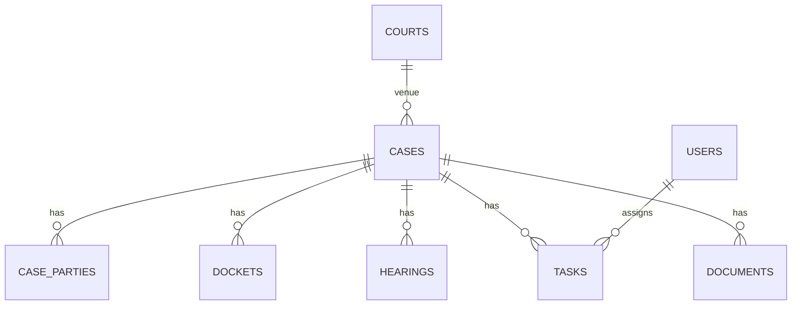

# Cursor → Opal.google Handoff Prompt
**Purpose:** Instruct Cursor to **study the existing Centralized Litigation Management System (CLMS)** codebase and assets, then generate a **single, self‑contained master prompt** for **Opal.google** to produce a new, cleanly re-envisioned version from Opal’s point of view.

---

## How to Use
1. **Paste this entire document into Cursor** as a task.
2. Cursor should analyze the current CLMS repository (code, DB, configs, seeds, migrations, dumps, docs).
3. Cursor will produce **two deliverables**:
   - **D1. CLMS Technical Dossier** (facts extracted from the current system).
   - **D2. Opal‑Ready Master Prompt** (clean prompt for Opal.google, incorporating D1 and written for reimplementation).

> Important: Prefer **facts from the repo** over prior assumptions. If a detail is missing, call it out in a **Gaps & Assumptions** section with conservative, clearly labeled assumptions.

---

## Scope & Goals (for Cursor)
- Create a **complete and accurate snapshot** of CLMS: database schema, entities, fields, constraints, relations, enums, RBAC, workflows, pages, endpoints, automations, validations, file flows, and integrations.
- Normalize/standardize terminology (Arabic/English), include pluralization and canonical names.
- Surface **non‑functional requirements** (NFRs): security, performance, audit, logging, backup, i18n/RTL, accessibility, browser/device targets.
- Capture **deployment/runtime** constraints (hosting, PHP/Laravel/Python/Node, job queues, CRONs, storage limits).
- Describe **migration** and **data import/export** (CSV, PDF, Word/MPDF/FPDF, email).
- Output an **Opal‑ready prompt** that is precise, structured, and implementation‑oriented.

---

## D1 — CLMS Technical Dossier (extracted description)
Cursor must produce D1 as a structured Markdown with these sections. **Do not invent**—cite exact sources/paths when possible.

### 1) Executive Summary
- One paragraph describing CLMS mission (centralized litigation tracking: cases, parties, hearings, filings, tasks, documents, notifications, finance).

### 2) Domain Model (Entities & Relations)
For each entity, list **fields**, **types**, **nullability**, **defaults**, **constraints**, **unique keys**, **indexes**, **FKs**, **soft‑delete** flags, **timestamps**, and **validation rules** (both DB and server‑side). Include **enums** and **value sets**.

**Core entities (add/trim per repo):**
- `users`, `roles`, `permissions`, `role_user`, `permission_role`
- `cases` (aka matter, lawsuit)
- `case_parties` (role-per-case: plaintiff/defendant/appellant/appellee/intervenor/etc.)
- `contacts` (people/organizations), `attorneys`, `courts`, `judges`
- `dockets`, `filings`, `motions`, `orders`, `judgments`, `appeals`
- `hearings`, `sessions`, `court_events`, `adjournments`
- `tasks`, `todos`, `assignments`, `reminders`
- `documents`, `attachments`, `templates`, `mail_merge_fields`
- `fees`, `costs`, `payments`, `invoices`, `receipts`
- `notes`, `activities` (audit trail), `notifications`
- `tags`, `labels`, `custom_fields`
- `lookup_*` tables (status, stage, court levels, case types, client capacity, priorities, outcomes)
- `integrations` (Zoho, Outlook/Exchange/IMAP/CalDAV, Bill4Time, LawPay, SMS/Email)
- `settings`, `webhooks`, `jobs`, `failed_jobs`

**For each relation**, specify: cardinality, direction, on‑delete/on‑update behaviors (CASCADE/RESTRICT/SET NULL), and ownership.

Include at least one **ERD** (Mermaid) derived from the schema:

> Expand with actual tables and keys.

### 3) Database Inventory
Provide a tabular inventory. Example format (fill with real data):

| Table | PK | Key Fields (type) | Indexes | FKs | Soft Delete | Notes |
|---|---|---|---|---|---|---|
| cases | id (bigint) | number(varchar), title(text), status(enum) | idx_number, idx_status | court_id→courts.id | yes | unique(number) |
| hearings | id | case_id(bigint), date(date), time(time), room(varchar) | idx_case_date | case_id→cases.id | no |  |

Also export a **complete DDL** block (as‑is from migrations/dumps) inside a fenced ```sql``` block.

### 4) Enums & Lookups
List all enums/lookup tables with **keys**, **display labels (EN/AR)**, **descriptions**, **ordering**, and **visibility flags**. Examples:
- `case_status`: Draft, Filed, Pending, Hearing Scheduled, Judgment, Closed, Archived
- `party_role`: Plaintiff, Defendant, Appellant, Appellee, Intervening, Prosecutor, Civil Claimant, etc.
- `hearing_outcome`: Adjourned, Decided, Postponed, Settled

### 5) Validation Matrix
For every field, declare **server/client validation**: required/nullable, min/max lengths, regexes, formats (email, IBAN, Egyptian national ID), uniqueness scope (global/per case), numeric ranges, date constraints, cross‑field rules (e.g., `hearing_date ≥ filing_date`).

### 6) RBAC & Security
- Roles (e.g., Admin, Partner, Associate, Paralegal, Clerk, Finance, Read‑Only).
- Permission map (CRUD by entity + actions like **Convert Quote → SO**, **Export PDF**, **Share Link**, **Approve Invoice**).
- Data scoping rules (by office, department, matter team).
- PII handling (encryption at rest, masked display), signed URLs, download policies, audit/immutable logs.
- Multi‑tenant or single‑tenant? Org scoping?

### 7) Workflows & Automations
Describe each workflow with swim‑lane style bullets (who/when/what). Include triggers, notifications, SLAs, escalation rules. Examples:
- **Case Intake → Filing → Hearing → Judgment → Appeal/Closure**.
- **Document lifecycle**: draft → review → approved → filed → served → archived.
- **Tasking**: assignment, due dates, reminders, recurring tasks.
- **Finance**: fee posting, invoice generation (MPDF/FPDF), payments, receipts.
- **Calendaring**: hearing/session sync to Outlook/Google/Zoho via CalDAV/iCal feeds.

### 8) UI/UX — Pages & Components
For each page, list **route**, **purpose**, **widgets**, **filters**, **columns**, **buttons**, and **modals**. Include **field lists** in view/edit forms.

**Minimum page inventory (extend with actual):**
- Dashboard (KPIs, upcoming hearings, overdue tasks, recent filings).
- Cases: list/index, create, view, edit, archive.
- Case sub‑tabs: Parties, Dockets/Filings, Hearings, Tasks, Documents, Finance, Activity Log.
- Global: Contacts, Courts, Judges, Tasks, Calendar, Documents, Templates, Reports, Settings, Users/Roles.
- Reports: cases by stage, hearing calendar, SLA breaches, collections aging, performance KPIs.
- Admin: Lookups, Custom Fields, Numbering, Audit, Backup/Restore.

Provide **table column definitions** (field/label/type/sort/filter), pagination and search behavior, and **RTL/i18n** notes.

### 9) APIs & Integrations
- Internal REST/GraphQL endpoints (list routes, methods, payloads).
- Webhooks (events & payloads).
- External services (Zoho, Outlook/Exchange/IMAP, Bill4Time/LawPay, SMS gateways). Include secrets management approach and retry/backoff.

### 10) Non‑Functional Requirements (NFRs)
Performance targets, concurrency, offline handling, backups, restore scenarios, logging/observability, rate limits, file size limits, retention policies, legal holds, GDPR‑like requirements, accessibility (WCAG), browser support.

### 11) Deployment & Ops
Hosting, stack, build toolchain, environment variables, queue workers, schedulers/CRON, storage (local/S3), email (SMTP/Graph), PDF engine (MPDF/FPDF), antivirus scanning, CI/CD.

### 12) Data Import/Export
CSV templates, required columns, encoding (UTF‑8, Arabic shaping/RTL), duplicate detection, merge strategy, audit of imports, bulk edit limits.

### 13) Gaps & Assumptions
Bullet each missing piece and provide cautious assumptions to be confirmed.

---

## D2 — Opal‑Ready Master Prompt (to be produced by Cursor)
Cursor must generate a **single prompt** suitable to paste into **Opal.google**, using the following structure. Replace every placeholder with concrete content from D1; keep the sectioning and formatting.

### OPAL PROMPT — Centralized Litigation Management (CLMS)
**Role:** You are Opal.google, creating a clean, modern, secure **Centralized Litigation Management System** based on the following definitive specification distilled from an existing implementation.

#### A. Product Vision (1–2 paragraphs)
- [Insert concise statement of goals, target users, jurisdictions, language/RTL needs, deployment constraints.]

#### B. Canonical Data Model
Provide both a **human table** and a **machine spec**.

**B1. Entity Table (excerpt)**
| Entity | Purpose | Key Fields | Required | Unique | Relations |
|---|---|---|---|---|---|
| Case | A litigated matter | number, title, type, status, court_id, team_id | number, title, type | number per tenant | 1..n hearings, 1..n filings, … |

**B2. Machine‑Readable Schema (authoritative)**
Provide the **complete** schema in one of these formats (choose best for Opal):
- **SQL DDL** (MySQL/MariaDB with utf8mb4, engine, indexes, FKs, ON DELETE/UPDATE)
- **OpenAPI 3.1** components/schemas (for REST)
- **JSON Schema** v2020‑12 per entity
- **Prisma** (if Node stack is preferred)

Example (choose one and extend to all entities; fill actual fields/types/rules):
```sql
CREATE TABLE cases (
  id BIGINT PRIMARY KEY AUTO_INCREMENT,
  number VARCHAR(64) NOT NULL UNIQUE,
  title VARCHAR(512) NOT NULL,
  type_id BIGINT NOT NULL,
  status ENUM('draft','filed','pending','hearing','judgment','closed','archived') NOT NULL DEFAULT 'draft',
  court_id BIGINT NOT NULL,
  opened_on DATE NOT NULL,
  closed_on DATE NULL,
  created_at TIMESTAMP NULL,
  updated_at TIMESTAMP NULL,
  deleted_at TIMESTAMP NULL,
  INDEX idx_cases_court_status (court_id, status),
  CONSTRAINT fk_cases_court FOREIGN KEY (court_id) REFERENCES courts(id) ON DELETE RESTRICT
);
```
> Include **every table** with constraints, indexes, and **full enum values**. Provide **Mermaid ERD** matching the DDL.

#### C. RBAC & Security
- Roles and permissions matrix (CRUD + special actions).  
- Data access rules (team/office scoping).  
- PII controls (encryption, masking), signed URLs, audit immutability.  
- AuthN/AuthZ stack (JWT/Session, 2FA, SSO if any).

#### D. Validations
- Per‑field rules (required, formats, ranges, cross‑field).  
- Unique scopes (e.g., `cases.number` per tenant).  
- Date logic (e.g., hearing ≥ filing).  
- File rules (types, size, antivirus).

#### E. Workflows
Describe each end‑to‑end flow with states, transitions, and triggers:
- Case lifecycle, document lifecycle, hearing scheduling, tasking/reminders, finance → invoice → payment → receipt.  
- Notification matrix (who/when/how).  
- Automations/CRONs.

#### F. UI/UX — Screens
List **all** screens with routes, widgets, filters, columns, form fields, and actions (buttons/menus). Specify RTL and localization keys where applicable.

#### G. APIs & Integrations
- Internal API routes + payloads.  
- External integrations (Zoho, Outlook/Exchange/IMAP/CalDAV, Bill4Time/LawPay, SMS).  
- Webhooks events.  
- Rate limiting and error models.

#### H. Non‑Functional Requirements
Performance, reliability, observability, backups, retention, legal hold, accessibility, browser support, mobile responsiveness.

#### I. DevOps & Deployment
Environments, env vars, queues, schedulers, file/object storage, PDF engine, CI/CD, backup/restore drills.

#### J. Data Import/Export
CSV templates, duplicate handling, Arabic/English (UTF‑8, RTL), mappings, audit of imports.

#### K. Gaps & Assumptions (to confirm)
Enumerate any uncertainties Cursor found—Opal must ask for these before building.

**Output format for Opal:**  
Return everything above as a **single Markdown document** with:
- A top‑level index  
- A completed **DDL** or **JSON Schema** (authoritative)  
- A Mermaid **ERD**  
- Tables for roles/permissions and screen inventories  
- A final **Checklist** of acceptance criteria

---

## Discovery Guidance (for Cursor)
Cursor should use repo‑aware heuristics to find the facts below. Where applicable, include exact file paths.

### A) Database & Schema Extraction
- If **Laravel**: parse `database/migrations/*`, `app/Models/*`, `database/seeders/*`, `config/*.php` (`database.php`, `queue.php`), `resources/lang/*`.
- If **Django**: `*/models.py`, migrations, DRF serializers, fixtures.
- If **Rails**: `db/schema.rb`, migrations, models.
- If **Node/Express/Prisma**: `prisma/schema.prisma`, migrations.
- If **SQL dumps**: `*.sql` — prefer **latest** by date in filename or Git history.
- Extract **types, lengths, precision, default values, nullability, indexes, FKs**, soft‑deletes, and **enum values**.

### B) API Surface
- Collect routes (e.g., `routes/web.php`, `routes/api.php`, `config/routes.rb`, `urls.py`, OpenAPI files).
- For each route: method, path, auth, request/response schemas.

### C) UI & Screens
- Scan front‑end routes/components/pages (Next.js, Vue, Blade, Livewire, Inertia).  
- Extract columns, filters, forms, field widgets, validation messages, RTL/i18n keys.

### D) Workflows & Jobs
- Identify schedulers/CRON (`app/Console/Kernel.php`), queue jobs, listeners, mailables, notifications.  
- Link them to entities and events.

### E) RBAC
- Parse policies, gates, middleware, `spatie/laravel-permission` seeds if present.  
- Generate a **roles × permissions** matrix.

### F) Documents & PDFs
- Locate any templates (Blade/MPDF/FPDF), mail‑merge fields, numbering formats.  
- Note file storage drivers and retention.

### G) Internationalization
- Extract Arabic/English strings and directionality notes (RTL layouts).

### H) Environments & DevOps
- `.env.example`, Docker/CI files, build scripts, cron schedules, logging config.

---

## Output Formats & Templates

### 1) Field Inventory Template
| Entity.Field | Label (EN/AR) | Type | DB Type | Required | Default | Validation | Enum/Lookup | FK | Notes |
|---|---|---|---|---|---|---|---|---|---|
| Case.number | Case No. / رقم القضية | string | varchar(64) | yes | — | unique per tenant, regex `^[A-Z0-9/-]+$` | — | — | Human-readable ID |

### 2) Role × Permission Template
| Role | cases | hearings | filings | documents | tasks | finance | admin |
|---|---|---|---|---|---|---|---|
| Admin | CRUD | CRUD | CRUD | CRUD | CRUD | CRUD | all |
| Partner | R/U | R/U | R/U | R/U | R/U | approve | manage team |

### 3) Screen Inventory Template
| Screen | Route | Purpose | Key Widgets | Filters | Columns/Fields | Actions |
|---|---|---|---|---|---|---|
| Cases Index | `/cases` | Browse/search matters | Search, facet filters | status, court, team | number, title, status, court, next_hearing | View, Edit, Archive |

### 4) Acceptance Checklist (for Opal)
- [ ] All entities & fields implemented with constraints and enums.
- [ ] All relations, FKs, and ON DELETE/UPDATE rules implemented.
- [ ] RBAC matrix enforced across APIs and UI.
- [ ] Validations and cross‑field rules enforced.
- [ ] Screens implemented with listed columns, filters, forms, actions.
- [ ] Workflows & automations operational (jobs/CRON).
- [ ] i18n/RTL complete; Arabic labels verified.
- [ ] Import/export templates load and export correctly (UTF‑8, CSV).
- [ ] PDFs/templates render; numbering formats match.
- [ ] Backups, logs, and audit trails verified.
- [ ] Security: auth, permissions, PII handling, signed URLs tested.

---

## Deliverable Names
- **D1:** `CLMS_Technical_Dossier.md`
- **D2:** `Opal_Master_Prompt_CLMS.md`

Cursor: Produce both documents in Markdown. In D2, **embed** the final authoritative schema (DDL or JSON Schema), ERD, and all tables so that Opal.google can proceed without further questions (except items in Gaps & Assumptions).

---

## Final Notes to Cursor
- Be exhaustive but precise. Prefer **lists and tables**.  
- Keep Arabic/English bilingual labels where present in the repo.  
- Include **exact enum values** and **sample records** if available (redact PII).  
- Flag any **ambiguous** or **contradictory** definitions.
